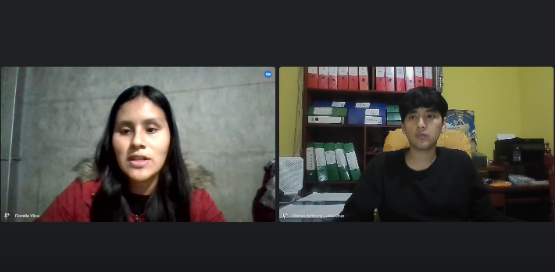
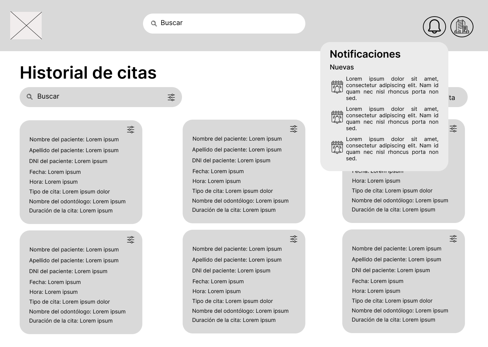
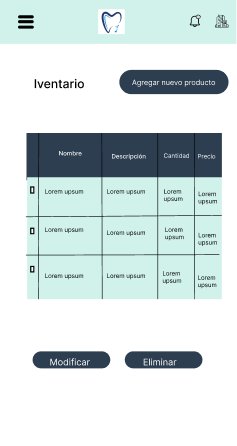
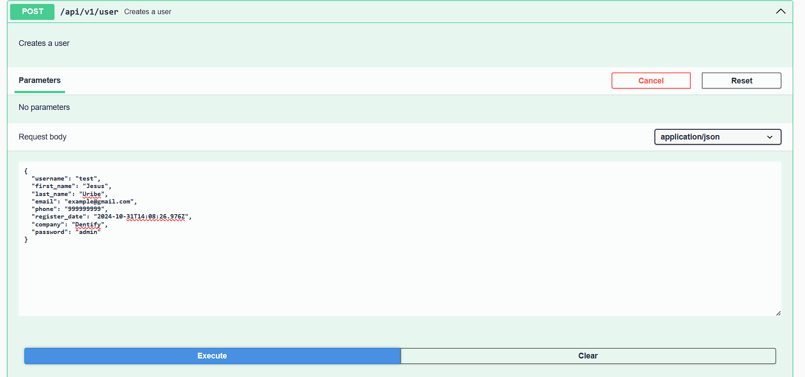
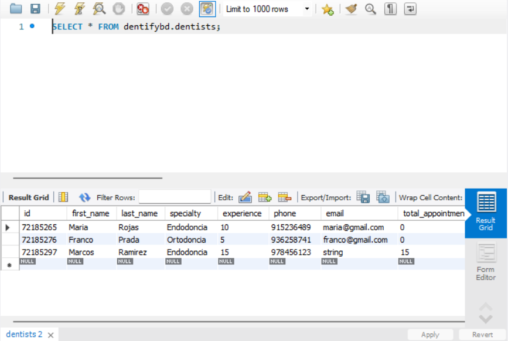

<h1 style="text-align: center;"> Informe del Trabajo Final </h1>
<h3 style="text-align: center;"> Universidad Peruana de Ciencias Aplicadas </h3>

<h5 style="text-align: center"> Área: Ingeniería de Software </h5>

<h5 style="text-align: center"> Curso: Aplicaciones Web </h5>
<h5 style="text-align: center"> Sección: SI91 </h5>

<h5 style="text-align: center"> Docente: Alex Humberto Sánchez Ponce </h5>

<h5 style="text-align: center"> Startup: MediTech </h5>

<h5 style="text-align: center"> Producto: Dentify </h5>

## Team members:

|                Nombre                 |   Código   |
| :-----------------------------------: | :--------: |
| Bohorquez Lerzundi, Gerardo Sebastián | u202224149 |
|  Huanaco Huayta, Elizabeth Lucero   | u20211g522 |
|     Uribe Quispe, Jesús Guillermo     | u202221876 |

<h5 style="text-align: center"> Ciclo 2024-02 </h5>

# Registro de Versiones del Informe
El objetivo de esta sección es resumir las modificaciones relevantes que se realizan al informe durante el ciclo de vida del proyecto. Esta sección inicia en una página nueva y se incluye un cuadro con la siguiente estructura:

**TF**

| Versión | Fecha | Autor | Descripción de modificación |
| :-----: | :---: | :---: | --------------------------- |
|TF |16/10/2024 | Bohorquez Lerzundi Gerardo Sebastian| realización de informe, endpoints de back end, presentación y exposición |
|TF |16/10/2024 | Huanaco Huayta, Elizabeth Lucero |realización de informe, endpoints de back end, presentación y exposición|
|TF |16/10/2024 | Uribe Quispe, Jesús Guillermo |gestión de versiones de back end, realización de informe, endpoints de back end, presentación y exposición|

**TB2**

| Versión | Fecha | Autor | Descripción de modificación |
| :-----: | :---: | :---: | --------------------------- |
|TB2 |29/10/2024 | Bohorquez Lerzundi Gerardo Sebastian|Funcionalidad de Pagos, Inventario, Actualización de Landing Page, realización de informe, realización de entrevistas|
|TB2 |29/10/2024 | Huanaco Huayta, Elizabeth Lucero | Funcionalidad de Especialistas, arreglo de funcionalidad de perfil, endpoints de Dentistas en el Back-end, realización de Validation interviews, realización de entrevistas|
|TB2 |29/10/2024 | Julca Cruz, Renso Anthony |-|
|TB2 |29/10/2024 | Uribe Quispe, Jesús Guillermo |Gestión de proyecto Front End y Back End, realización de Citas, arreglo de bugs en servicios, arreglo de bugs en funcionalidad de pagos y pacientes, realización de funcionalidad de soporte, realización de endpoints de Usuarios en BackEnd, realización de entrevistas.|

**TP1**

| Versión | Fecha | Autor | Descripción de modificación |
| :-----: | :---: | :---: | --------------------------- |
|TP1 |25/09/2024 | Bohórquez Lerzundi, Gerardo Sebastián| Realización de ppt, funcionalidad dashboard y maquetacion de componente pago |
|TP1 |25/09/2024 |Huanaco Huayta, Elizabeth Lucero | Realización de ppt, funcionalidad de perfil relacionada con fakeAPI |
|TP1 |25/09/2024 |Jimenez Melgar, Daniel Luciano |Realización de formulario de soporte |
|TP1 |25/09/2024 |  Julca Cruz, Renso Anthony |Realización de formulario de creación de citas |
|TP1 |25/09/2024 |Uribe Quispe, Jesús Guillermo |Realización de login, registro, autenticación, pagina principal, barra de navegación, generación de FakeAPI, gestión de estructuración de proyecto, gestión de proyecto en github, funcionalidad de historiales clínicos relacionados a la FakeAPI, creación de modelos usuario, pacientes, funcionalidad de internacionalización, configuración de json server, implementación de tailwind css, realización de funcionalidad de servicios CRUD|

**TB1**

| Versión | Fecha | Autor | Descripción de modificación |
| :-----: | :---: | :---: | --------------------------- |
|TB1 |06/09/2024 | Bohórquez Lerzundi, Gerardo Sebastián| Lean UX Problem Statement, Lean UX Canvas, User Stories, Web Style Guidelines, Information System, Domain-Driven Software Architecture.  |
|TB1 |06/09/2024 |Huanaco Huayta, Elizabeth Lucero | Lean UX Assumptions, Competidores, Análisis competitivo, Estrategias frente a competidores, Wireframes y Mockups de la versión desktop del landing page, y Wireframes de la versión desktop del web application. |
|TB1 |06/09/2024 |Jimenez Melgar, Daniel Luciano | Competidores, Analisis de competidores, Entrevistas, User Task Matrix, Ubiquos language, Wireframe y Mock-ups de la version mobile del lading page, y Mock-ups del Web app|
|TB1 |06/09/2024 |  Julca Cruz, Renso Anthony | Diseño de entrvistas, Analisis de Entrevistas, User Personas, User Task Matrix, User Journey Mapping, As-Is Scenario Mapping, Software Development Environment Configuration y Source Code Style Guide & Conventions. |
|TB1 |06/09/2024 |Uribe Quispe, Jesús Guillermo | Descripción de la Startup, Antecedentes y Problemática, Estrategias y tácticas frente a competidores, Segmentos objetivos, Diseño de Base de Datos, Diagrama de clases, Wireframe y Mockup Landing Page|

## Project Report Collaboration Insights

URL del repositorio para el reporte del proyecto: https://github.com/TF-AplicacionesWeb
**TF**

Para el desarrollo del informe perteneciente a la entrega TF, se dividió la implementación de secciones de la siguiente forma para cada integrante del equipo:

| Integrante | Tareas Asignadas |
| ---------- | ---------------- |
| Bohorquez Lerzundi Gerardo Sebastian| realización de informe, endpoints de back end, presentación y exposición |
| Huanaco Huayta, Elizabeth Lucero |realización de informe, endpoints de back end, presentación y exposición|
| Uribe Quispe, Jesús Guillermo |gestión de versiones de back end, realización de informe, endpoints de back end, presentación y exposición|

**TB2**

Para el desarrollo del informe perteneciente a la entrega TB2, se dividió la implementación de secciones de la siguiente forma para cada integrante del equipo:

| Integrante | Tareas Asignadas |
| ---------- | ---------------- |
| Bohorquez Lerzundi Gerardo Sebastian|Funcionalidad de Pagos, Inventario, Actualización de Landing Page, realización de informe, realización de entrevistas|
| Huanaco Huayta, Elizabeth Lucero | Funcionalidad de Especialistas, arreglo de funcionalidad de perfil, endpoints en el backend, realización de Validation interviews, realización de entrevistas|
| Julca Cruz, Renso Anthony |Realización de Funcionalidad de métricas y reportes|
| Uribe Quispe, Jesús Guillermo |Gestión de proyecto Front End y Back End, realización de Citas, arreglo de bugs en servicios, arreglo de bugs en funcionalidad de pagos y pacientes, realización de funcionalidad de soporte, realización de endpoints de Usuarios en BackEnd, realización de entrevistas.|

**TP1**

Para el desarrollo del informe perteneciente a la entrega TP1, se dividió la implementación de secciones de la siguiente forma para cada integrante del equipo:

| Integrante | Tareas Asignadas |
| ---------- | ---------------- |
| Bohórquez Lerzundi, Gerardo Sebastián| Realización de ppt, funcionalidad dashboard y maquetacion de componente pago |
 |Huanaco Huayta, Elizabeth Lucero | Realización de ppt, funcionalidad de perfil relacionada con fakeAPI |
|Jimenez Melgar, Daniel Luciano | Realización de formulario de soporte |
|  Julca Cruz, Renso Anthony |  Realización de formulario de creación de citas |
|Uribe Quispe, Jesús Guillermo | Realización de login, registro, autenticación, pagina principal, barra de navegación, generación de FakeAPI, gestión de estructuración de proyecto, gestión de proyecto en github, funcionalidad de historiales clínicos relacionados a la FakeAPI, creación de modelos usuario, pacientes, funcionalidad de internacionalización, configuración de json server, implementación de tailwind css, realización de funcionalidad de servicios CRUD. |

**TB1**

  

  

Para el desarrollo del informe perteneciente a la entrega TB1, se dividió la implementación de secciones de la siguiente forma para cada integrante del equipo:

| Integrante | Tareas Asignadas |
| ---------- | ---------------- |
| Bohórquez Lerzundi, Gerardo Sebastián| Lean UX Problem Statement, Lean UX Canvas, User Stories, Web Style Guidelines, Information System, Domain-Driven Software Architecture.  |
 |Huanaco Huayta, Elizabeth Lucero | Lean UX Assumptions, Competidores, Análisis competitivo, Estrategias frente a competidores, Wireframes y Mockups de la versión desktop del landing page, y Wireframes de la versión desktop del web application.|
|Jimenez Melgar, Daniel Luciano | Competidores, Analisis de competidores, Entrevistas, User Task Matrix, Ubiquos language, Wireframe y Mock-ups de la version mobile del lading page, y Mock-ups del Web app |
|  Julca Cruz, Renso Anthony | Diseño de entrvistas, Analisis de Entrevistas, User Personas, User Task Matrix, User Journey Mapping, As-Is Scenario Mapping, Software Development Environment Configuration y Source Code Style Guide & Conventions. |
|Uribe Quispe, Jesús Guillermo | Descripción de la Startup, Antecedentes y Problemática, Estrategias y tácticas frente a competidores, Segmentos objetivos, Diseño de Base de Datos, Diagrama de clases, Wireframe y Mockup Landing Page|

**Github Collaboration Insights**

Github también presenta un timeline de las ramas principales y los procesos de merge a los que se han sometido. Todas las ramas se crearon tomando en cuenta el diseño de GitFlow para una buena organización cuando se usa un software de control de versiones.

Los integrantes son:
- Bohórquez Lerzundi, Gerardo Sebastián(Sebasbl562)
- Huanaco Huayta, Elizabeth Lucero(lucerohh)
- Uribe Quispe, Jesús Guillermo(JesusU27)

## STUDENT OUTCOME
ABET – EAC - Student Outcome 5: Trabaja efectivamente en un equipo cuyos miembros juntos proporcionan liderazgo; crea un entorno colaborativo e inclusivo y establece metas, planifica tareas y cumple objetivos.
  

<b>ABET – EAC - Student Outcome 5</b>
| Criterio específico                                                                                                                                              | Acciones realizadas                                                                                                                                                      | Conclusiones                                                                                                                                   |
|------------------------------------------------------------------------------------------------------------------------------------------------------------------|--------------------------------------------------------------------------------------------------------------------------------------------------------------------------|-----------------------------------------------------------------------------------------------------------------------------------------------|
| Trabaja en equipo para proporcionar liderazgo en forma conjunta | **Huanaco Huayta Elizabeth Lucero**   **TB1:**   Participé activamente en las reuniones de coordinación para definir nuestro caso de negocio. A partir de estas reuniones, desarrollé los Lean UX Assumptions, investigué sobre los competidores actuales en el mercado, y con esa información realicé un análisis competitivo, así como la redacción de estrategias a aplicar frente a nuestros competidores. Además, coordiné con los miembros del equipo asignados para establecer los parámetros que debíamos seguir en la elaboración de los wireframes y mockups.   **TP1:** Durante las reuniones virtuales, se organizó y designó las tareas a cada integrante. Esto me permitió desarrollar el componente y los requisitos según se coordinó en la reunión.   **TB2:** Como integrante del equipo, colaboré en la primera versión del backend, apoyando un ambiente de trabajo colaborativo. Aporté en el desarrollo de algunos endpoints de la API, siguiendo los lineamientos acordados en equipo y mantuve una comunicación con los demás integrantes para alinear nuestro progreso.       **Bohorquez Lerzundi Gerardo Sebastián**   **TB1:**    Desarrollé el Lean UX Problem Statement, Lean UX Canvas y User Stories, y participé en la definición de la arquitectura de software orientada al dominio.   **TP1**    Colaboré en el desarrollo de la funcionalidad de dashboard y en la maquetación del componente de pago, coordinando con el equipo para mantener coherencia en el diseño y la funcionalidad. Además, participé en la creación de la presentación del proyecto, asegurando que reflejara nuestro trabajo conjunto.  **TB2**   Coordiné con el equipo en el desarrollo de la funcionalidad de pagos, el inventario y la actualización de la landing page. También trabajé en la creación de entrevistas y del informe, aportando liderazgo en cada etapa para reflejar un esfuerzo compartido.     **Jimenez Melgar Daniel Luciano**   **TB1:**   Realicé un análisis de competidores, llevé a cabo entrevistas, y elaboré un User Task Matrix para identificar las tareas críticas de la aplicación. También creé un glosario de Ubiquitous Language y diseñé wireframes y mock-ups para la versión móvil del landing page, así como para la aplicación web, asegurando una experiencia de usuario eficiente y funcional.       **Julca Cruz Renso Anthony**   **TB1:**   Realice las 3 entrevistas basandome en una serie de preguntas para poder recolectar la información de manera satisfactoria, Luego realice las dos User Persona por cada segmento objetivo de nuestro trabajo, realice la User Task Matrix, Journey Mapping y el As-is Scenario Mapping. Para el capitulo 5 realice Software Development Environment Configuration en el cual detallamos que herramientas utilizamos para el desarrollo de nuestro trabajo y finalmente Source Code Style Guide & Conventions.       **Uribe Quispe, Jesús Guillermo**   **TB1:** Mediante llamados, organicé al equipo para poder completar exitosamente este primer entregable. La comunicación nos ayudó a entendernos mejor y a ir todos en una misma dirección, asi como también generar un buen entorno.   **TP1:** Mediante llamados, organicé al equipo para poder completar exitosamente este trabajo parcial. La comunicación nos ayudó a entendernos mejor.   **TB2:** Mediante reuniones y delegación de trabajos y tareas, permitió realizar el trabajo de forma conjunta tanto en el desarrollo del Front End, así como el Back End. | **Huanaco Huayta Elizabeth Lucero**   **TB1:**   Esta fase del proyecto no solo nos permitió mejorar nuestras habilidades de trabajo en equipo, también nos ayudó a cumplir eficientemente con las actividades asignadas y alcanzar los objetivos establecidos en relación con el caso de negocio.  **TP1:** En esta entrega del trabajo aprendí que la coordinación y planificación correctamente elaboradas son requisitos imprescindibles durante el desarrollo de un proyecto de software.  **TB2:** En conclusión, mi participación en el desarrollo de la primera versión del backend reflejó mi compromiso con el trabajo en equipo y la colaboración continua. La comunicación abierta para resolver problemas en grupo permitieron una alineación efectiva en cada etapa.       **Bohorquez Lerzundi Gerardo Sebastián**   **TB1:**   El liderazgo conjunto permitió tomar decisiones alineadas y enfocadas en resolver problemas clave del proyecto. El trabajo en equipo mejoró la definición de requisitos y la calidad de nuestras soluciones.   **TP1:**   Este trabajo en equipo me permitió desarrollar liderazgo compartido, valorando los aportes del grupo y logrando objetivos comunes con una comunicación clara.  **TB2:**  Este proyecto me ayudó a liderar en áreas críticas, promoviendo un esfuerzo colectivo donde cada miembro aportó a los resultados finales.     **Jimenez Melgar Daniel Luciano**   **TB1:**   La colaboración entre los miembros del equipo fue clave para alinear los objetivos del producto y diseñar soluciones efectivas que respondan a las necesidades de nustros futuros usuarios.       **Julca Cruz Renso Anthony**   **TB1:**   Con el trabajo aprendimos la colaboración en equipo sacando adelante mediante lluvia de ideas, para poder mejorar e impulsar el desarrollo del mismo. Tnemos una visión excelente para el desarrollo de nuestro trabajo para poder cubrir esa necesidad a nuestro publico objetivo.       **Uribe Quispe, Jesús Guillermo**   **TB1:**   Acerca de este trabajo aprendí más sobre la colaboración y organización con un equipo, a pesar de inconvenientes que pudimos tener, logramos completar exitosamente este primer entregable.   **TP1:** Acerca de este trabajo parcial aprendí sobre la organización con el equipo de trabajo, tanto en el sentido de planificación como en el de la estructuración y jerarquización del proyecto.   **TB2:** Acerca de este segundo entregable aprendí a planificar mejor al equipo, así como también comprender el desarrollo de Web Services.                                                                                     |
|Crea un entorno colaborativo e inclusivo, establece metas, planifica tareas y cumple objetivos | **Huanaco Huayta Elizabeth Lucero**   **TB1:**   Coordinamos como equipo para elaborar de manera conjunta los wireframes y mockups del landing page, así como los wireframes y mock-ups de la web application. Para lograrlo, establecimos un entorno colaborativo y planificamos las tareas de forma estructurada, asegurando que se cumpliera con el diseño del producto en los plazos acordados. Además, participé en las reuniones de planificación para desarrollar el Lean UX Assumptions, lo que nos permitió tener claros los objetivos del proyecto desde el inicio.  **TP1:** A través de la creación de ramas en el proyecto de github, hemos desarrollado colaborativamente las distintas pantallas y funcionalidades para cumplir con los objetivos de este entregable. Esto fomentó el trabajo en equipo y el desarrollo del trabajo.   **TB2:** En esta fase del proyecto, trabajé junto al equipo para implementar la primera versión del backend, fomentando un entorno colaborativo. La colaboración constante y el intercambio de ideas facilitaron un ambiente de trabajo en el que cada integrante pudo aportar.       **Bohorquez Lerzundi, Gerardo Sebastián**   **TB1:**   Elaboré las Web Style Guidelines, diseñé el Information System, y planifiqué tareas usando Lean UX, manteniendo un enfoque centrado en el usuario.   **TP1:**    Planifiqué y distribuí tareas para avanzar en la funcionalidad de pagos y el diseño del dashboard, estableciendo metas claras con el equipo. Fomenté un ambiente donde cada integrante se sintiera cómodo para aportar, optimizando la eficiencia y el cumplimiento de plazos.   **TB2:**   Planifiqué la implementación de la funcionalidad de inventario y la actualización de la landing page, estableciendo objetivos alcanzables y distribuyendo tareas en equipo. Coordiné entrevistas, promoviendo un espacio inclusivo y receptivo.       **Jimenez Melgar Daniel Luciano**   **TB1:**   Investigué los Competidores y realicé un Análisis de Competidores detallado para identificar sus características, ventajas y debilidades. Conduje Entrevistas con posibles usuarios. Además, elaboré un User Task Matrix para definir las tareas prioritarias que los usuarios deben completar en la plataforma. Creé un glosario de Ubiquitous Language para asegurar una comunicación clara y sin ambigüedades. Finalmente, diseñé Wireframes y Mock-ups para la versión móvil del landing page y Web App.       **Julca Cruz Renso Anthony**   **TB1:**   Realice las 3 entrevistas basandome en una serie de preguntas para poder recolectar la información de manera satisfactoria, Luego realice las dos User Persona por cada segmento objetivo de nuestro trabajo, realice la User Task Matrix, Journey Mapping y el As-is Scenario Mapping. Para el capitulo 5 realice Software Development Environment Configuration en el cual detallamos que herramientas utilizamos para el desarrollo de nuestro trabajo y finalmente Source Code Style Guide & Conventions.       **Uribe Quispe Jesús Guillermo**   **TB1:**   A través de la plataforma Github, hemos ordenado y designado tareas para cada integrante, esto fomenta la colaboración, el trabajo en equipo y el cumplimineto de varios objetivos.   **TP1:**  A través de la plataforma Github, hemos ordenado y designado tareas para cada integrante, esto fomenta la colaboración, el trabajo en equipo y el cumplimiento de varios objetivos que nos propusimos para realización de la aplicación web hecha en Vue.   **TB2:** A través de Github, cree un entorno para desarrollar controlando las versiones del proyecto y desarrollar de manera más ordenada el proyecto junto con mi equipo. | **Huanaco Huayta Elizabeth Lucero**   **TB1:**   Promover la colaboración permitió que el equipo se enfocara en metas compartidas, lo que mejoró la eficiencia y nos ayudó a cumplir los objetivos planificados de manera exitosa.  **TP1:** En este entregable fomentamos el ambiente de colaboración a través del desarrollo de nuestras tareas individuales. La participación de los integrantes facilitó el avance del trabajo según lo requerido en este entregable a pesar de los inconvenientes.   **TB2:** En conclusión, la implementación de la primera versión del backend fue un claro ejemplo de cómo un entorno colaborativo puede llevar a cumplir los objetivos de manera eficiente.       **Bohorquez Lerzundi Gerardo Sebastián**   **TB1:**   Un entorno inclusivo facilitó la planificación efectiva y el cumplimiento de objetivos. La colaboración constante ayudó a integrar ideas diversas y a lograr una experiencia de usuario coherente.  **TP1:**   Aprendí la importancia de una planificación inclusiva, lo cual mejoró nuestro trabajo en equipo y facilitó el logro de los objetivos.   **TB2:**   Este proyecto fortaleció mi habilidad para crear un entorno colaborativo, asegurando que el equipo trabajara alineado y alcanzara cada meta establecida.         **Jimenez Melgar Daniel Luciano**   **TB1:**   Fomentar la colaboración y establecer un ambiente inclusivo permitió que el equipo se alineara en torno a metas comunes, mejorando la productividad y alcanzando los objetivos planificados de manera satisfactoria.       **Julca Cruz Renso Anthony**   **TB1:**   Se fomento el trabajo en equipo uniendo ideas mediante lluvias de ideas y plasmando en ellas un mejor camino para nuestro trabajo.       **Uribe Quispe, Jesús Guillermo**   **TB1:** Fomentamos la colaboración, el trabajo en equipo y la designación de tareas del informe para poder entregar el proyecto exitosamente.   **TP1:** Fomentamos la colaboración y planificación en el equipo ya que tuvimos diferentes funcionalidades por cumplir y realizar individualmente hablando, a pesar de inconvenientes presentados como el de la reducción de integrantes en el grupo, pudimos hacer lo mejor posible en este entregable.  **TB2:** en conclusión fomenté la participación de mi equipo delegando tareas para una correcta interacción y desarrollo con el proyecto realizado.  

## Contenido

1. [**Capítulo I: Introducción.**](#1.)  
   1.1. [Startup Profile.](#1.1.)  
   1.1.1. [Descripción del startup.](#1.1.1.) 
   1.1.2.[Perfiles de los integrantes del equipo.](#1.1.2.) 
   1.2. [Solution Profile.](#1.2.) 
   1.2.1. [Antecedentes y Problemática.](#1.2.1.) 
   1.2.2. [Lean UX Process.](#1.2.2.) 
   1.2.2.1 [LEntrevistasts.](#1.2.2.1.) 
   1.2.2.2. [Lean UX Assumptions.](#1.2.2.2.) 
   1.2.2.3 [Lean UX Hypothesis Statements.](#1.2.2.3.) 
   1.2.2.4 [Lean UX Canvas.](#1.2.2.4.) 
   1.3. [Segmentos objetivo.](#1.3.) 
2. [**Capítulo II: Requirements Elicitation & Analysis.**](#2.) 
   2.1. [Competidores.](#2.1.) 
   2.1.1. [Análisis competitivo.](#2.1.1.) 
   2.1.2. [Estrategias y tácticas frente a competidores.](#2.1.2.) 
   2.2. [Entrevistas.](#2.2.) 
   2.2.1. [Diseño de entrevistas.](#2.2.1.) 
   2.2.2. [Registro de entrevistas.](#2.2.2.) 
   2.2.3. [Análisis de entrevistas.](#2.2.3.) 
   2.3. [Needfinding.](#2.3.) 
   2.3.1. [User Personas.](#2.3.1.) 
   2.3.2. [User Task Matrix.](#2.3.2.) 
   2.3.3. [User Journey Mapping.](#2.3.3.) 
   2.3.4. [Empathy Mapping.](#2.3.4.) 
   2.3.5. [As-is Scenario Mapping.](#2.3.5.) 
   2.4. [Ubiquitous Language](#2.4.) 
3. [**Capítulo III: Requirements Specification.**](#3.) 
   3.1. [To-Be Scenario Mapping.](#3.1.) 
   3.2. [User Stories.](#3.2.) 
   3.3. [Impact Mapping.](#3.3.) 
   3.4. [Product Backlog.](#3.4.) 
4. [**Capítulo IV: Product Design.**](#4.) 
   4.1. [Style Guidelines.](#4.1.) 
   4.1.1. [General Style Guidelines.](#4.1.1.) 
   4.1.2. [Web Style Guidelines.](#4.1.2.) 
   4.2. [Information Architecture.](#4.2.) 
   4.2.1. [Organization Systems.](#4.2.1.) 
   4.2.2. [Labeling Systems.](#4.2.2.) 
   4.2.3. [SEO Tags and Meta Tags](#4.2.3.) 
   4.2.4. [Searching Systems.](#4.2.4.) 
   4.2.5. [Navigation Systems.](#4.2.5.) 
   4.3. [Landing Page UI Design.](#4.3.) 
   4.3.1. [Landing Page Wireframe.](#4.3.1.) 
   4.3.2. [Landing Page Mock-up.](#4.3.2.) 
   4.4. [Web Applications UX/UI Design.](#4.4.) 
   4.4.1. [Web Applications Wireframes.](#4.4.1.) 
   4.4.2. [Web Applications Wireflow Diagrams.](#4.4.2.) 
   4.4.3. [Web Applications Mock-ups.](#4.4.3.) 
   4.4.4. [Web Applications User Flow Diagrams.](#4.4.4.) 
   4.5. [Web Applications Prototyping.](#4.5.) 
   4.6. [Domain-Driven Software Architecture.](#4.6.) 
   4.6.1. [Software Architecture Context Diagram.](#4.6.1.) 
   4.6.2. [Software Architecture Container Diagrams.](#4.6.2.) 
   4.6.3. [Software Architecture Components Diagrams.](#4.6.3.) 
   4.7. [Software Object-Oriented Design.](#4.7.) 
   4.7.1. [Class Diagrams.](#4.7.1.) 
   4.7.2. [Class Dictionary.](#4.7.2.) 
   4.8. [Database Design.](#4.8.) 
   4.8.1. [Database Diagram.](#4.8.1.) 
5. [**Capítulo V: Product Implementation, Validation & Deployment.**](#5.) 
   5.1. [Software Configuration Management.](#5.1.) 
   5.1.1. [Software Development Environment Configuration.](#5.1.1.) 
   5.1.2. [Source Code Management.](#5.1.2.) 
   5.1.3. [Source Code Style Guide & Conventions.](#5.1.3.) 
   5.1.4. [Software Deployment Configuration.](#5.1.4.) 
   5.2. [Landing Page, Services & Applications Implementation.](#5.2.) 
   5.2.1. [Sprint 1.](#5.2.1.) 
   5.2.1.1. [Sprint Planning 1.](#5.2.1.1.) 
   5.2.1.2. [Sprint Backlog 1.](#5.2.1.2.) 
   5.2.1.3. [Development Evidence for Sprint Review.](#5.2.1.3.) 
   5.2.1.4. [Testing Suite Evidence for Sprint Review.](#5.2.1.4.) 
   5.2.1.5. [Execution Evidence for Sprint Review.](#5.2.1.5.) 
   5.2.1.6. [Services Documentation Evidence for Sprint Review.](#5.2.1.6.) 
   5.2.1.7. [Software Deployment Evidence for Sprint Review.](#5.2.1.7.) 
   5.2.1.8. [Team Collaboration Insights during Sprint.](#5.2.1.8.) 
   5.2.2. [Sprint 2.](#5.2.2.) 
   5.2.2.1. [Sprint Planning 2.](#5.2.2.1.) 
   5.2.2.2. [Sprint Backlog 2.](#5.2.2.2.) 
   5.2.2.3. [Development Evidence for Sprint Review.](#5.2.2.3.) 
   5.2.2.4. [Testing Suite Evidence for Sprint Review.](#5.2.2.4.) 
   5.2.2.5. [Execution Evidence for Sprint Review.](#5.2.2.5.) 
   5.2.2.6. [Services Documentation Evidence for Sprint Review.](#5.2.2.6.) 
   5.2.2.7. [Software Deployment Evidence for Sprint Review.](#5.2.2.7.) 
   5.2.2.8. [Team Collaboration Insights during Sprint.](#5.2.2.8.) 
    5.2.3. [Sprint 3.](#5.2.3.) 
   5.2.3.1. [Sprint Planning 2.](#5.2.3.1.) 
   5.2.3.2. [Sprint Backlog 2.](#5.2.3.2.) 
   5.2.3.3. [Development Evidence for Sprint Review.](#5.2.3.3.) 
   5.2.3.4. [Testing Suite Evidence for Sprint Review.](#5.2.3.4.) 
   5.2.3.5. [Execution Evidence for Sprint Review.](#5.2.3.5.) 
   5.2.3.6. [Services Documentation Evidence for Sprint Review.](#5.2.3.6.) 
   5.2.3.7. [Software Deployment Evidence for Sprint Review.](#5.2.3.7.) 
   5.2.3.8. [Team Collaboration Insights during Sprint.](#5.2.3.8.) 
   5.2.4. [Sprint 4.](#5.2.4.) 
   5.2.4.1. [Sprint Planning 2.](#5.2.4.1.) 
   5.2.4.2. [Sprint Backlog 2.](#5.2.4.2.) 
   5.2.4.3. [Development Evidence for Sprint Review.](#5.2.4.3.) 
   5.2.4.4. [Testing Suite Evidence for Sprint Review.](#5.2.4.4.) 
   5.2.4.5. [Execution Evidence for Sprint Review.](#5.2.4.5.) 
   5.2.4.6. [Services Documentation Evidence for Sprint Review.](#5.2.4.6.) 
   5.2.4.7. [Software Deployment Evidence for Sprint Review.](#5.2.4.7.) 
   5.2.4.8. [Team Collaboration Insights during Sprint.](#5.2.4.8.) 
   5.3.[Validation Interviews](#5.3.) 
   5.3.1.[Interview's design](#5.3.1.) 
   5.3.3.[Evaluations according to heuristics](#5.3.3.) 
6. [**Conclusiones.**](#6.) 
6.1. [Conclusiones y recomendaciones](#6.1.) 
6.2. [Video About-The-Team](#6.2.) 
8. [**Bibliografía.**](#7.) 
9. [**Anexos.**](#8.) 

<h2>Capítulo I: Introducción</h2>

<h3> 1.1 Startup Profile</h3>

En esta sección se presenta la descripción del startup y los perfiles de los miembros del equipo.

<h4> 1.1.1. Descripción del startup</h4>

MediTech es una innovadora startup tecnológica dedicada a transformar la manera en que los consultorios dentales gestionan sus operaciones cotidianas. Nuestro producto Dentify es una aplicación web integral diseñada específicamente para cubrir todas las necesidades de gestión de un consultorio.

**Misión:** Nuestra misión es simplificar y optimizar la gestión de consultorios dentales, permitiendo que los profesionales se concentren en brindar protección y bienestar al paciente.

**Visión:** Nuestra visión es convertirnos en la plataforma líder de gestión de consultorios dentales en Lima, impulsando la digitalización en la industria odontológica. 

**Valores:**
- Calidad y excelencia
- Innovación constante
- Responsabilidad Social

<h4> 1.1.2. Perfiles de los integrantes del equipo</h4>

<table align="center"  border="1" width="70%" style="text-align:center;">
    <tr align="center">
        <td rowspan="3">
             
        </td>
        <td align="left">
            <b>Nombre y Apellido:</b>
             
            Bohorquez Lerzundi, Gerardo Sebastián
        </td>
    </tr>
    <tr>
        <td align="left">
        <b>Carrera:</b>
         
        Ingeniería de Software
        </td>
    </tr>
    <tr>
        <td align="left">
        <b>Acerca de:</b>
          
	Estoy cursando el quinto semestre de Ingeniería de Software en la Universidad UPC. Me distingo por ser una persona 		ágil, comprometida, asertiva y profundamente ética. En este proyecto, me comprometo a aportar lo mejor de mí, no solo 		para alcanzar los objetivos del equipo, sino también para fomentar un ambiente de trabajo positivo y colaborativo.
        </td>
    </tr>
    <tr align="center">
        <td rowspan="3">
            
        </td>
        <td align="left">
            <b>Nombre y Apellido:</b>
             
            Huanaco Huayta, Elizabeth Lucero
        </td>
    </tr>
    <tr>
        <td align="left">
        <b>Carrera:</b>
         
          Ingeniería de Software 
        </td>
    </tr>
    <tr>
        <td align="left">
        <b>Acerca de:</b>
         
       Estoy en el quinto ciclo de Ingeniería de Software en la Universidad Peruana de Ciencias Aplicadas. Me considero una persona organizada, resiliente y asertiva. Elegí enfocarme en esta carrera por el interés que tengo en el desarrollo de software, ya que considero que es un área clave para el futuro de la innovación tecnológica. En este proyecto, me comprometo a aplicar mis cualidades y contribuir al logro de los objetivos de mi equipo. 
        </td>
    </tr>
    <tr align="center">
        <td rowspan="3">
            
        </td>
        <td align="left">
            <b>Nombre y Apellido:</b>
             
            Jimenez Melgar, Daniel Luciano
        </td>
    </tr>
    <tr>
        <td align="left">
        <b>Carrera:</b>
         
        Ingeniería de Software
        </td>
    </tr>
    <tr>
        <td align="left">
        <b>Acerca de:</b>
         
        Me encuentro cursando el 6to ciclo de mi carrera de Ingeniería de Software. Disfruto ayudando a mis compañeros en todo lo que me sea posible. Creo en la importancia de la colaboración y el poder del trabajo en equipo para superar nuevos desafíos.
        </td>
    </tr>
    <tr align="center">
        <td rowspan="3">
            
        </td>
        <td align="left">
            <b>Nombre y Apellido: </b>
             
            Julca Cruz, Renso Anthony
        </td>
    </tr>
    <tr>
        <td align="left">
        <b>Carrera:</b>
         
        Ingenieria de Software
        </td>
    </tr>
    <tr>
        <td align="left">
        <b>Acerca de:</b>
         
         Estudiante de Ingenieria de Software, actualmente curso el 5to ciclo de esta carrera. Me apasiona programar y ser autodidacta para poder mejorar mis habilidades en el desarrollo de software, quisiera dedicarme a la parte de gestion bancaria.
        </td>
    </tr>
    <tr align="center">
        <td rowspan="3">
            
        </td>
        <td align="left">
            <b>Nombre y Apellido:</b>
             
            Uribe Quispe, Jesús Guillermo
        </td>
    </tr>
    <tr>
        <td align="left">
        <b>Carrera:</b>
         
        Ingeniería de Software
        </td>
    </tr>
    <tr>
        <td align="left">
        <b>Acerca de:</b>
         
        Soy estudiante de Ingenieria de Software en la UPC y actualmente estoy en el 5to ciclo. Elegí esta carrera porque me interesó el campo del software y la matemáticas. Me comprometo a
		ayudar a mis compañeros con el trabajo asi como también fuera de este.
        </td>
    </tr>
	 
</table>

<h3> 1.2. Solution Profile</h3>

<h4> 1.2.1. Antecedentes y Problemática</h4>

**Antecedentes:**

La gestión de pacientes en consultorios dentales ha evolucionado significativamente con la incorporación de tecnologías digitales, facilitando procesos como la programación de citas, la actualización de historiales médicos y la comunicación entre el personal médico y los pacientes. Cabe resaltar que el desarrollo de salud digital en Perú no está del todo consolidado, pero si en un crecimiento moderado. Según (INEI, 2022), menciona que el porcentaje total de personas que tienen acceso a internet es de un 72.7% en 2022, con respecto al 2020 en la cual solo abarcaba el 64.5%. Por tanto, al ver dicho crecimiento, nos proponemos brindar e impulsar la digitalización en consultorios dentales para abarcar a más personas que necesiten una gestión optimizada y eficaz de sus pacientes.

**Problemática:**

A pesar de estos avances, la adopción de tecnologías para la gestión de pacientes enfrenta desafíos significativos. Muchas clínicas dentales, especialmente las de menor tamaño, aún dependen de métodos manuales o sistemas desactualizados, lo que puede llevar a errores en la programación de citas, pérdida de información importante y una experiencia insatisfactoria para los pacientes. Además, la falta de capacitación en el uso de estas tecnologías puede resultar en una implementación ineficaz, afectando negativamente la eficiencia operativa y la calidad del servicio. Estos problemas se ven agravados por la percepción de que las soluciones digitales son costosas y difíciles de integrar en las prácticas existentes.

**WHAT (Qué): ¿Cuál es el problema?**

El problema es la ineficiencia y gestión de pacientes en diversos consultorios dentales, lo que se traduce en errores en la programación de citas, pérdida de historiales médicos y una mala experiencia para los pacientes debido a la demora de sus atenciones debido al uso de sistemas de gestión que no son digitales.

**WHEN (Cuándo): ¿Cuándo sucede el problema?**

El problema ocurre durante todo el proceso de atención al paciente, desde la programación de la cita hasta el seguimiento post-tratamiento. Es más evidente en momentos de alta demanda o cuando se manejan múltiples pacientes simultáneamente.

**WHERE (Dónde): ¿Dónde surge el problema?**

El problema surge dentro de los consultorios dentales, especialmente de aquellos que aún dependen de métodos manuales o sistemas desactualizados para gestionar la información y las operaciones diarias.

**WHO (Quién): ¿A quiénes les sucede el problema?**

El problema afecta tanto a los dentistas, el personal administrativo y los pacientes. Los profesionales experimentan dificultades para manejar eficazmente las tareas diarias, mientras que los pacientes sufren retrasos y posibles errores en su atención.

**WHY (Por qué): ¿Cuál es la causa del problema?**

La causa principal es la falta de adopción de tecnologías digitales adecuadas para la gestión de pacientes. Esto se debe a factores como el costo percibido de las soluciones digitales, la falta de formación en el uso de dichas herramientas y la resistencia al cambio por parte de algunos profesionales.

**HOW (Cómo): ¿Cómo llevó a los involucrados a llegar a esta situación?**

La combinación de la dependencia de métodos tradicionales, la falta de inversión en la tecnología y la ausencia de una formación continua ha llevado a una situación en la cual los consultorios no pueden manejar eficientemente las demandas actuales, resultando en un servicio subóptimo.

**HOW MUCH (Cuánto): ¿Cuánto afecta el problema?**

El problema afecta significativamente la eficiencia operativa de los consultorios, la satisfacción del paciente y, en última instancia, la rentabilidad del negocio. Clínicas con sistemas de gestión inadecuados pueden perder pacientes y reputación, además de enfrentar mayores costos operativos debido a la ineficiencia y errores.

<h4> 1.2.2. Lean UX Process</h4>

<h5> 1.2.2.1. Lean UX Problem Statements</h5>

En la actualidad, los consultorios dentales enfrentan el desafío de gestionar de manera eficiente y centralizada sus operaciones diarias, incluyendo la programación de citas, la gestión de historiales clínicos y la facilitación de pagos en línea. Este desafío es especialmente crítico en un entorno donde la digitalización es clave para mejorar la experiencia del paciente y optimizar el tiempo y recursos del profesional odontológico.

Hemos identificado que muchos consultorios dentales todavía dependen de métodos tradicionales y fragmentados para gestionar sus operaciones, lo que resulta en una experiencia ineficiente tanto para los pacientes como para los profesionales. La falta de una solución integrada dificulta la coordinación de citas, el acceso rápido a historiales clínicos y la simplificación de procesos de pago, lo que puede afectar negativamente la satisfacción del paciente y la eficiencia del consultorio.

**¿Cómo podemos desarrollar una plataforma web integral y fácil de usar que optimice la gestión de los consultorios dentales, permitiendo a los profesionales concentrarse en brindar un servicio de alta calidad, mientras se mejora la experiencia del paciente a través de la digitalización y la automatización de tareas clave?**

<h5> 1.2.2.2. Lean UX Assumptions</h5>

**Business Assumptions**

- Creemos que nuestros clientes necesitan una mejor tecnología para la gestión de sus citas, historial clínico y pagos en línea.
  
- Estas necesidades se pueden resolver mediante el uso de un sitio web que integre gestión de pacientes, registro de historiales clínicos, reserva y recordatorios de citas, y opciones de pago en línea.

- Los clientes iniciales son profesionales odontológicos que buscan ofrecer un servicio más eficiente y cómodo para sus pacientes.

- El valor #1 que un cliente quiere del servicio es eficiencia en la gestión de su clínica dental y la satisfacción del paciente a través de herramientas que mejoren su experiencia.

- El cliente también puede obtener estos beneficios adicionales con la venta de planes de suscripción, soporte continuo y especializado para la gestión del consultorio, y funcionalidades para el control administrativo, lo que les permitirá mejorar la eficiencia operativa y la satisfacción en el manejo de su consultorio dental.

- Vamos a adquirir la mayoría de los clientes a través del marketing digital y alianzas estratégicas con asociaciones dentales para ampliar nuestra red de contactos y aumentar la visibilidad de nuestro sitio web.

- Se hará dinero a través de las ventas de suscripciones a diferentes niveles de acceso a la plataforma y las ventas de productos del consultorio dental.

- Nuestra competencia principal en el mercado serán los sitios web de gestión dental que no ofrecen una integración completa o carecen de una experiencia de usuario intuitiva.

- Los venceremos debido al uso de tecnologías modernas y un enfoque en la mejora de la experiencia tanto para los dentistas como para los pacientes, además de ofrecer soporte continuo.

- Nuestro mayor riesgo es la resistencia al cambio por parte de los dentistas que utilizan métodos tradicionales para gestionar sus consultorios dentales.

- Resolveremos esto a través de demostraciones del software y un enfoque en el soporte al cliente para ayudar a los usuarios a adaptarse rápidamente a nuestro sitio web.

**Assumptions Worksheet**

- **¿Quién es el usuario?**
  Dentistas que buscan una experiencia de gestión más moderna y eficiente.

- **¿Dónde encaja nuestro producto en su trabajo o vida?**
  Nuestro sitio web se integra en la vida diaria de los dentistas para facilitar la gestión de citas, historiales médicos, y pagos. Para los pacientes, mejora la experiencia de reserva de citas y acceso a su información de salud.

- **¿Qué problemas tiene nuestro producto? ¿Resolver?**
  La adopción de nuevas tecnologías puede ser un desafío para algunos dentistas. Además, puede haber resistencia al uso de plataformas digitales para la gestión de la información.

- **¿Cuándo y cómo es nuestro producto usado?**
  El sitio web se usa diariamente para gestionar citas, revisar historiales médicos, procesar pagos y enviar recordatorios, así como también para agendar citas, realizar pagos y acceder a sus registros de salud.

- **¿Qué características son importantes?**
  Garantizar la accesibilidad desde una variedad de dispositivos, integración con sistemas de pago y calendarios, recordatorios automáticos e interfaz amigable.

- **¿Cómo debe verse nuestro producto y cómo comportarse?**
  Debe tener un diseño limpio, profesional e intuitivo que refleje la seriedad y confianza necesaria en el ámbito de la salud. Asimismo, el sitio web debe responder rápidamente a las acciones del usuario y ser fácil de navegar.

<h5> 1.2.2.3. Lean UX Hypothesis Statements</h5>

- Creemos que al ofrecer herramientas para gestionar citas, historiales clínicos y pagos en línea, mejoraremos la eficiencia en la clínica y la experiencia del paciente. Sabemos que estamos teniendo éxito en mejorar la experiencia de los usuarios cuando observamos un incremento en la eficiencia de las citas y una reducción en quejas de pacientes.

- Creemos que al integrar opciones de pago en línea y generar facturas automáticas, simplificamos el proceso de facturación para los dentistas y pacientes. Sabemos que estamos logrando este objetivo cuando más del 80% de los pagos se procesan en línea sin problemas y se reduce el tiempo de emisión de facturas.

- Creemos que al proporcionar recursos educativos sobre cuidados dentales y consejos de higiene, mejoraremos la educación del paciente y su compromiso con el tratamiento. Sabemos que estamos educando a los pacientes cuando más del 60% de ellos interactúan regularmente con estos recursos y se registra un incremento en la satisfacción del paciente.

<h5> 1.2.2.4. Lean UX Canvas </h5>

<h3> 1.3 Segmentos Objetivos</h3>

En esta sección, definiremos los perfiles específicos del público objetivo para un producto o servicio. Estos grupos comparten características demográficas, comportamientos o necesidades similares, lo que les diferencia de otros segmentos del mercado y permite ajustar estrategias para satisfacer sus expectativas de manera más efectiva.

- **Segmento demográfico:**
Nos enfocamos en dos grupos clave: dueños o administradores de consultorios dentales y dentistas que tienen su propio consultorio. Estos profesionales, en su mayoría de entre 30 y 50 años, cuentan con ingresos medios a altos y la capacidad económica para invertir en herramientas de gestión. Generalmente, ya tienen una base de pacientes estable y están interesados en mejorar la eficiencia de su negocio.

- **Segmento geográfico:**
El público objetivo se encuentra en áreas urbanas, donde los consultorios dentales suelen tener una mayor demanda de pacientes, lo que genera la necesidad de optimizar la gestión del tiempo y los recursos.

- **Segmento psicográfico:**
Este grupo incluye a profesionales que buscan innovar en sus prácticas. Valoran la tecnología que les permita optimizar procesos, mejorar la experiencia de sus pacientes y mantener la calidad de su atención. Además, buscan una mayor eficiencia en el manejo administrativo de sus consultorios.

- **Segmento Conductual:**
Los dueños y dentistas están constantemente buscando soluciones que les faciliten la gestión de citas, la organización de historiales médicos, el control de inventario y la administración de pagos, lo que mejora tanto la satisfacción de los pacientes como la suya.

**Sintesis del segmento objetivo** 
Nos dirigimos principalmente a dos segmentos objetivos:

- **Dueños o administradores de consultorios dentales** que buscan herramientas que optimicen la operación del negocio, permitiéndoles manejar citas, inventarios y pagos de manera eficiente.
- **Dentistas con consultorios propios** que necesitan soluciones para gestionar de manera más ágil su práctica diaria, sin perder de vista el enfoque en la atención al paciente.

  Ambos grupos valoran la eficiencia y la innovación tecnológica para optimizar el servicio y la gestión de su consultorio dental.

<h2>Capítulo II: Requirements Elicitation & Analysis</h2>

<h3> 2.1 Competidores</h3>

| **Competidor**   |         **Descripción**                                                                                                                                 | **Características**                                                                                                                                       | **Logo** |
|---------------------------|-------------------------------------------------------------------------------------------------------------------------------------------------|-----------------------------------------------------------------------------------------------------------------------------------------------------------|----------|
| **Panda Dental Software**  | Solución para clínicas dentales, que facilita la gestión de pacientes, facturación y análisis de datos. Ofrece automatización de procesos y soporte técnico. | - Historia clínica digital.   - Programación de citas.   - Monitoreo y registro de tratamientos realizados.   - Notificaciones por SMS y correo electrónico para citas.   - Estadísticas y reportes detallados. |   |
| **Dentrix**                | Dentrix es un software integral para consultorios dentales que optimiza la gestión del consultorio con herramientas avanzadas.                 | - Copias de seguridad de datos automatizadas   - Reclamos electrónicos   - Procesamiento de tarjetas de pago   - Estados de cuenta automatizados   - Herramientas de desarrollo de sitios web   - Recordatorios de citas   - Software de reconocimiento de voz |  |
| **Curve Dental**           | Curve Dental es una plataforma basada en la nube para la gestión de clínicas dentales que proporciona una solución integral.                    | - Plataforma basada en la nube   - Gestión de citas y historiales clínicos   - Procesamiento de pagos y facturación   - Recetas electrónicas y formularios inteligentes   - Integración de imágenes clínicas y datos del paciente   - Interfaz intuitiva   - Informes dentales y paneles de control para la gestión financiera y operativa |  |

<h4> 2.1.1 Análisis competitivo</h4>

| **Competidor**   | **Dentify**     | **Panda Dental Software**    | **Dentrix**    | **Curve Dental**     |
|------------------------|------------------------------------------------------------------------------------------------------------------------------------------------------------------------------------------------------------------------------------------------------------------------------------------------------------------|----------------------------------------------------------------------------------------------------------------------------------------------------------------------------------------------------------------------------|--------------------------------------------------------------------------------------------------------------------------------------------------------------------------------------------------------------------------------------------------------|--------------------------------------------------------------------------------------------------------------------------------------------------------------------------------------------------------------------------------------------------------|
| **Perfil Overview**     | Aplicación web diseñada para optimizar la gestión de clínicas dentales mediante funcionalidades, como la gestión de pacientes, la programación de citas, la facturación y los pagos. Además, incluye herramientas de análisis y reportes para mejorar la toma de decisiones.  | Aplicación web diseñada para mejorar la gestión en consultorios dentales. Ofrece documentación automatizada, planificación de tratamientos, integración con historiales médicos electrónicos (EMR), y herramientas educativas para pacientes.                         | Software que ofrece soluciones diseñadas para mejorar la experiencia en el consultorio dental, como copias de seguridad de datos automatizadas, reclamos electrónicos, procesamiento de tarjetas de pago, estados de cuenta automatizados y recordatorios de citas.  | Plataforma basada en la nube para la gestión de clínicas dentales, ofreciendo herramientas para la administración de citas, historiales clínicos, procesamiento de pago, facturación, recetas electrónicas y formularios inteligentes.  |
| **Ventaja Competitiva** | Integración de múltiples funciones en una sola plataforma, desde la gestión de citas hasta la facturación y los pagos, con un enfoque en la personalización y automatización de procesos para mejorar la eficiencia y la experiencia del paciente. | Automatiza la toma de notas y la generación de reportes en consultorios periodontales, optimizando la eficiencia clínica. Además, integra herramientas para la planificación de tratamientos y la gestión de historiales médicos electrónicos.                        | Utiliza inteligencia artificial para mejorar automáticamente las exploraciones de rayos X con detecciones de caries y mediciones del nivel óseo radiográfico interproximal (RBL). Además, ofrece una versión de prueba limitada gratis para estudiantes.   | Solución basada en la nube con integración de imágenes clínicas, gráficos y datos que mejoran la gestión centralizada. Combina informes dentales y paneles de control myPractice para brindar información útil sobre los aspectos financieros y operativos. |
| **Mercado Objetivo**    | Consultorios dentales pequeños y medianos que buscan soluciones para mejorar la eficiencia operativa. | Consultorios y clínicas dentales que buscan automatizar procesos clínicos y la gestión de historiales médicos electrónicos. | Clínicas o consultorios dentales, profesionales de la salud dental y administradores de la clínica. | Clínicas o consultorios dentales, profesionales de la salud dental y administradores de la clínica. |
| **Estrategias de Marketing** | Creación de contenido educativo, demostraciones gratuitas, marketing en redes sociales. | Uso de redes sociales para interactuar con la audiencia, webinars, pruebas gratuitas para atraer nuevos clientes y permitirles experimentar el producto. | Marketing en redes sociales, organiza webinars y eventos, ofrece pruebas gratuitas, publica artículos y recursos educativos sobre temas relevantes.  | Marketing en redes sociales, organiza eventos, publica artículos sobre temas relevantes, y alianzas estratégicas con asociaciones dentales. |
| **Productos & Servicios** | Gestión de pacientes y citas, facturación electrónica, integración de pagos en línea, programas de fidelización y herramientas de análisis y reportes, adaptables a las necesidades específicas de cada clínica. | Panda Dental Software. Capacitación para el uso del software, soporte técnico especializado, actualizaciones y mantenimiento del sistema, e integraciones con calendarios y plataformas de pago. | Dentrix Enterprise, Dentrix Ascend, Dentrix G7, Dentrix Pay, Dentrix Imaging, Dentrix Document Center y Dentrix Hub.  | Curve Hero, Curve Imaging, Curve Patient Portal, Curve Mobile App y Curve Analytics.|
| **Precios & Costos**    | Suscripción mensual con niveles de acceso a funcionalidades, además de un periodo gratuito para probar el producto. | Precios escalables basados en el tamaño de la clínica y las funcionalidades requeridas. Tarifas de suscripción mensual o anual, cargos adicionales por usuarios o módulos extra, y posibles tarifas de implementación.  | Dentrix no publica precios específicos en su sitio web, aunque varían según el tamaño de la práctica, el número de usuarios y las características específicas requeridas. | Se necesita contactar directamente a Curve Dental para obtener una cotización personalizada, aunque los precios varían según el tamaño y las necesidades de la clínica. |
| **Canales de distribución (Web y/o Móvil)** | Web   | Web   | Web   | Web  |
| **Fortalezas**   | Automatización de tareas administrativas, mejor experiencia del paciente, interfaz intuitiva que facilita la adopción por parte del personal de las clínicas.  | Automatización de procesos, programas de fidelización, soporte técnico, capacitación, actualizaciones regulares, y facilidad para integrarse con otros sistemas. | Amplia experiencia, funciones completas, integración con otros sistemas, soporte y capacitación. | Solución basada en la nube, funciones completas, integración con otros sistemas, actualizaciones continuas, soporte y capacitación. |
| **Debilidades**  | Costos iniciales prohibitivos para pequeñas clínicas, curva de aprendizaje para algunas funcionalidades. | Costos elevados, complejidad que requiere capacitación, dependencia de buena conectividad a Internet, flexibilidad limitada para la personalización. | Costo elevado, curva de aprendizaje y falta de aplicación móvil. | Costo elevado, curva de aprendizaje, dependencia de internet, falta de aplicación móvil. |
| **Oportunidades**       | Expansión a nuevos mercados, desarrollo de funcionalidades como inteligencia artificial para diagnósticos predictivos. | Expansión a nuevos mercados, innovación tecnológica, formación de alianzas estratégicas. | Innovación tecnológica y colaboraciones estratégicas. | Innovación tecnológica y colaboraciones estratégicas.  |
| **Amenazas**            | Fuerte competencia en el mercado de software dental, posibles cambios en las regulaciones de datos y privacidad. | Competencia intensa, cambios regulatorios, rápida evolución tecnológica, riesgos de seguridad de datos. | Competencia creciente, cambios en la regulación y resistencia al cambio. | Competencia creciente, cambios en la regulación y resistencia al cambio. |

<h4> 2.1.2. Estrategias y tácticas frente a competidores</h4>

- Ofreceremos nuestra interfaz intuitiva, que simplificará el uso del software, con una navegación fácil y rápida, y soporte personalizado para asegurar una adopción ágil y una alta satisfacción del cliente.

- Ofreceremos planes de suscripción escalonados para adaptarnos a diversos presupuestos y necesidades. Desde opciones básicas hasta avanzadas, cada plan estará diseñado para diferentes tipos de consultorios.

- Utilizaremos testimonios de clientes satisfechos en nuestro marketing para construir credibilidad. Los testimonios se destacarán en nuestro sitio web y materiales promocionales. Este enfoque ayudará a atraer nuevos clientes y fortalecer la confianza en nuestra plataforma.

<h3> 2.2 Entrevistas</h3>

<h4> 2.2.1. Diseño de entrevistas.</h4>

- Preguntas para la Asistente Dental
1. ¿Podrías contarme un poco sobre ti?
2. ¿Cómo describirías tu rol como asistente dental en tu clínica?
3. ¿Qué herramientas o software utilizas actualmente para gestionar las tareas diarias en la clínica?
4. ¿Podrías describir un día típico en tu trabajo?
5. ¿Cuáles son los mayores desafíos que enfrentas al coordinar la agenda del dentista y manejar las citas?
6. ¿Cómo gestionas la comunicación con los pacientes, especialmente en casos de cancelaciones o reprogramaciones?
7. Si pudieras implementar una nueva funcionalidad en el software que usas, ¿qué sería y por qué?
8. ¿Qué importancia le das a la experiencia del paciente en la clínica, y cómo crees que tu trabajo influye en esa experiencia?
9. ¿Qué características personales consideras que te ayudan en tu rol como asistente dental?
10. ¿Qué marcas, dispositivos o canales digitales prefieres para realizar tu trabajo y mantenerte actualizada?

- Preguntas para la Odontologa
1. ¿Cómo organizas tu día para asegurarte de que todas las citas de los pacientes se realicen sin contratiempos y qué situaciones suelen causar retrasos o reprogramaciones?
2. ¿Qué tan fácil o difícil es para ti llevar un registro actualizado de los tratamientos de cada paciente y qué estrategias utilizas para mantener al día las historias clínicas?
3. ¿Cómo prefieres manejar las conversaciones con los pacientes sobre pagos y tratamientos costosos?
4. ¿Cómo gestionas el seguimiento de los pagos pendientes de los pacientes?
5. ¿Cómo te aseguras de que todas las facturas y pagos estén registrados correctamente al final del día?
6. ¿Qué tan importante es para ti recibir feedback (opinión) directo de tus pacientes y cómo te enteras de que han recomendado tus servicios a otros?
7. ¿Qué haces para asegurarte de que los pacientes regresen para sus revisiones periódicas?
8. ¿Cómo evalúas el éxito de tu práctica y qué tipo de información revisas para decidir si necesitas ajustar tu carga de trabajo o tarifas?
9. ¿Cómo determinar qué tratamientos y servicios son más rentables para tu práctica, y si tomas decisiones sobre la expansión o reducción de ciertos servicios basándote en la demanda de los pacientes?

<h3> 2.2.2. Entrevistas</h3>

<h2>Asistentes dentales</h2>
<table>
  <tr align="center">
    <tr>
      <td>
        <b>ENTREVISTA 1</b>
      </td>
    </tr>
        <td rowspan="3">
             
        </td>
    </tr>
    <tr>
        <td align="left">
        <b>Datos Personales del Entrevistado:</b>
        </td>
    </tr>
    <tr>
        <td align="left"> 
        Allison Rivera es una joven profesional de 20 años que trabaja como asistente administrativo en un centro dental. Actualmente se encuentra en el 9no ciclo de la carrera de administración de empresas. Es organizada, proactiva y siempre busca formas de mejorar la eficiencia en su trabajo.
        </td>
    </tr>
</table>

<table>
  <tr align="center">
    <tr>
      <td>
        <b>ENTREVISTA 2</b>
      </td>
    </tr>
        <td rowspan="3">
             
        </td>
    </tr>
    <tr>
        <td align="left">
        <b>Datos Personales del Entrevistado:</b>
        </td>
    </tr>
    <tr>
        <td align="left"> 
        Fiorella Vilca, tiene 23 años y actualmente está en el 4º ciclo de Ingeniería de Software. Trabajo a tiempo parcial como asistente dental para equilibrar sus estudios con sus necesidades financieras.
        </td>
    </tr>
</table>

<table>
  <tr align="center">
    <tr>
      <td>
        <b>ENTREVISTA 3</b>
      </td>
    </tr>
        <td rowspan="3">
             
        </td>
    </tr>
    <tr>
        <td align="left">
        <b>Datos Personales del Entrevistado:</b>
        </td>
    </tr>
    <tr>
        <td align="left"> 
        Moisés Rodrigues trabaja como personal administrativo en un consultorio dental, tiene 19 años y se encuentra cursando su 6to ciclo.
        </td>
    </tr>
</table>

<h2>Odontólogos</h2>
<table>
  <tr align="center">
    <tr>
      <td>
        <b>ENTREVISTA 4</b>
      </td>
    </tr>
        <td rowspan="3">
             
        </td>
    </tr>
    <tr>
        <td align="left">
        <b>Datos Personales del Entrevistado:</b>
        </td>
    </tr>
    <tr>
        <td align="left"> 
        Mariluz es una odontóloga con 10 años de experiencia en el sector dental. Tiene su propio consultorio donde se especializa en ortodoncia, y su enfoque se centra en ofrecer un servicio personalizado y de alta calidad. Además de su práctica clínica, Mariluz se encarga de la administración y gestión de su consultorio, lo que le permite tener un control total sobre su negocio.
        </td>
    </tr>
</table>

<table>
  <tr align="center">
    <tr>
      <td>
        <b>ENTREVISTA 5</b>
      </td>
    </tr>
        <td rowspan="3">
             
        </td>
    </tr>
    <tr>
        <td align="left">
        <b>Datos Personales del Entrevistado:</b>
        </td>
    </tr>
    <tr>
        <td align="left"> 
        Alejandro Flores, es un practicante de odontología de 20 años, se encuentra realizando sus prácticas pre-profesionales.
        </td>
    </tr>
</table>

<table>
  <tr align="center">
    <tr>
      <td>
        <b>ENTREVISTA 6</b>
      </td>
    </tr>
        <td rowspan="3">
             
        </td>
    </tr>
    <tr>
        <td align="left">
        <b>Datos Personales del Entrevistado:</b>
        </td>
    </tr>
    <tr>
        <td align="left"> 
        José Luza, un practicante de odontología de 20 años, se encuentra realizando sus prácticas pre profesionales. 
        </td>
    </tr>
</table>

**CARPETA DE ENTREVISTAS:** 

- https://drive.google.com/drive/folders/1R3qObddumASEe8bWxbsaa97e17YXjy1k?usp=sharing
- [2024-08-31 11-56-07.mp4](https://upcedupe-my.sharepoint.com/:v:/g/personal/u20221a569_upc_edu_pe/EQbw_V0FnWpDlRWALQC4PrYBW0ucHdk4ABzv7nab6Wt7PQ?e=vYewAQ&nav=eyJyZWZlcnJhbEluZm8iOnsicmVmZXJyYWxBcHAiOiJTdHJlYW1XZWJBcHAiLCJyZWZlcnJhbFZpZXciOiJTaGFyZURpYWxvZy1MaW5rIiwicmVmZXJyYWxBcHBQbGF0Zm9ybSI6IldlYiIsInJlZmVycmFsTW9kZSI6InZpZXcifX0%3D)
- [2024-08-31 12-22-56.mp4](https://upcedupe-my.sharepoint.com/:v:/g/personal/u20221a569_upc_edu_pe/EXCYHr8GjYRDmE4z5v_zY30BQK5i5cM6982uem2z4RU1_w?e=Q2bzDT&nav=eyJyZWZlcnJhbEluZm8iOnsicmVmZXJyYWxBcHAiOiJTdHJlYW1XZWJBcHAiLCJyZWZlcnJhbFZpZXciOiJTaGFyZURpYWxvZy1MaW5rIiwicmVmZXJyYWxBcHBQbGF0Zm9ybSI6IldlYiIsInJlZmVycmFsTW9kZSI6InZpZXcifX0%3D)
- [2024-09-07 00-29-20.mp4](https://upcedupe-my.sharepoint.com/:v:/g/personal/u20221a569_upc_edu_pe/EW4H_F4PGuZAibzZJlCAq4sBy3_1jwO282CMaO6X5kzf7Q?e=3LNhrz&nav=eyJyZWZlcnJhbEluZm8iOnsicmVmZXJyYWxBcHAiOiJTdHJlYW1XZWJBcHAiLCJyZWZlcnJhbFZpZXciOiJTaGFyZURpYWxvZy1MaW5rIiwicmVmZXJyYWxBcHBQbGF0Zm9ybSI6IldlYiIsInJlZmVycmFsTW9kZSI6InZpZXcifX0%3D)

<h4> 2.2.3. Analisis de Entrevistas.</h4>

**Datos del entrevistado #1** 
**Nombre completo:** Allison Rivera 
**Edad:** 20 años  
**Distrito:** Los Olivos 

**Resumen**
- Allison Rivera, una joven profesional de 20 años y estudiante del noveno ciclo de Administración de Empresas, desempeña el rol de asistente administrativo en un centro dental. En su trabajo, se encarga de coordinar la agenda del dentista, manejar la facturación, y asegurar la eficiencia operativa de la clínica. Allison enfrenta desafíos como equilibrar la disponibilidad del dentista con la demanda de los pacientes y gestionar reprogramaciones sin afectar la agenda. Además, utiliza un sistema de gestión de citas y un software de facturación para mantener todo en orden, y se enfoca en proporcionar una experiencia positiva para los pacientes mediante la personalización de la atención y la implementación de programas de fidelización. Con su enfoque organizado y proactivo, Allison genera reportes clave que ayudan a optimizar las operaciones del consultorio y monitorea indicadores de éxito para asegurar el crecimiento continuo del centro dental.

**Datos del entrevistado #2**  
**Nombre completo:** Fiorella Vilca 
**Edad:** 23 años  
**Distrito:** San Martin de Porres 

**Resumen**
- Fiorella Vilca, una joven de 23 años que cursa el cuarto ciclo de Ingeniería de Software, combina sus estudios con un trabajo a tiempo parcial como asistente dental. En su rol, Fiorella asiste al dentista coordinando citas y manejando tareas administrativas, además de encargarse de la recepción y la limpieza del consultorio. Utiliza herramientas como Dentisys para la gestión de citas y complementa con Google Sheets o Excel para el manejo del inventario, aunque ve la necesidad de una mejor integración entre las herramientas. Los principales desafíos en su trabajo incluyen la coordinación eficiente de la agenda del dentista y la gestión de reprogramaciones de última hora. Fiorella valora profundamente la experiencia del paciente y se esfuerza por brindar un servicio amable y organizado, utilizando su capacidad de comunicación, organización y empatía para desempeñar su rol con eficacia. Además, se mantiene actualizada en su campo mediante el uso de dispositivos digitales y el seguimiento de profesionales en redes sociales.

**Datos del entrevistado #3** 
**Nombre completo:** Mariluz Cruz 
**Edad:** 40 años  
**Distrito:** Carabayllo 

**Resumen**
- Mariluz Cruz Lucero organiza eficientemente su consultorio odontológico, asegurando que las citas y pagos se realicen sin contratiempos, gracias a una planificación detallada y un riguroso sistema de registro de tratamientos. Utiliza listas de precios estandarizadas para las conversaciones sobre costos y mantiene un seguimiento cercano de los pagos, minimizando el riesgo de deudas pendientes. Valora el feedback de los pacientes, lo que le permite ajustar y mejorar su práctica continuamente. Además, se enfoca en la rentabilidad mediante la adaptación a la demanda local y la especialización en servicios específicos, lo que contribuye a la sostenibilidad y éxito de su consultorio.

**Datos del entrevistado #4** 
**Nombre completo:** Moises Rodriguez 
**Edad:** 19 años  
**Distrito:** Ate 

**Resumen**
- Moisés Rodrigues trabaja como personal administrativo en un consultorio dental, nos habló de la gestión administrativa en la clínica. Moisés explicó cómo coordina la agenda del dentista para optimizar la programación de citas. Finalmente, habló sobre los reportes generados para mantener al dentista informado y cómo utiliza estos datos para mejorar la eficiencia operativa de la clínica.

**Datos del entrevistado #5** 
**Nombre completo:** Alejandro Flores 
**Edad:** 20 años 
**Distrito:** Ate 

**Resumen**
- Alejandro Flores, es un practicante de odontología de 20 años, se discutieron diversos aspectos de la gestión en un consultorio dental. Alejandro compartió cómo organiza su día para manejar eficazmente las citas de los pacientes, destacando la importancia de mantener registros actualizados de los tratamientos.En cuanto a la facturación, explicó sus métodos para abordar las conversaciones sobre pagos. Finalmente, Alejandro describió cómo evalúa el éxito de la práctica y ajusta su carga de trabajo basándose en la demanda de tiempo de los tratamientos.

**Datos del entrevistado #6** 
**Nombre completo:** Jose Luza 
**Edad:** 19 años 
**Distrito:** Surquillo 

**Resumen**
- José Luza, un practicante de odontología de 20 años, organiza su día revisando las citas desde temprano y asegura que los tratamientos de los pacientes se registren de manera precisa. Utiliza herramientas manuales para mantener al día las historias clínicas. En cuanto a la facturación, prefiere mantener conversaciones directas sobre pagos y se asegura de registrar correctamente cada transacción. Finalmente, destaca que evalúa el éxito de su práctica revisando los reportes semanales y mensuales, ajustando su carga de trabajo según la demanda.
  

<h3> 2.3. NeedFinding. </h3>

<h4> 2.3.1. User Personas.</h4>

**a. User Persona de una Asistente Administrativa en una Clínica Dental**

 

**b. User Persona de una Odontóloga**

 

<h4> 2.3.2. User Task Matrix.</h4>

- Allison: Asistente administrativa en un centro odontológico donde el odontólogo sólo atiende a los pacientes.
- Mariluz: Odontóloga que también gestiona y administra el centro odontológico, además de atender a los pacientes.
  
| **Tareas / Allison - Asistente administrativa** | **Frecuencia** | **Importancia** |
|----------------------------------------------|----------------|-----------------|
| Recepción y registro de pacientes            | Alta           | Alta            |
| Coordinación de citas y agendas              | Alta           | Alta            |
| Gestión de cancelaciones y reprogramaciones  | Media          | Alta            |
| Facturación y procesamiento de pagos         | Alta           | Alta            |
| Coordinación con proveedores y gestión de inventarios | Media      | Media           |
| Comunicación y coordinación con el equipo    | Alta           | Alta            |
| Seguimiento de programas de fidelización     | Baja           | Media           |
| Generación de reportes para el dentista      | Mensual        | Alta            |

| Tareas Maryluz - Odontologa Independediente | Frecuencia | Importancia |
|--------------------------------|------------|-------------|
| Agendar citas                   | Alta       | Alta        |
| Gestionar historiales médicos   | Alta       | Alta        |
| Procesar pagos                  | Media      | Media       |
| Enviar recordatorios            | Media      | Media       |
| Preparar informes               | Alta       | Alta        |
| Realizar tratamientos dentales  | Alta       | Alta        |
| Atender consultas de pacientes  | Alta       | Alta        |
| Revisar y gestionar inventario  | Media      | Media       |
| Coordinar con proveedores       | Media      | Media       |

<h4> 2.3.3. User Journey Mapping.</h4>

 

 

<h4> 2.3.4. Empathy Mapping.</h4>

 

 

<h4> 2.3.5. As-Is Scenario Mapping.</h4>

 

 

<h4> 2.4. Ubiquitous Language.</h4>

- **Patient Record (Historia Clínica)**: Conjunto de documentos e información relacionada con la salud de un paciente, incluyendo historial médico, diagnósticos, tratamientos, y procedimientos realizados en la clínica dental.
- **Appointment Scheduling (Programación de Citas)**: Proceso de asignar una fecha y hora específicas para que un paciente visite la clínica dental.
- **Dental Charting (Odontograma)**: Registro gráfico de las condiciones de los dientes y encías de un paciente.
- **Billing (Facturación)**: Proceso de generar y enviar facturas a los pacientes o a sus aseguradoras por los servicios dentales proporcionados, detallando los costos de los tratamientos y procedimientos realizados.
- **Electronic Health Record (EHR) (Registro Electrónico de Salud)**: Sistema digitalizado que almacena la información médica de los pacientes, permitiendo un acceso rápido y seguro a su historial médico, resultados de exámenes, y tratamientos previos.
- **Oral Hygiene Education (Educación en Higiene Oral)**: Proceso de educar a los pacientes sobre prácticas adecuadas de higiene dental, como el cepillado y uso del hilo dental, para prevenir enfermedades dentales y mantener una buena salud oral.
- **Radiographic Imaging (Imágenes Radiográficas)**: Uso de radiografías (rayos X) para visualizar las estructuras internas de la boca y los dientes.
- **Patient Portal (Portal del Paciente)**: Plataforma en línea que permite a los pacientes acceder a su información de salud, programar citas, pagar facturas, y comunicarse con su dentista de manera segura.
- **Revenue Cycle Management (RCM) (Gestión del Ciclo de Ingresos)**: Proceso de gestión financiera que abarca desde la programación de citas hasta la facturación y el cobro de pagos, optimizando los ingresos y reduciendo los costos operativos de la clínica.
- **Compliance (Cumplimiento)**: Adherencia a las leyes, regulaciones y normas establecidas por entidades gubernamentales y profesionales que regulan la práctica dental.
- **Dental Practice Management Software (Software de Gestión de Consultorios Dentales)**: Herramienta digital que ayuda a los consultorios dentales a gestionar sus operaciones diarias.
- **Continuing Education (Educación Continua)**: Programas y cursos diseñados para que los profesionales de la odontología actualicen sus conocimientos y habilidades, asegurando que estén al tanto de los últimos avances en técnicas y tecnología dental.

<h2>CAPITULO III: REQUIREMENTS SPECIFICATIONS </h2>

<h3>3.1. To-Be Scenario Mapping</h3>

<h3>3.2. User Stories</h3>

<table class="tg">
<thead>
  <tr>
    <th class="tg-4zxv">Epic / Story ID</th>
    <th class="tg-4zxv">Título</th>
    <th class="tg-4zxv">Descripción</th>
    <th class="tg-4zxv">Criterios de Aceptación</th>
    <th class="tg-4zxv">Relacionado con (Epic ID)</th>
  </tr>
  </thead>
<tbody>
  <tr>
    <td class="tg-jxgv">US01</td>
    <td class="tg-jxgv">Registrar usuario</td>
    <td class="tg-jxgv">Como personal del consultorio, quiero registrarme en la aplicación para acceder a los servicios.</td>
    <td class="tg-pdeq">Escenario 1: Personal del consultorio se registra en la aplicación Dado que el consultorio odontológico se ha registrado en la aplicación Cuando esté en registro Y complete los datos solicitados en el formulario de registro Y seleccione el botón Registrarme Entonces la aplicación redirigirá al personal odontológico a la pantalla de inicio.</td>
    <td class="tg-jxgv">Epic 8</td>
  </tr>
  <tr>
    <td class="tg-jxgv">US02</td>
    <td class="tg-jxgv">Iniciar sesión</td>
    <td class="tg-jxgv">Como personal de consultorio, quiero iniciar sesión en la aplicación para acceder a mi cuenta.</td>
    <td class="tg-pdeq">Escenario 1: Personal del consultorio inicia sesión en la aplicación Dado que el personal del consultorio no ha iniciado sesión en la aplicación Cuando ingrese en la sección Iniciar sesión Y complete los campos de información Entonces la aplicación redirige al personal del consultorio al inicio.</td>
    <td class="tg-jxgv">Epic 08</td>
  </tr>
  <tr>
    <td class="tg-jxgv">US03</td>
    <td class="tg-jxgv">Gestionar citas</td>
    <td class="tg-jxgv">Como personal administrativo, quiero programar una cita en el sistema para distribuir eficientemente las consultas.</td>
    <td class="tg-pdeq">Escenario 1: Personal administrativo reserva una cita Dado que el personal administrativo ha iniciado sesión en la aplicación Cuando ingresa a la sección “Citas” Y hace click en la opción “Nueva Cita” Y completa los campos de información, como nombre del paciente, apellido del paciente,  dni del paciente, fecha y hora de la cita, tipo de consulta, dentista asignado, duración estimada y estado de pago. Y hace click en la opción “Reservar cita” Entonces la aplicación registra y confirma la cita en el calendario del sistema. Escenario 2: Personal administrativo modifica información de una cita Dado que el personal administrativo ha iniciado sesión en la aplicación Cuando ingresa a la sección “Citas” Y se dirige al historial de citas registradas Y seleccione la opción “Modificar cita” en la cita que desea modificar Y modifica los campos de información que desee Y hace click en la opción “Guardar cita” Entonces la aplicación registra y confirma la cita en el calendario del sistema. Escenario 3: Personal administrativo elimina una cita Dado que el personal administrativo ha iniciado sesión en la aplicación Cuando ingresa a la sección “Citas” Y se dirige al historial de citas registradas Y seleccione la opción “Eliminar cita” en la cita que desea eliminar Y confirma la eliminación de la cita Entonces la aplicación elimina la cita en el calendario del sistema.</td>
    <td class="tg-jxgv">Epic 01</td>
  </tr>
  <tr>
    <td class="tg-jxgv">US04</td>
    <td class="tg-jxgv">Recordatorio de cita</td>
    <td class="tg-jxgv">Como personal del consultorio, quiero recibir recordatorios de la cita para coordinar y asegurar que todo esté listo para las citas programadas.</td>
    <td class="tg-pdeq">Escenario 1: Personal del consultorio recibe recordatorios de citas Dado que el personal del consultorio ha iniciado sesión en la aplicación Y tiene citas programadas en el calendario Cuando la fecha y hora de una cita se acerque Entonces la aplicación envía un recordatorio automático al personal del consultorio mediante una notificación.</td>
    <td class="tg-jxgv">Epic 01</td>
  </tr>
  <tr>
    <td class="tg-jxgv">US05</td>
    <td class="tg-jxgv">Gestionar historias clínicas</td>
    <td class="tg-jxgv">Como personal odontológico, quiero acceder y actualizar las historias clínicas de las pacientes para asegurar que la información esté disponible durante las consultas.</td>
    <td class="tg-pdeq">Escenario 1: Personal odontológico crea el historial clínico de un nuevo paciente Dado que el personal odontológico ha iniciado sesión en la aplicación Y se encuentre en la sección “Historial clínico” Cuando seleccione la opción “Nuevo paciente” Y completa los campos con la información básica del paciente Entonces la aplicación crea un nuevo historial clínico para el paciente. Escenario 2: Personal odontológico actualiza el historial clínico de un paciente Dado que el personal odontológico ha iniciado sesión en la aplicación Y selecciona la opción “Pacientes” Cuando busca al paciente Y hace click en “Ficha de seguimiento” Y registra la fecha y la información médica Y guarda la nota Entonces la aplicación actualiza el historial clínico en el sistema.</td>
    <td class="tg-jxgv">Epic 02</td>
  </tr>
  <tr>
    <td class="tg-jxgv">US06</td>
    <td class="tg-jxgv">Pagar tratamiento</td>
    <td class="tg-jxgv">Como personal administrativo, quiero registrar y procesar el pago de un tratamiento para asegurar que la transacción quede registrada.</td>
    <td class="tg-pdeq">Escenario 1: Personal administrativo registra pago en la aplicación Dado que el personal administrativo ha iniciado sesión en la aplicación Y se encuentra en la sección “Pagos” Y selecciona la cita que se va a pagar Y completa los campos de información del pago Y seleccione en “Pagar” Entonces la aplicación procesa y registra el pago en el historial de pagos Y la aplicación cambia el status de la cita a “Cancelado”. Escenario 2: Personal administrativo emite factura de un pago registrado Dado que el personal administrativo ha registrado un pago en el sistema  Cuando el sistema procese el pago exitosamente Entonces el sistema debe generar automáticamente una factura con los detalles del tratamiento y el monto pagado.</td>
    <td class="tg-jxgv">Epic 03</td>
  </tr>
  <tr>
    <td class="tg-jxgv">US07</td>
    <td class="tg-jxgv">Historial de pagos</td>
    <td class="tg-jxgv">Como personal administrativo, quiero visualizar las facturas de los pagos registrados en el sistema para realizar un seguimiento eficiente.</td>
    <td class="tg-pdeq">Escenario 1: Personal administrativo verifica una factura en el historial de pagos Dado que el personal administrativo ha registrado un pago en el sistema Cuando ingresa a la sección “Historial de pagos” Entonces el sistema muestra la lista de facturas emitidas asociadas a los pagos. Escenario 2: Personal administrativo busca facturas por el filtro “Fecha” Dado que el personal administrativo ha iniciado sesión en la plataforma Y se encuentra en la sección “Historial de pagos” Cuando utiliza el filtro de búsqueda por fecha Y redacta la fecha Entonces el sistema debe mostrar todas las facturas emitidas según la fecha ingresada. Escenario 3: Personal administrativo busca facturas por el filtro “Paciente” Dado que el personal administrativo ha iniciado sesión en la plataforma Y se encuentra en la sección “Historial de pagos” Cuando utiliza el filtro de búsqueda por paciente Y redacta el nombre del paciente Entonces el sistema debe mostrar todas las facturas emitidas según el paciente.</td>
    <td class="tg-jxgv">Epic 03</td>
  </tr>
  <tr>
    <td class="tg-jxgv">US08</td>
    <td class="tg-jxgv">Buscar citas</td>
    <td class="tg-jxgv">Como personal administrativo, quiero buscar citas por fecha, paciente o dentista para gestionar fácilmente las citas registradas.</td>
    <td class="tg-pdeq">Escenario 1: Personal administrativo busca una cita por el filtro fecha Dado que el personal administrativo ha iniciado sesión en la plataforma Y se encuentra en la sección “Citas” Cuando utiliza el filtro de búsqueda por fecha Y escribe la fecha Entonces el sistema debe mostrar la lista de citas registradas en el sistema para la fecha. Escenario 2: Personal administrativo busca una cita por el nombre del paciente Dado que el personal administrativo ha iniciado sesión en la plataforma Y se encuentra en la sección “Citas” Cuando utiliza el filtro de búsqueda por paciente Y escribe el nombre del paciente Entonces el sistema debe mostrar la lista de citas registradas en el sistema para el paciente. Escenario 3: Personal administrativo busca una cita por el nombre del odontólogo Dado que el personal administrativo ha iniciado sesión en la plataforma Y se encuentra en la sección “Citas” Cuando utiliza el filtro de búsqueda por odontólogo Y escribe el nombre del odontólogo Entonces el sistema debe mostrar la lista de citas registradas en el sistema para el odontólogo. Escenario 4: Personal administrativo busca una cita por el estado de pago Dado que el personal administrativo ha iniciado sesión en la plataforma Y se encuentra en la sección “Citas” Cuando utiliza el filtro de búsqueda estado de pago Y selecciona un estado de pago Entonces el sistema debe mostrar la lista de citas registradas en el sistema según el estado de pago seleccionado.</td>
    <td class="tg-jxgv">Epic 01</td>
  </tr>
  <tr>
    <td class="tg-jxgv">US09</td>
    <td class="tg-jxgv">Buscar historia clínica</td>
    <td class="tg-jxgv">Como personal odontológico, quiero buscar la historia clínica del paciente para acceder inmediatamente a la información médica relevante.</td>
    <td class="tg-pdeq">Escenario 1: Personal odontológico busca una historia clínica Dado que el personal odontológico ha iniciado sesión en la plataforma Cuando ingrese a la sección “Pacientes” Y redacte en el buscador el nombre del paciente Entonces el sistema debe mostrar la historia clínica del paciente</td>
    <td class="tg-jxgv">Epic 02</td>
  </tr>
  <tr>
    <td class="tg-jxgv">US10</td>
    <td class="tg-jxgv">Menú </td>
    <td class="tg-jxgv">Como personal del consultorio, quiero acceder a un menú de navegación organizado para gestionar de manera eficiente información relevante del consultorio</td>
    <td class="tg-pdeq">Escenario 1: Personal administrativo navega a través del menú Dado que el personal administrativo ha iniciado sesión en la plataforma Cuando accede a la página principal Y navega a través del menú organizado Y hace click en una de las secciones Entonces es redirigido a la página correspondiente. Escenario 2: Personal odontológico navega a través del menú Dado que el personal odontológico ha iniciado sesión en la plataforma Cuando accede a la página principal Y navega a través del menú organizado Y hace click en una de las secciones Entonces es redirigido a la página correspondiente.</td>
    <td class="tg-jxgv">Epic 09</td>
  </tr>
  <tr>
    <td class="tg-jxgv">US11</td>
    <td class="tg-jxgv">Soporte</td>
    <td class="tg-jxgv">Como personal del consultorio, quiero acceder a la sección soporte del sistema para resolver cualquier problema en la aplicación.</td>
    <td class="tg-pdeq">Escenario 1: Personal del consultorio envía un ticket de soporte Dado que el personal del consultorio ha iniciado sesión en la plataforma Cuando accede a la sección “Soporte” Y completa el formulario del ticket Y hace click en la opción “Enviar” Entonces el sistema envía el ticket al equipo de soporte.</td>
    <td class="tg-jxgv">Epic 10</td>
  </tr>
  <tr>
    <td class="tg-jxgv">US 12</td>
    <td class="tg-jxgv">Perfil</td>
    <td class="tg-jxgv">Como usuario, quiero poder gestionar mi perfil personal en la aplicación para actualizar mis datos y preferencias.</td>
    <td class="tg-pdeq">Escenario 1: Usuario visualiza la información de su perfi Dado que el usuario ha iniciado sesión en la aplicación. Cuando ingresa a la sección “Perfil”. Entonces el sistema muestra la información actual del perfil del usuario. Escenario 2: Usuario actualiza su información personal. Dado que el usuario ha iniciado sesión en la aplicación Y se encuentra en la sección “Perfil”. Cuando el usuario actualiza la información personal (como nombre, correo electrónico, o contraseña) Y hace click en “Guardar cambios”. Entonces el sistema debe guardar la nueva información y mostrar un mensaje de confirmación. Escenario 3: Usuario recibe notificación por correo electrónico tras cambiar su contraseña Dado que el usuario ha actualizado su contraseña en la aplicación. Cuando el sistema guarda el cambio de contraseña. Entonces el usuario debe recibir una notificación por correo electrónico confirmando el cambio de contraseña.</td>
    <td class="tg-jxgv">Epic 11</td>
  </tr>
  <tr>
    <td class="tg-jxgv">US 13</td>
    <td class="tg-jxgv">Gestión del inventario</td>
    <td class="tg-jxgv">Como personal administrativo, quiero gestionar el inventario de productos en el consultorio para asegurar que siempre haya suficiente stock de materiales.</td>
    <td class="tg-pdeq">Escenario 1:  Personal administrativo agrega un nuevo producto al inventario. Dado que el personal administrativo ha iniciado sesión en la aplicación Y se encuentra en la sección “Inventario”. Cuando selecciona la opción “Agregar nuevo producto” Y completa los campos de información del producto, como nombre, descripción, cantidad, y precio Y hace click en la opción “Guardar”. Entonces el sistema debe agregar el nuevo producto al inventario. Escenario 2: Personal administrativo actualiza la información de un producto Dado que el personal administrativo ha iniciado sesión en la aplicación Y se encuentra en la sección “Inventario”. Cuando selecciona un producto existente Y modifica los campos de información como cantidad o precio Y hace click en la opción “Guardar”. Entonces el sistema actualiza la información del producto en el inventario. Escenario 3: Personal administrativo elimina un producto del inventario Dado que el personal administrativo ha iniciado sesión en la aplicación Y se encuentra en la sección “Inventario”. Cuando selecciona un producto existente Y hace click en la opción “Eliminar” Y confirma la eliminación. Entonces el producto debe ser eliminado del inventario.</td>
    <td class="tg-jxgv">Epic 04</td>
  </tr>
  <tr>
    <td class="tg-jxgv">US 14</td>
    <td class="tg-jxgv">Aumento en la base de datos</td>
    <td class="tg-jxgv">Como personal administrativo, necesito adquirir un mayor almacenamiento para administrar los datos de mi consultoría.</td>
    <td class="tg-pdeq">Escenario 1: El personal administrativo observa un aumento de los datos almacenados.Debido al aumento en el consumo de memoria, el personal administrativo debe asegurar el buen funcionamiento de la aplicación web. Entonces solicita ampliar el límite de memoria en su base de datos predeterminada.</td>
    <td class="tg-jxgv">Epic 12</td>
  </tr>
  <tr>
    <td class="tg-jxgv">US 15</td>
    <td class="tg-jxgv">Métricas e informes</td>
    <td class="tg-jxgv">Como administrador, quiero generar y revisar informes de actividades y métricas para evaluar el rendimiento del consultorio y tomar decisiones informadas.</td>
    <td class="tg-pdeq">Escenario 1: Administrador genera un informe de actividades. Dado que el administrador ha iniciado sesión en la aplicación Y se encuentra en la sección de informes. Cuando selecciona el tipo de informe de actividades y define el rango de fechas Y hace click en “Generar informe”. Entonces el sistema debe crear un informe detallado de las actividades realizadas en el rango de fechas seleccionado. Escenario 2: Administrador visualiza métricas de rendimiento. Dado que el administrador ha iniciado sesión en la aplicación Y se encuentra en la sección de métricas. Cuando selecciona el tipo de métrica que desea visualizar (como número de citas, ingresos, etc.). Entonces el sistema debe mostrar un resumen de las métricas seleccionadas en gráficos o tablas.</td>
    <td class="tg-jxgv">Epic 05</td>
  </tr>
  <tr>
    <td class="tg-jxgv">US 16</td>
    <td class="tg-jxgv">Dashboard</td>
    <td class="tg-jxgv">Como personal administrativo, quiero ver un panel de control que muestre un resumen de las actividades y métricas del consultorio para tener una visión general rápida.</td>
    <td class="tg-pdeq">Escenario 1: Personal administrativo accede al dashboard. Dado que el personal administrativo ha iniciado sesión en la aplicación Y se encuentra en la pantalla principal. Cuando acceda a la sección “Dashboard”. Entonces el sistema debe mostrar un panel de control con un resumen de actividades, métricas, y alertas importantes. Escenario 2: Personal administrativo visualiza datos actualizados en el dashboard. Dado que el personal administrativo ha accedido al dashboard. Cuando se actualizan los datos en el sistema (como nuevas citas o pagos). Entonces el dashboard debe reflejar los datos actualizados en tiempo real.</td>
    <td class="tg-jxgv">Epic 06</td>
  </tr>
  <tr>
    <td class="tg-jxgv">US 17</td>
    <td class="tg-jxgv">Gestion de especialistas</td>
    <td class="tg-jxgv">Como administrador, quiero agregar y eliminar especialistas en el sistema para mantener actualizado el personal disponible en el consultorio.</td>
    <td class="tg-pdeq">Escenario 1: Administrador agrega un nuevo especialista Dado que el administrador ha iniciado sesión en la aplicación Y se encuentra en la sección  “Especialistas”. Cuando selecciona la opción “Agregar nuevo especialista” Y completa los campos de información del especialista, como nombre y especialidad Y hace click en “Guardar”. Entonces el sistema debe agregar el nuevo especialista al sistema. Escenario 2: Administrador elimina un especialista Dado que el administrador ha iniciado sesión en la aplicación Y se encuentra en la sección “Especialistas”. Cuando selecciona un especialista existente Y hace click en “Eliminar” Y confirma la eliminación. Entonces el especialista debe ser eliminado del sistema.</td>
    <td class="tg-jxgv">Epic 07</td>
  </tr>
  <tr>
    <td class="tg-jxgv">US 18</td>
    <td class="tg-jxgv">Gestión horarios</td>
    <td class="tg-jxgv">Como administrador, quiero actualizar los horarios disponibles de los especialistas para coordinar adecuadamente la programación de citas.</td>
    <td class="tg-pdeq">Escenario 1: Administrador actualiza la disponibilidad de un especialista Dado que el administrador ha iniciado sesión en la aplicación Y se encuentra en la sección “Especialistas”. Cuando selecciona un especialista existente Y modifica los campos de horarios disponibles Y hace click en “Guardar”. Entonces el sistema debe actualizar la disponibilidad del especialista.</td>
    <td class="tg-jxgv">Epic 07</td>
  </tr>
  <tr>
    <td class="tg-jxgv">US19</td>
    <td class="tg-jxgv">Menú Principal(Landing Page)</td>
    <td class="tg-jxgv">Como visitante quiero visualizar en un navegador atajos importantes hacia los datos de MediTech, sobre quienes son, que ofrecen y sus contactos.</td>
    <td class="tg-pdeq">Escenario 1:La persona interesada quiere tener información acerca de MediTech y su producto.Dado que el potencial cliente ha entrado a la landing pageCuando ingrese al contenidoEntonces la página muestra el contenido principal con un navegador para una interacción más intuitiva.</td>
    <td class="tg-jxgv">Epic 13</td>
  </tr>
  <tr>
    <td class="tg-jxgv">US20</td>
    <td class="tg-jxgv">Sección “Nosotros”</td>
    <td class="tg-jxgv">Como visitante quiero saber más sobre MediTech, su producto y las características que definen a la empresa.</td>
    <td class="tg-pdeq">Escenario 1:La persona quiere saber sobre MediTech y el productoDado que el cliente se dirige a la sección “Nosotros”  Cuando presione el atajo del navegador o desplazándose verticalmente Entonces podrá ver la información de Meditech</td>
    <td class="tg-jxgv">Epic 13</td>
  </tr>
  <tr>
    <td class="tg-jxgv">US21</td>
    <td class="tg-jxgv">Sección “Servicios”</td>
    <td class="tg-jxgv">Como visitante quiero saber más sobre el producto y las funcionalidades que posee.</td>
    <td class="tg-pdeq">Escenario 1: La persona quiere saber sobre el producto y las funcionalidades que ofrece “Dentify”Dado que el cliente se dirige a la sección “Servicios”  Cuando presione el atajo del navegador o desplazándose verticalmente Entonces podrá ver la información de las funcionalidades de MediTech.</td>
    <td class="tg-jxgv">Epic 13</td>
  </tr>
  <tr>
    <td class="tg-jxgv">US22</td>
    <td class="tg-jxgv">Sección “Información”</td>
    <td class="tg-jxgv">Como visitante quiero saber sobre los distintos tipos de medio por donde comunicarme con “Meditech”.</td>
    <td class="tg-pdeq">Escenario 1: La persona quiere saber sobre los distintos tipos de medios por donde comunicarse Dado que el cliente se dirige a la sección “Información”  Cuando presione el atajo del navegador o desplazándose verticalmente Entonces podrá ver la información de MediTech, como el número telefónico, la ubicación principal, el correo electrónico y las distintas redes sociales.</td>
    <td class="tg-jxgv">Epic 13</td>
  </tr>
  <tr>
    <td class="tg-jxgv">US23</td>
    <td class="tg-jxgv">Sección “Contacto”</td>
    <td class="tg-jxgv">Como visitante al estar interesado en el producto “Dentify”, quiero más información sobre las demás funcionalidades y contactar directamente con Meditech para dar a conocer mi posible adquisición del producto.</td>
    <td class="tg-pdeq">Escenario 1: La persona quiere dar información para contactarse directamente con él Dado que el cliente se dirige a la sección “Contacto”  Cuando presione el atajo del navegador “Contáctanos”  o desplazándose verticalmente Entonces podrá ver un formulario en donde se rellenará la información para que MediTech te tenga en cuenta y pueda darte más información.</td>
    <td class="tg-jxgv">Epic 13</td>
  </tr>

  <tr>
    <td>TS001</td>
    <td>Implementar Registro de Usuario</td>
    <td>Como desarrollador que trabaja en la aplicación de Meditech, quiero implementar una API que permita el registro de nuevos usuarios.</td>
    <td>Escenario 1: 
        Dado que el sistema necesita registrar usuarios, cuando un usuario nuevo se registra con su nombre, email y contraseña, entonces el sistema debe almacenar esta información de manera segura. 
    <td> Epic 08</td>
</tr>

<tr>
    <td>TS002</td>
    <td>Implementar Inicio de Sesión</td>
    <td>Como desarrollador que trabaja en la aplicación de Meditech, quiero implementar una API que permita a los usuarios iniciar sesión de forma segura.</td>
    <td>Escenario 1: 
        Dado que un usuario registrado intenta iniciar sesión, cuando introduce su email y contraseña correctos, entonces el sistema debe autenticarlos y crear una sesión. 
    <td> Epic 08 </td>
</tr>

<tr>
    <td>TS003</td>
    <td>Gestionar Citas</td>
    <td>Como desarrollador que trabaja en la aplicación de Meditech, quiero crear una API para que los usuarios puedan gestionar citas.</td>
    <td>Escenario 1: 
        Dado que un usuario quiere programar una cita, cuando selecciona una fecha y odontólogo disponible, entonces la cita debe guardarse en el sistema. 
    <td> Epic 01 </td>
</tr>

<tr>
    <td>TS004</td>
    <td>Implementar Recordatorio de Citas</td>
    <td>Como desarrollador que trabaja en la aplicación de Meditech, quiero crear un sistema de recordatorio de citas que envíe notificaciones a los pacientes.</td>
    <td>Escenario 1: 
        Dado que se acerca la fecha de una cita, cuando faltan 24 horas para la cita programada, entonces el sistema debe enviar un recordatorio al paciente por email o SMS. 
    <td> Epic 01 </td>
</tr>

<tr>
    <td>TS005</td>
    <td>Gestionar Historial Clínico</td>
    <td>Como desarrollador que trabaja en la aplicación de Meditech, quiero implementar una API para gestionar el historial clínico de los pacientes.</td>
    <td>Escenario 1: 
        Dado que un odontólogo realiza una consulta, cuando se completa la consulta, entonces el sistema debe permitir agregar o actualizar el historial clínico del paciente. 
    <td>  Epic 02 </td>
</tr>

<tr>
    <td>TS006</td>
    <td>Pagar Tratamiento</td>
    <td>Como desarrollador que trabaja en la aplicación de Meditech, quiero implementar una API que permita procesar pagos de tratamientos.</td>
    <td>Escenario 1: 
        Dado que un paciente desea pagar un tratamiento, cuando se selecciona un método de pago, entonces el sistema debe procesar y registrar el pago exitosamente. 
    <td> Epic 06</td>
</tr>

<tr>
    <td>TS007</td>
    <td>Historial de Pagos</td>
    <td>Como desarrollador que trabaja en la aplicación de Meditech, quiero crear una API que muestre el historial de pagos de un paciente.</td>
    <td>Escenario 1: 
        Dado que un paciente o usuario administrativo quiere revisar el historial de pagos, cuando se selecciona la opción de ver pagos, entonces el sistema debe mostrar los pagos realizados por el paciente. 
    <td> Epic 03 </td>
</tr>

<tr>
    <td>TS008</td>
    <td>Buscar Citas</td>
    <td>Como desarrollador que trabaja en la aplicación de Meditech, quiero implementar una API que permita buscar citas programadas por paciente o por fecha.</td>
    <td>Escenario 1: 
        Dado que un usuario busca una cita, cuando se ingresan filtros como el nombre del paciente o la fecha, entonces el sistema debe devolver las citas correspondientes. 
    <td> Epic 01</td>
</tr>

<tr>
    <td>TS009</td>
    <td>Buscar Historial Clínico</td>
    <td>Como desarrollador que trabaja en la aplicación de Meditech, quiero implementar una funcionalidad que permita buscar el historial clínico de los pacientes.</td>
    <td>Escenario 1: 
        Dado que un usuario busca el historial clínico de un paciente, cuando se ingresa el nombre o el DNI del paciente, entonces el sistema debe devolver el historial clínico correspondiente. 
    <td> Epic 02</td>
</tr>

<tr>
    <td>TS010</td>
    <td>Perfil de Usuario</td>
    <td>Como desarrollador que trabaja en la aplicación de Meditech, quiero crear una página donde los usuarios puedan actualizar su perfil.</td>
    <td>Escenario 1: 
        Dado que un usuario desea actualizar su información, cuando accede a su perfil y hace cambios, entonces el sistema debe guardar la nueva información del usuario. 
    <td> Epic 11</td>
</tr>

<tr>
    <td>TS011</td>
    <td>Gestionar Inventario</td>
    <td>Como desarrollador que trabaja en la aplicación de Meditech, quiero crear una API para gestionar el inventario de productos utilizados en los tratamientos odontológicos.</td>
    <td>Escenario 1: 
        Dado que el administrador necesita gestionar productos, cuando se añade, actualiza o elimina un producto, entonces el inventario debe reflejar estos cambios. 
    <td> Epic 04 </td>
</tr>

<tr>
    <td>TS012</td>
    <td>Métricas e Informes</td>
    <td>Como desarrollador que trabaja en la aplicación de Meditech, quiero implementar una API para generar métricas e informes de rendimiento de los odontólogos y citas.</td>
    <td>Escenario 1: 
        Dado que un usuario administrativo desea ver métricas, cuando se seleccionan las fechas y odontólogos, entonces el sistema debe generar un informe con las métricas de desempeño. 
    <td> Epic 05 </td>
</tr>

<tr>
    <td>TS013</td>
    <td>Dashboard</td>
    <td>Como desarrollador que trabaja en la aplicación de Meditech, quiero crear un dashboard que muestre un resumen de citas, pagos y métricas.</td>
    <td>Escenario 1: 
        Dado que el usuario desea ver un resumen de la información, cuando accede al dashboard, entonces debe ver datos clave como citas próximas, métricas y pagos recientes. 
    <td> Epic 05 </td>
</tr>

<tr>
    <td>TS014</td>
    <td>Gestión de Odontólogos</td>
    <td>Como desarrollador que trabaja en la aplicación de Meditech, quiero implementar una funcionalidad para gestionar la información de los odontólogos.</td>
    <td>Escenario 1: 
        Dado que se necesita registrar un nuevo odontólogo, cuando el administrador introduce sus datos, entonces el sistema debe almacenar esa información. 
    <td> Epic 07 </td>
</tr>

<tr>
    <td>TS015</td>
    <td>Gestión de Horarios</td>
    <td>Como desarrollador que trabaja en la aplicación de Meditech, quiero crear una funcionalidad que permita gestionar los horarios de los odontólogos.</td>
    <td>Escenario 1: 
        Dado que un odontólogo tiene disponibilidad en ciertos días, cuando el administrador asigna horarios, entonces el sistema debe almacenar estos horarios correctamente. 
    <td> Epic 07</td>
</tr>

  <tr>
    <td class="tg-ktyi">Epic 01</td>
    <td class="tg-ktyi">Gestión de Citas</td>
    <td class="tg-ktyi">Como personal administrativo, quiero gestionar todas las citas en el sistema para asegurar una programación eficiente y mantener el control sobre las consultas.</td>
    <td class="tg-ktyi">Dado que el personal administrativo ha iniciado sesión en la aplicación, Cuando accede a la sección “Citas” y crea, modifica o elimina citas, Entonces la aplicación debe registrar, actualizar o eliminar la cita en el calendario del sistema y reflejar los cambios.</td>
    <td class="tg-ktyi"></td>
  </tr>
  <tr>
    <td class="tg-ktyi">Epic 02</td>
    <td class="tg-ktyi">Gestión de Historias Clínicas</td>
    <td class="tg-ktyi">Como personal odontológico, quiero acceder y actualizar las historias clínicas de los pacientes para asegurar que toda la información médica esté disponible durante las consultas.</td>
    <td class="tg-ktyi">Dado que el personal odontológico ha iniciado sesión en la aplicación, Cuando accede a la sección “Pacientes” y crea o actualiza historias clínicas, Entonces la aplicación debe registrar y actualizar la información en el sistema.</td>
    <td class="tg-ktyi"></td>
  </tr>
  <tr>
    <td class="tg-ktyi">Epic 03</td>
    <td class="tg-ktyi">Gestión de Pagos y Facturación</td>
    <td class="tg-ktyi">Como personal administrativo, quiero registrar y procesar pagos de tratamientos, así como emitir facturas, para asegurar que todas las transacciones quedan registradas y sean accesibles.</td>
    <td class="tg-ktyi">Dado que el personal administrativo ha iniciado sesión en la aplicación, Cuando registra un pago y genera una factura, Entonces el sistema debe procesar el pago, emitir una factura y actualizar el estado de la cita.</td>
    <td class="tg-ktyi"></td>
  </tr>
  <tr>
    <td class="tg-ktyi">Epic 04</td>
    <td class="tg-ktyi">Gestión de inventario</td>
    <td class="tg-ktyi">Como personal administrativo, quiero gestionar el inventario de productos en el consultorio para asegurar que siempre haya suficiente stock y pueda mantenerse al día con los suministros necesarios.</td>
    <td class="tg-ktyi">Dado que el personal administrativo ha iniciado sesión en la aplicación, Cuando agrega, actualiza o elimina productos en el inventario, Entonces el sistema debe reflejar los cambios en el inventario en tiempo real.</td>
    <td class="tg-ktyi"></td>
  </tr>
  <tr>
    <td class="tg-ktyi">Epic 05</td>
    <td class="tg-ktyi">Métricas e informes</td>
    <td class="tg-ktyi">Como administrador, quiero generar y revisar informes de actividades y métricas del consultorio para evaluar el rendimiento y tomar decisiones basadas en datos.</td>
    <td class="tg-ktyi">Dado que el administrador ha iniciado sesión en la aplicación, Cuando genera un informe o revisa las métricas, Entonces el sistema debe proporcionar informes detallados y métricas actualizadas en formato gráfico o tabular.</td>
    <td class="tg-ktyi"></td>
  </tr>
  <tr>
    <td class="tg-ktyi">Epic 06</td>
    <td class="tg-ktyi">Dashboard</td>
    <td class="tg-ktyi">Como personal administrativo, quiero tener acceso a un panel de control que muestre un resumen de las actividades y métricas del consultorio para una visión general rápida y eficiente.</td>
    <td class="tg-ktyi">Dado que el personal administrativo ha iniciado sesión en la aplicación, Cuando accede al dashboard, Entonces el sistema debe mostrar un resumen actualizado de actividades y métricas.</td>
    <td class="tg-ktyi"></td>
  </tr>
  <tr>
    <td class="tg-ktyi">Epic 07</td>
    <td class="tg-ktyi">Gestion de especialistas</td>
    <td class="tg-ktyi">Como administrador, quiero gestionar tanto la lista de especialistas como sus horarios disponibles en el sistema para mantener actualizada la programación y asegurar una coordinación efectiva de citas.</td>
    <td class="tg-ktyi">Dado que el administrador ha iniciado sesión en la aplicación, Cuando agrega o elimina un especialista, Entonces el sistema debe actualizar la lista de especialistas en el sistema. Dado que el administrador ha iniciado sesión en la aplicación, Cuando modifica los horarios disponibles de un especialista, Entonces el sistema debe actualizar la disponibilidad en el calendario de citas.</td>
    <td class="tg-ktyi"></td>
  </tr>
  <tr>
    <td class="tg-ktyi">Epic 08</td>
    <td class="tg-ktyi">Gestión de Usuarios</td>
    <td class="tg-ktyi">Como administrador, quiero gestionar la creación y autenticación de usuarios en la aplicación para asegurar que solo los usuarios autorizados puedan acceder a las funcionalidades correspondientes y mantener la seguridad del sistema.</td>
    <td class="tg-dgl5">Dado que el administrador ha iniciado sesión en la aplicación, Cuando crea un nuevo usuario ingresando todos los detalles necesarios, Entonces el sistema debe registrar el nuevo usuario en el sistema y permitir el acceso con las credenciales proporcionadas.  Dado que un usuario ha ingresado sus credenciales en la página de inicio de sesión, Cuando el usuario envía el formulario de inicio de sesión, Entonces el sistema debe verificar las credenciales y permitir el acceso al usuario si las credenciales son correctas, o mostrar un mensaje de error si no lo son.</td>
    <td class="tg-ktyi"></td>
  </tr>
  <tr>
    <td class="tg-ktyi">Epic 09</td>
    <td class="tg-ktyi">Navegación y Menú</td>
    <td class="tg-ktyi">Como usuario, quiero navegar a través del menú de la aplicación para acceder fácilmente a todas las secciones y funcionalidades disponibles sin dificultad.</td>
    <td class="tg-dgl5">Dado que un usuario ha iniciado sesión en la aplicación, Cuando el usuario accede al menú, Entonces el sistema debe mostrar todas las opciones disponibles en el menú y permitir la navegación a cada sección correspondiente. Dado que el usuario ha seleccionado una opción en el menú, Cuando el usuario hace clic en la opción deseada, Entonces el sistema debe redirigir al usuario a la sección seleccionada y mostrar la información relevante.</td>
    <td class="tg-ktyi"></td>
  </tr>
  <tr>
    <td class="tg-ktyi">Epic 10</td>
    <td class="tg-ktyi">Soporte Tecnico</td>
    <td class="tg-ktyi">Como usuario, quiero poder enviar tickets de soporte para reportar problemas o solicitar asistencia técnica para asegurar que mis inquietudes sean atendidas oportunamente.</td>
    <td class="tg-dgl5">Dado que un usuario ha iniciado sesión en la aplicación, Cuando el usuario envía un ticket de soporte con la descripción del problema, Entonces el sistema debe registrar el ticket y enviar una confirmación al usuario indicando que el ticket ha sido recibido y está en proceso Dado que el usuario ha enviado un ticket de soporte, Cuando el usuario consulta el estado de su ticket, Entonces el sistema debe mostrar la información actualizada sobre el estado del ticket y cualquier respuesta del soporte técnico.</td>
    <td class="tg-ktyi"></td>
  </tr>
  <tr>
    <td class="tg-ktyi">Epic 11</td>
    <td class="tg-ktyi">Gestión de Perfil</td>
    <td class="tg-ktyi">Como usuario, quiero gestionar mi perfil personal en la aplicación para actualizar mi información personal y configurar mis preferencias.</td>
    <td class="tg-dgl5">Dado que un usuario ha iniciado sesión en la aplicación, Cuando el usuario actualiza la información de su perfil (como nombre, dirección de correo electrónico, etc.), Entonces el sistema debe guardar los cambios y reflejar la nueva información en el perfil del usuario. Dado que un usuario ha iniciado sesión en la aplicación, Cuando el usuario accede a su perfil, Entonces el sistema debe mostrar toda la información actualizada del perfil del usuario.</td>
    <td class="tg-ktyi"></td>
  </tr>
  <tr>
    <td class="tg-ktyi">Epic 12</td>
    <td class="tg-ktyi">Gestión de Base de Datos</td>
    <td class="tg-ktyi">Como administrador, quiero gestionar el almacenamiento en la base de datos para asegurar que el sistema pueda manejar el crecimiento de datos y mantener el rendimiento óptimo.</td>
    <td class="tg-dgl5">Dado que el almacenamiento en la base de datos está alcanzando su límite Cuando el administrador solicita un aumento de almacenamiento Entonces el sistema debe procesar la solicitud y aumentar el almacenamiento disponible según la capacidad solicitada.Dado que el sistema está en funcionamiento Cuando el administrador revisa el estado del almacenamiento Entonces el sistema debe proporcionar información actualizada sobre el uso del espacio en disco y alertar si se está acercando al límite.</td>
    <td class="tg-ktyi"></td>
  </tr>
  <tr>
    <td class="tg-ktyi">Epic 13</td>
    <td class="tg-ktyi">Landing Page</td>
    <td class="tg-ktyi">Como usuario quiero tener una buena interactividad con la landing page para informarme correctamente sobre el producto que ofrece Meditech</td>
    <td class="tg-dgl5">Dado que un usuario quiere información acerca de Meditech Cuando visite la landing page Entonces se despliega el sitio web con interaciones sencillas para informar a los posibles clientes. </td>
    <td class="tg-ktyi"></td>
  </tr>
</tbody></table>

<h3>3.3. Impact Mapping</h3>

<h3> 3.4 Product Backlog.</h4>

El "Product Backlog" es una herramienta esencial en la metodología ágil de desarrollo de software. Consiste en una lista priorizada de todas las tareas, user stories, y epics que deben ser completadas para llevar a cabo el desarrollo del producto final. Este backlog es dinámico y evoluciona constantemente en respuesta a las necesidades del negocio, los comentarios de los usuarios y los cambios en el mercado

| # Orden | User story ID | Título                | Description                                                                 | Story points (1,2,3,5,8,13) |
|---------|----------------|-----------------------|-----------------------------------------------------------------------------|--------------|
|01| US01|Registrar usuario|Como personal del consultorio, quiero registrarme en la aplicación para acceder a los servicios.|5|
|02|US02|Iniciar sesión|Como personal de consultorio, quiero iniciar sesión en la aplicación para acceder a mi cuenta.|5|
|03|US03| Gestionar citas|Como personal administrativo, quiero programar una cita en el sistema para distribuir eficientemente las consultas.|5|
|04|US04|Recordatorio de cita|Como personal del consultorio, quiero recibir recordatorios de la cita para coordinar y asegurar que todo esté listo para las citas programadas.|5|
|05|US05|Gestionar historias clínicas|Como personal odontológico, quiero acceder y actualizar las historias clínicas de las pacientes para asegurar que la información esté disponible durante las consultas.|5|
|06|US06|Pagar tratamiento|Como personal administrativo, quiero registrar y procesar el pago de un tratamiento para asegurar que la transacción quede registrada.|5|
|07|US07|Historial de pagos|Como personal administrativo, quiero visualizar las facturas de los pagos registrados en el sistema para realizar un seguimiento eficiente.|5|
|08|US08|Buscar citas|Como personal administrativo, quiero buscar citas por fecha, paciente o dentista para gestionar fácilmente las citas registradas.|5|
|09|US09|Buscar historia clínica | Como personal odontológico, quiero buscar la historia clínica del paciente para acceder inmediatamente a la información médica relevante.|5|
|10|US10|Menú |Como personal del consultorio,quiero acceder a un menú de navegación organizado para gestionar de manera eficiente información relevante del consultorio|5|
|11|US11|Soporte|Como personal del consultorio, quiero acceder a la sección soporte del sistema para resolver cualquier problema en la aplicación.|5|
|12|US12|Perfil | Como usuario, quiero poder gestionar mi perfil personal en la aplicación para actualizar mis datos y preferencias.|3|
|13|US13|Gestión del inventario|Como personal administrativo, quiero gestionar el inventario de productos en el consultorio para asegurar que siempre haya suficiente stock de materiales.|5|
|14|US14|Aumento en la base de datos | Como personal administrativo, necesito adquirir un mayor almacenamiento para administrar los datos de mi consultoría.|5|
|15|US15|Métricas e informes | Como administrador, quiero generar y revisar informes de actividades y métricas para evaluar el rendimiento del consultorio y tomar decisiones informadas. | 5|
|16|US16|Dashboard |Como personal administrativo, quiero ver un panel de control que muestre un resumen de las actividades y métricas del consultorio para tener una visión general rápida. | 5 |
|17|US17|Gestion de especialistas |Como administrador, quiero agregar y eliminar especialistas en el sistema para mantener actualizado el personal disponible en el consultorio.|5|
|18|US18|Gestión horarios|Como administrador, quiero actualizar los horarios disponibles de los especialistas para coordinar adecuadamente la programación de citas.|5|
|19|US19|Menú Principal(Landing Page)|Como visitante quiero visualizar en un navegador atajos importantes hacia los datos de MediTech, sobre quienes son, que ofrecen y sus contactos.|5|
|20|US20|Sección “Nosotros”|Como visitante quiero saber más sobre MediTech, su producto y las características que definen a la empresa.|5|
|21|US21|Sección “Servicios”  |Como visitante quiero saber más sobre el producto y las funcionalidades que posee.|5|
|22|US22|Sección “Información”|Como visitante quiero saber sobre los distintos tipos de medio por donde comunicarme con “Meditech”.|5|
|23|US23 |Sección “Contacto” | Como visitante al estar interesado en el producto “Dentify”, quiero más información sobre las demás funcionalidades y contactar directamente con Meditech para dar a conocer mi posible adquisición del producto.|5|
|24|TS001|Implementar Registro de Usuario|Como desarrollador que trabaja en la aplicación de Meditech, quiero implementar una API que permita el registro de nuevos usuarios.|5|
|25|TS002|Implementar Inicio de Sesión|	Como desarrollador que trabaja en la aplicación de Meditech, quiero implementar una API que permita a los usuarios iniciar sesión de forma segura.|5|
|26|TS003|Gestionar Citas|	Como desarrollador que trabaja en la aplicación de Meditech, quiero crear una API para que los usuarios puedan gestionar citas.|5|
|27|TS004|Implementar Recordatorio de Citas	|Como desarrollador que trabaja en la aplicación de Meditech, quiero crear un sistema de recordatorio de citas que envíe notificaciones a los pacientes.|5|
|28|TS005|Gestionar Historial Clínico	| Como desarrollador que trabaja en la aplicación de Meditech, quiero implementar una API para gestionar el historial clínico de los pacientes.|5|
|29|TS006 | Pagar Tratamiento	| Como desarrollador que trabaja en la aplicación de Meditech, quiero implementar una API que permita procesar pagos de tratamientos.|5|
|30|TS007|Historial de Pagos	| Como desarrollador que trabaja en la aplicación de Meditech, quiero crear una API que muestre el historial de pagos de un paciente.|5|
|31|TS008|	Buscar Citas	|Como desarrollador que trabaja en la aplicación de Meditech, quiero implementar una API que permita buscar citas programadas por paciente o por fecha.|5|
|32|TS009|	Buscar Historial Clínico	|Como desarrollador que trabaja en la aplicación de Meditech, quiero implementar una funcionalidad que permita buscar el historial clínico de los pacientes.|5|	
|33|TS010|	Perfil de Usuario	| Como desarrollador que trabaja en la aplicación de Meditech, quiero crear una página donde los usuarios puedan actualizar su perfil.	|5|
|34|TS011|	Gestionar Inventario	| Como desarrollador que trabaja en la aplicación de Meditech, quiero crear una API para gestionar el inventario de productos utilizados en los tratamientos odontológicos.|5|
|35|TS012|	Métricas e Informes	| Como desarrollador que trabaja en la aplicación de Meditech, quiero implementar una API para generar métricas e informes de rendimiento de los odontólogos y citas.|5|
|36|TS013|	Dashboard	|Como desarrollador que trabaja en la aplicación de Meditech, quiero crear un dashboard que muestre un resumen de citas, pagos y métricas.|5|
|37|TS014|	Gestión de Odontólogos	|Como desarrollador que trabaja en la aplicación de Meditech, quiero implementar una funcionalidad para gestionar la información de los odontólogos.|5|
|38|TS015|	Gestión de Horarios|	Como desarrollador que trabaja en la aplicación de Meditech, quiero crear una funcionalidad que permita gestionar los horarios de los odontólogos.|5|

<h2> CAPÍTULO IV: PRODUCT DESIGN</h2>

<h3> 4.1. Style Guidelines.</h3>

<h4> 4.1.1. General Style Guidelines</h4>

**Lenguaje aplicado:** 
Para la realización de la aplicación web “Dentify” y su respectiva Landing Page hemos tomado un lenguaje formal, serio y respetuoso, ya que va acorde con el propósito de y la finalidad de este producto.

Para la realización de la Aplicación Web y Landing Page, hemos aplicado los principios de elementos de diseño.

**Consistencia:**  Mantenemos una estructura y apariencia coherentes en todas las partes del producto digital. Esto implica utilizar elementos de diseño consistentes como distintos tipos de tipografía, tamaño de fuente, colores y distintos estilos de interacción para que el usuario pueda familiarizarse rápidamente con la interfaz, lo cual, facilita la navegación del usuario.

**Simplicidad:**  eliminamos cualquier elemento innecesario o complicado en la interfaz para que los usuarios puedan realizar sus tareas de forma rápida y sencilla. 

**Comunicación:**  hemos considerado que los usuarios reciban confirmaciones visuales cuando realizan una acción. Esta retroalimentación ayuda a los usuarios a saber y comprender el punto en el que están y principalmente para confirmar que sus acciones han sido ejecutadas de manera exitosa.

Jerarquía Visual: Mediante los tipos y tamaños de fuente, colores y contrastes, hemos jerarquizado los elementos de la aplicación web de manera que guíe la atención del usuario y resalte la información más importante.

<h4> 4.1.2. Web Style Guidelines</h4>

**Fuentes tipograficas:** 
 
**Colores:** 
 
**Icons** 
 

<h3> 4.2. Information Architecture</h4>

<h4> 4.2.1 Organization Systems</h4>

- **Jerarquia Visual**  

**Uso en Landing Page (MediTech):**  
- Resalta secciones clave: “Nosotros”, “Servicios”, “Información”, y “Contáctenos” con títulos grandes y botones destacados para guiar a los visitantes de manera intuitiva.

- Ejemplo: “Servicios” tendrá iconos visibles y botones que llevan a más detalles sobre las soluciones que MediTech ofrece, especialmente Dentify.
  
**Uso en App Web (Dentify):**  
- Prioriza funcionalidades interactivas como “Reserva de Citas”, “Pagar Tratamiento”, y “Historial” con botones prominentes, accesibles desde el menú principal.
- Ejemplo: Las funciones críticas como “Reservar Cita” estarán en la parte superior o con botones flotantes en la versión móvil para facilitar el acceso.

- **Categorización de Contenidos:**  

**Uso en Landing Page (MediTech):**  

- Secciones categorizadas de manera clara para una navegación sencilla, como “Nosotros” que agrupa la historia de la empresa y el equipo, o “Servicios” que detalla lo que 
  MediTech ofrece.

- Ejemplo: “Información” podría incluir artículos o casos de éxito, divididos por temas relevantes como eficiencia clínica, manejo de citas, etc.
  
**Uso en App Web (Dentify):**  
- Las funcionalidades se agrupan en categorías específicas dentro de la app, como “Citas”, “Pagos” y “Historial” para que los usuarios identifiquen fácilmente dónde 
  encontrar lo que necesitan.

- Ejemplo: “Gestión de Inventario” y “Métricas” estarán bajo una categoría administrativa para los usuarios premium.

- **Secuencia de Contenidos:**  

**Uso en Landing Page (MediTech):**  
- La secuencia sigue un flujo natural desde la presentación de la empresa (“Nosotros”) hasta el contacto (“Contáctenos”), guiando al usuario paso a paso.
- Ejemplo: El usuario primero explora los servicios, luego se dirige a más información específica y finalmente al contacto.
  
**Uso en App Web (Dentify):**  
- En la app, la secuencia de contenidos sigue un flujo operativo: desde ingresar al perfil hasta realizar acciones como ver el historial o reservar citas.
- Ejemplo: Después de iniciar sesión, la secuencia lleva al usuario al menú principal y luego a las funcionalidades más usadas, como “Reserva de Citas”.

- **Agrupación de Funcionalidades:**  
**Uso en Landing Page (MediTech):**  
- Agrupaciones claras por secciones funcionales: “Servicios” agrupa lo que la empresa puede hacer, mientras que “Contáctenos” agrupa formas de comunicación y ubicación.
- Ejemplo: Un subgrupo de “Servicios” podría enfocar específicamente a Dentify, resaltando la app como una solución destacada.
**Uso en App Web (Dentify):**  
- Funcionalidades agrupadas por relevancia y uso: “Perfil” agrupa configuraciones personales, “Citas” agrupa todo lo relacionado con la programación y recordatorios.
- Ejemplo: Las opciones de pago y facturación están agrupadas bajo “Pagos”, mientras que “Historial” agrupa información médica de los pacientes.

<h4>4.2.2. Labeling Systems. </h4>
  

- **Etiquetas Descriptivas y Consistentes:**  
**Uso en Landing Page (MediTech):**  
- Uso de etiquetas claras que describen directamente la acción o información disponible, como “Información” o “Servicios”.
- Ejemplo: En la sección “Contáctenos”, las etiquetas específicas guiarán al usuario sobre cómo comunicarse, ya sea por formulario, teléfono o chat.
**Uso en App Web (Dentify):**  
- Etiquetas centradas en acciones directas, como “Reserva de Citas”, “Historial”, y “Pagos” para que los usuarios identifiquen rápidamente las funciones.
- Ejemplo: Dentro de la sección “Perfil”, etiquetas como “Actualizar Información” o “Cambiar Contraseña” son específicas y orientadas al usuario.

<h4>4.2.3. SEO Tags and Meta Tags</h4>

**Optimización SEO para Mejor Visibilidad:**  
- **Uso en Landing Page y App Web:** Aplicación de Meta Tags para ambas plataformas, asegurando que la landing page y la app web sean encontradas fácilmente por usuarios que busquen soluciones dentales digitales.
- **Ejemplo de Title Común:** “Dentify by MediTech - Gestión Digital de Consultorios Dentales”
- **Meta Description:** “Descubre cómo Dentify simplifica la gestión de citas y tratamientos en tu consultorio dental. Conoce más sobre nuestras soluciones en MediTech.”
Keywords: “citas dentales en línea, gestión de consultorios, app dental, servicios de gestión dental”

<h4>4.2.4. Searching Systems.</h4>

**Búsqueda Personalizada:**  
**Uso en Landing Page (MediTech):**  

- Búsqueda simple para encontrar secciones dentro de la página, como artículos o descripciones de servicios.
- Ejemplo: Una barra de búsqueda en la sección “Información” para filtrar artículos sobre temas específicos como gestión clínica.

**Uso en App Web (Dentify):**  

- Búsqueda avanzada que permita encontrar rápidamente citas, pacientes o tratamientos específicos dentro de la app.
- Ejemplo: Filtrado por fecha, especialista o tipo de tratamiento dentro del historial.

<h4>4.2.5. Navigation Systems.</h4>

**Menú Principal:**  
- **Uso en Landing Page (MediTech):**  

	- Menú fijo superior con enlaces a todas las secciones importantes, diseñado para permanecer visible al desplazarse.
	- Ejemplo: Un menú compacto en la versión móvil con íconos para “Nosotros”, “Servicios”, y el chat para asistencia inmediata.
  
- **Uso en App Web (Dentify):**  
	- Menú dinámico con acceso rápido a funcionalidades clave como “Citas”, “Pagos” y “Historial”. En móviles, será un menú desplegable.
	- Ejemplo: Acceso directo a soporte técnico desde cualquier pantalla para usuarios premium.
   
**Navegación Contextual:**  

- **Uso en Landing Page (MediTech):**  

	- Enlaces contextuales que llevan a detalles específicos dentro de la misma página, como leer más sobre un servicio dentro de la sección “Servicios”.
	- Ejemplo: Dentro de “Información”, enlaces que llevan a casos de estudio o artículos relacionados.
- **Uso en App Web (Dentify):**  
	- Navegación interna que facilita moverse entre secciones relacionadas, como ir de un historial a la opción de agendar una cita directamente.
	- Ejemplo: Botones dentro de “Historial” que permiten agendar una nueva cita con el mismo especialista.

<h3>4.3. Landing Page UI Design.</h3>

<h4>4.3.1. Landing Page Wireframe.</h4>

**Nosotros**

**Servicios**

**Contáctanos**

**Mobile**  
**Nosotros**  

**Servicios**  

**Contactenos**  

<h4>4.3.2. Landing Page Mock-up.</h4>

**Nosotros**

**Servicios**

**Contáctanos**

**Mobile**  
**Nosotros**  

**Servicios**  

**Contactenos**  

<h3>4.4. Web Applications UX/UI Design.</h3>

<h4>4.4.1. Web Applications Wireframes.</h4>

**Registro**

**Iniciar sesión**

**Dashboard**

**Citas**

**Pagos**

**Pacientes**

**Especialistas**

**Soporte**

**Inventario**

**Informes**

**Métricas**

**Notificaciones**

**Perfil**

**Mobile**  
**Register**  

**Login**  

**Perfil**  

**Aplicacion**  

<h4>4.4.2. Web Applications Wireflow Diagrams.</h4>

Enlace Figma: https://www.figma.com/design/6fL6lP76J7kZqHFRPzoKLR/Landing-page-%2F-Desarrollo-de-aplicaciones-web?node-id=0-1&node-type=CANVAS&t=MfzOZR4gVNwmIWD6-0  

User Goal: Registrar usuario  
  
User Goal: Gestionar citas   
  
User Goal: Gestionar pagos  
  
User Goal: Gestionar historial clinico   
  
User Goal: Gestionar Perfil  
  
User Goal: Gestionar inventario   
  
User Goal: Gestionar informes  
  
User Goal: Observar métricas  
  
User Goal: Ver especialistas  
  

<h4>4.4.3. Web Applications Mock-ups</h4>

**Registro**

**Iniciar sesión**

**Dashboard**

**Citas**

**Pagos**

**Pacientes**

**Especialistas**

**Soporte**

**Inventario**

**Informes**

**Métricas**

**Notificaciones**

**Perfil**

**Mobile**  
**Register**  

**Login**  

**Perfil**  

**Aplicacion**  

<h4>4.4.4. Web Applications User Flow Diagrams.</h4>

Interacción cuando un cliente se registra y procede a gestionar una cita médica

  
Interacción cuando un cliente realiza y gestiona los pagos

  
Interacción cuando un cliente registra un paciente con su historial clinico

  
Interacción cuando un cliente gestiona su perfil

  
Interacción cuando un cliente gestiona el inventariado de la clínica

  
Interacción cuando un cliente genera un informe

  
Interacción cuando un cliente genera el Dashboard

  
Interacción cuando un cliente gestiona los especialistas y sus métricas

  

<h3>4.5. Web Applications Prototyping.</h4>

Para diseñar los prototipos de la interfaz de usuario para Desktop y Mobile Web Browser, se siguieron varios criterios clave:

1. Claridad y Simplicidad: Se buscó que la navegación en la aplicación fuera intuitiva y fácil de entender, permitiendo a los usuarios comprender plenamente las funciones, como el registro de procesos y la visualización de informes estadísticos.
   
2. Diseño Responsivo: Se consideró esencial asegurar que la aplicación web fuera compatible con diferentes tamaños de pantalla, garantizando que los usuarios puedan acceder sin limitaciones, independientemente del dispositivo que utilicen.

3. Enfoque en la Información Relevante: El diseño prioriza la presentación de la información más importante para los usuarios del segmento objetivo, evitando sobrecargar la interfaz.

Enlace del Prototype: https://www.figma.com/design/6fL6lP76J7kZqHFRPzoKLR/Landing-page-%2F-Desarrollo-de-aplicaciones-web?node-id=0-1&node-type=CANVAS&t=MfzOZR4gVNwmIWD6-0

Enlace del video Prototype-desktop: https://upcedupe-my.sharepoint.com/:v:/g/personal/u20221a569_upc_edu_pe/ETs6kjG9PWhNhOMDCNojTY4B_JJAt42YKipQ_-RJbqo_4A?e=DxZYqM&nav=eyJyZWZlcnJhbEluZm8iOnsicmVmZXJyYWxBcHAiOiJTdHJlYW1XZWJBcHAiLCJyZWZlcnJhbFZpZXciOiJTaGFyZURpYWxvZy1MaW5rIiwicmVmZXJyYWxBcHBQbGF0Zm9ybSI6IldlYiIsInJlZmVycmFsTW9kZSI6InZpZXcifX0%3D

Enlace del video Prototype-mobile: https://upcedupe-my.sharepoint.com/:v:/g/personal/u20221a569_upc_edu_pe/EeaRkQosNhxLovfVir357N8BPz-WtzxkOWIIrzJzC2pKfw?e=joqPJg&nav=eyJyZWZlcnJhbEluZm8iOnsicmVmZXJyYWxBcHAiOiJTdHJlYW1XZWJBcHAiLCJyZWZlcnJhbFZpZXciOiJTaGFyZURpYWxvZy1MaW5rIiwicmVmZXJyYWxBcHBQbGF0Zm9ybSI6IldlYiIsInJlZmVycmFsTW9kZSI6InZpZXcifX0%3D

<h3>4.6. Domain-Driven Software Architecture.</h4>

<h4>4.6.1. Software Architecture Context Diagram.</h4>

 

<h4>4.6.2. Software Architecture Container Diagrams.</h4>

 

<h4>4.6.3. Software Architecture Components Diagrams.</h4>

 

<h3>4.7. Software Object-Oriented Design.</h4>

<h4>4.7.1. Class Diagrams.</h4>

<h4>4.7.2. Class Dictionary.</h4>

nombre de clase: Usuario

| atributo       | tipo   | descripción          |
|----------------|--------|----------------------|
| id             | int    | Identificador único  |
| nombre         | string | Nombre del usuario   |
| apellido       | string | Apellido del usuario |
| email          | string | Correo electrónico   |
| contraseña     | string | Clave de acceso      |
| telefono       | string | Número de teléfono   |
| fecha_registro | date   | Fecha de registro    |
| trial | bool | usuario en modo prueba |

nombre de clase: HistorialClinico

| atributo          | tipo   | descripción               |
|-------------------|--------|---------------------------|
| id_historial      | int    | Identificador único       |
| dni_paciente      | string | DNI del paciente          |
| edad              | int    | Edad del paciente         |
| correo            | string | Correo electrónico        |
| fecha_nacimiento  | date   | Fecha de nacimiento       |
| antecedentes      | text   | Antecedentes médicos      |
| fecha             | date   | Fecha del historial       |
| descripcion       | text   | Descripción del historial |
| tratamiento       | string | Tratamiento asignado      |

nombre de clase: Metricas

| atributo      | tipo    | descripción               |
|---------------|---------|---------------------------|
| id_metricas   | int     | Identificador único       |
| total_citas   | int     | Total de citas            |
| total_pagos   | decimal | Total de pagos            |
| fecha_inicio  | date    | Fecha de inicio           |
| fecha_fin     | date    | Fecha de finalización     |

nombre de clase: Odontologo

| atributo       | tipo   | descripción               |
|----------------|--------|---------------------------|
| id_odontologo  | int    | Identificador único       |
| nombre         | string | Nombre del odontólogo     |
| apellido       | string | Apellido del odontólogo   |
| especialidad   | string | Especialidad del odontólogo |
| experiencia    | int    | Años de experiencia       |
| telefono       | string | Número de teléfono        |
| email          | string | Correo electrónico        |

nombre de clase: Horario

| atributo      | tipo  | descripción               |
|---------------|-------|---------------------------|
| id_horario    | int   | Identificador único       |
| dia_semana    | enum  | Día de la semana          |
| hora_inicio   | time  | Hora de inicio            |
| hora_fin      | time  | Hora de finalización      |

nombre de clase: Cita

| atributo              | tipo      | descripción                    |
|-----------------------|-----------|--------------------------------|
| id_cita               | int       | Identificador único de la cita |
| dni_paciente          | string    | DNI del paciente               |
| fecha_cita            | datetime  | Fecha y hora de la cita        |
| motivo                | string    | Motivo de la cita              |
| realizada             | bit       | Indicador de cita realizada    |
| recordatorio_enviado  | boolean   | Indicador de recordatorio enviado |

nombre de clase: Pago

| atributo              | tipo      | descripción                    |
|-----------------------|-----------|--------------------------------|
| id_pago               | int       | Identificador único del pago   |
| dni_paciente          | string    | DNI del paciente               |
| monto                 | decimal   | Monto del pago                 |
| metodo_pago           | enum      | Método de pago                 |
| fecha_pago            | date      | Fecha del pago                 |

nombre de clase: Inventario

| atributo              | tipo      | descripción                    |
|-----------------------|-----------|--------------------------------|
| id_producto           | int       | Identificador único del producto |
| nombre_producto       | string    | Nombre del producto            |
| cantidad              | int       | Cantidad en inventario         |
| precio_unitario       | decimal   | Precio unitario del producto   |
| fecha_actualizacion   | date      | Fecha de última actualización  |

<h3>4.8. Database Design.</h3>

<h4>4.8.1. Database Diagram.</h4>

<h2>CAPÍTULO IV: PRODUCT IMPLEMENTATION, VALIDATION & DEPLOYMENT </h4>

<h3> 5.1. Software Configuration Management.</h3>

Controlar y rastrear los cambios que se realizan en el software durante el ciclo de vida. Asegura que el software se mantiene consistente, ordenado y controlado a medida que evoluciona desde su desarrollo inicial hasta su entrega y mantenimiento.

<h4> 5.1.1. Software Development Environment Configuration.</h4>

**Requirements Management**  

**UXPressia:** Es una herramienta que utilicé para desarrollar y gestionar diversos aspectos de la experiencia del usuario en el proyecto. Con UXPressia, elaboré User Personas para definir perfiles detallados de los usuarios, creé Empathy Maps para comprender sus emociones y necesidades, desarrollé Journey Maps para mapear las etapas y puntos de contacto en su interacción con la landing page, y construí Impact Maps para alinear los objetivos del proyecto con las necesidades de los usuarios y los resultados esperados. Esta herramienta facilita una comprensión integral de los usuarios y mejoró el enfoque del diseño. **Ruta de referencia:**

 

**Miro:** Es una plataforma en línea que facilita la colaboración en tiempo real mediante pizarras digitales. Proporciona herramientas para crear diagramas, mapas mentales, flujos de trabajo y otros tipos de representaciones visuales. En este caso, utilizamos Miro para la elaboración de As-Is y To-Be Scenarios Mapping. **Ruta de referencia:**

 

**Product UX/UI Design**  
**Figma:** Es una herramienta de diseño colaborativo que se utilizó para desarrollar varios aspectos del proyecto. Primero, se diseñaron los wireframes en Figma para definir la estructura básica y el flujo general de la landing page. Luego, se creó los mock-ups detallados para mostrar la apariencia final, incluyendo colores, tipografía y elementos gráficos. Finalmente, se utilizo Figma para desarrollar prototipos interactivos, permitiendo simular y probar la navegación y las interacciones del usuario antes de proceder con el desarrollo. **Ruta de referencia:** https://www.figma.com/

 

**Overflow:** Es un plugin de Figma que se usará para crear Wireflows y User Flows. Overflow nos permitirá combinar wireframes con flujos de usuario para visualizar cómo los usuarios interactúan con la interfaz, mostrando la estructura y las conexiones entre pantallas de manera clara. Además, con Overflow podemos mapear el recorrido completo del usuario, detallando cada paso y decisión en el proceso para optimizar la experiencia del usuario y garantizar que cada interacción sea fluida y eficiente. **Ruta de referencia:** https://www.figma.com/community/plugin/880782315986192393/overflow

 

**Software Development**  
**WebStorm:** Es un entorno de desarrollo integrado (IDE) creado por JetBrains, diseñado para optimizar la experiencia de programación. En este caso, utilizamos WebStorm como nuestro entorno de desarrollo principal para escribir y editar el código HTML, CSS y JavaScript, además de integrar la biblioteca Bootstrap 5 para desarrollar la landing page de nuestro proyecto. **Ruta de referencia:** https://www.jetbrains.com/es-es/webstorm/

 

**HTML:** Es el lenguaje de marcado que se utiliza para estructurar y organizar el contenido de una página web. En este caso, empleamos HTML para definir la estructura de la landing page, como encabezados, párrafos, imágenes y botones. **Ruta de referencia:** https://html.spec.whatwg.org/multipage/#toc-introduction

 

**CSS:** Es el lenguaje de estilos que se utiliza para controlar la apariencia visual de la página. En este proyecto, utilizamos CSS para personalizar los colores, fuentes, márgenes y el diseño general de los elementos de la landing page. **Ruta de referencia:** https://developer.mozilla.org/es/docs/Web/CSS

 

**JavaScript:** Es un lenguaje de programación que se usa para agregar interactividad a las páginas web. En este caso, empleamos JavaScript para manejar la interacción del usuario, como animaciones o acciones dinámicas en la landing page. **Ruta de referencia:** https://developer.mozilla.org/es/docs/Web/JavaScript

 

**Bootstrap 5:** Es una biblioteca de componentes y un sistema de grillas que facilita el diseño web responsivo. Utilizamos Bootstrap 5 en esta landing page para agilizar la creación de un diseño adaptable y aprovechar sus componentes preconstruidos, como botones, formularios y barras de navegación. **Ruta de referencia:** https://getbootstrap.com/

 

**Software Deployment**  
**Git:** Es una herramienta de control de versiones que nos permitirá rastrear cambios, colaborar de manera eficiente y mantener un historial detallado de las modificaciones en el código. **Ruta de referencia:** https://git-scm.com/

 

**Software Documentation and Project Management**
**GitHub:** Como plataforma de alojamiento, facilitará la colaboración en equipo, la gestión de ramas y la integración continua, optimizando el flujo de trabajo de desarrollo y asegurando una gestión organizada del proyecto. **Ruta de referencia:** https://github.com/

 

<h4> 5.1.2. Source Code Management.</h4>

El Proyecto tanto de la Landing Page asi como el de la Aplicación web, seguirá los principios del modelo "Git Branch Model" en la cual se define como una estrategia para organizar el trabajo en un repositorio de Git mediante la creación de ramas (branches) que permiten desarrollar nuevas características, corregir errores, y gestionar versiones de manera eficiente. Uno de los modelos más conocidos es Git Flow, propuesto por Vincent Driessen, que define cómo y cuándo crear ramas para mantener el control del ciclo de vida del desarrollo de software, la cual usaremos.

**Repositorio de Landing Page:** https://github.com/TF-AplicacionesWeb/Landing_Page

**Estructura de Branches:**  

**1.Rama principal:** esta rama es la principal del proyecto, contendrá versiones finales del desarrollo. Solo se permitirán cambios si ya han pasado por una previa revisión en otras ramas de testing.

**2.Rama de Desarrollo:** esta rama es en donde se lleva a cabo los avances del proyecto en equipo. Es donde se integran las nuevas características antes de fusionarlas al main.

**3.Rama de Características:**  Se crean a partir de develop para desarrollar nuevas características o funcionalidades. Una vez completadas, se fusionan de nuevo a develop. Cabe destacar que estas ramas son temporales, ya que su única funcionalidad es desarrollar una funcionalidad y fusionarla con la rama de desarrollo si es que se completó el requerimiento. Sin embargo en el proyecto de la Landing Page, no se eliminarán para fines de descripción.

**4.Rama de Corrección:** Estas ramas se crean para abarcar un error específico y poder solucionarlo para fusionarlo a la rama de desarrollo.

**5.Rama de Lanzamiento:** Se crean cuando en la rama de desarrollo está listo para una nueva versión de producción. Permiten hacer pruebas y correcciones menores antes de fusionar a main.

**Versionamiento Semántico:** Para nombrar las Releases, se utilizará el sistema de versionamiento semántico (Semantic
Versioning 2.0.0).

**Convenciones de Commits:** Para los mensajes de los commits realizados, se utilizará la especificación Conventional Commits
La estructura a seguir será la siguiente:

"(tipo):(titulo)" y "(descripcion)"

<h4> 5.1.3. Source Code Style Guide & Conventions.</h4>

HTML**  
- Para el desarrollo en HTML, se ha seguido la Guía de Estilo HTML de Google y las Convenciones de Codificación para HTML. Los puntos más importantes aplicados son:
1. **Uso de etiquetas semánticas:**  
- Se han utilizado etiquetas como header, nav, main, footer para mejorar la accesibilidad y la comprensión del documento.
2. **Indentación y estructura:**  
- A pesar de que HTML permite combinar mayúsculas y minúsculas en los nombres de los elementos y atributos, se limitará al uso de minúsculas para mantener el orden y garantizar la legibilidad. 

**CSS**  
En el CSS, se ha implementado la convención BEM y las guías de estilo recomendadas para mantener el código claro y organizado. Aquí algunos detalles específicos de tu código CSS:
1. **Uso de nombres de clases descriptivos y en inglés:**  
- Las clases siguen un esquema claro, como custom-navbar y custom-button, lo que facilita la identificación del propósito de cada clase.
2. **Transiciones y efectos en botones:**  
- Se implementaron transiciones suaves para mejorar la experiencia de usuario cuando interactúa con botones.
3. **Uso de fuentes personalizadas:**  
- Se han utilizado varias fuentes personalizadas cargadas mediante @font-face, lo que sigue las mejores prácticas de personalización tipográfica en CSS.

**JavaScript**  
En el proyecto se ha utilizado Bootstrap para manejar la interactividad y los componentes dinámicos de la interfaz. Los archivos JavaScript incluidos son versiones oficiales del framework, lo que permite aprovechar funcionalidades avanzadas sin necesidad de escribir código JavaScript desde cero.

**Bootstrap**  
Para Bootstrap, se han seguido las mejores prácticas, como utilizar clases predefinidas para ahorrar tiempo y asegurar que el diseño sea responsive. Además, se ha personalizado el diseño sin modificar directamente las clases de Bootstrap, lo que asegura compatibilidad y facilidad de actualización.

<h4> 5.1.4. Software Deployment Configuration.</h4>

En el caso de la Landing page, para poder hacer el despligue se tienen que seguir ciertos pasos y requisitos:

Ve a tu cuenta en GitHub.
Haz clic en "New repository".
Dale un nombre al repositorio, por ejemplo, Example.
Asegúrate de que el repositorio sea público si quieres que GitHub Pages lo publique fácilmente.
Haz clic en "Create repository".

2. Subir la landing page al repositorio

3. Configurar GitHub Pages
Una vez que tu código esté en GitHub, sigue estos pasos para habilitar GitHub Pages:

Ve a tu repositorio en GitHub.
Haz clic en la pestaña Settings (Configuración).
Desplázate hacia abajo hasta la sección Pages en el menú lateral izquierdo.

En la sección Source, selecciona la rama de la que quieres desplegar (normalmente main o gh-pages).

GitHub ahora generará una URL para tu landing page, que estará disponible en algo como:

https://usuario.github.io/Example

4. Actualizaciones
Cada vez que hagas un cambio en tu landing page, simplemente haz commit y push al repositorio, y GitHub Pages actualizará automáticamente la página en cuestión de minutos.

Consideraciones:
GitHub Pages solo soporta sitios estáticos (HTML, CSS, JavaScript). Si tu landing page necesita procesamiento en el servidor, necesitarás otro servicio de hospedaje.
Este también necesita de un archivo "index.html" para poder desplegarse, de lo contrario no se podrá.

<h3> 5.2.  Landing Page, Services & Applications Implementation.</h3>

En esta sección se explica y evidencia el proceso de implementación, pruebas, documentación y despliegue del Landing Page, Web Services y Frontend Web Applications. 

<h4> 5.2.1. Sprint #1.</h4>

<h5> 5.2.1.1. Sprint Planning #1.</h5>

En la siguiente sección, se presentará el sprint #1 con la primera versión del trabajo para la entrega del proyecto. Mostrando la organización, distribución y resultados del landing page.    

| Sprint # | Sprint 1 |
|----------|----------|
| **Sprint Planning Background** | |
| **Date** | 2024-08-31|
| **Time** | 01:30 PM |
| **Location** | llamada por la plataforma "Discord" |
| **Prepared By** | Uribe Quispe, Jesús Guillermo |
| **Attendees (to planning meeting)** | Uribe Quispe Jesús Guillermo / Bohorquez Lerzundi Gerardo Sebastián / Huanaco Huayta Elizabeth Lucero / Jimenez Melgar Daniel Luciano |
| **Sprint 1 – 1 Review Summary** | Corresponde el primer sprint, por lo que no hay otros sprint anteriores. |
| **Sprint 1 – 1 Retrospective Summary** |Corresponde el primer sprint, por lo que no hay otros sprint anteriores.  |
| **Sprint Goal & User Stories**| |
| **Sprint n Goal** | Desarrollar y desplegar una landing page funcional que presente de manera clara y atractiva los principales beneficios y características del producto, optimizada para dispositivos móviles y preparada para captar leads a través de un formulario de contacto. El objetivo es tener la página lista para producción y accesible en GitHub Pages, asegurando un diseño responsivo, tiempos de carga rápidos y contenido alineado con las necesidades del usuario final. |
| **Sprint n Velocity** | 30 story points |
| **Sum of Story Points** | 25 |

<h5> 5.2.1.2. Sprint Backlog #1.</h5>

Para el Sprint #1 nos trazamos como objetivo desarrollar y desplegar una landing page funcional, optimizada para móviles y preparada para captar leads, lista para producción en GitHub Pages con un diseño responsivo y tiempos de carga rápidos.

<table><thead>
  <tr>
    <th>&nbsp;&nbsp;&nbsp; # Sprint&nbsp;&nbsp;&nbsp;</th>
    <th colspan="7">Sprint 1</th>
  </tr></thead>
<tbody>
  <tr>
    <td colspan="2">&nbsp;&nbsp;&nbsp; User Story&nbsp;&nbsp;&nbsp;</td>
    <td colspan="6">Work Item/Task</td>
  </tr>
  <tr>
    <td>&nbsp;&nbsp;&nbsp; Id&nbsp;&nbsp;&nbsp;</td>
    <td>&nbsp;&nbsp;&nbsp; Title&nbsp;&nbsp;&nbsp;</td>
    <td>&nbsp;&nbsp;&nbsp; Id&nbsp;&nbsp;&nbsp;</td>
    <td>&nbsp;&nbsp;&nbsp; Title&nbsp;&nbsp;&nbsp;</td>
    <td>&nbsp;&nbsp;&nbsp; Descripción&nbsp;&nbsp;&nbsp;</td>
    <td>&nbsp;&nbsp;&nbsp; Estimación (Hours)&nbsp;&nbsp;&nbsp;</td>
    <td>&nbsp;&nbsp;&nbsp; Assigned to&nbsp;&nbsp;&nbsp;</td>
    <td>&nbsp;&nbsp;&nbsp; Status (In&nbsp;&nbsp;&nbsp;-process / To - review / Done)&nbsp;&nbsp;&nbsp;</td>
  </tr>
  <tr>
    <td>&nbsp;&nbsp;&nbsp; US19&nbsp;&nbsp;&nbsp;</td>
    <td>&nbsp;&nbsp;&nbsp; Menu Principal&nbsp;&nbsp;&nbsp;</td>
    <td>&nbsp;&nbsp;&nbsp; UT01&nbsp;&nbsp;&nbsp;</td>
    <td>&nbsp;&nbsp;&nbsp; Página principal de la Landing Page&nbsp;&nbsp;&nbsp;</td>
    <td>&nbsp;&nbsp;&nbsp; Elaboración del navegador y sus funcionalidades e implementación del modelo de la página-&nbsp;&nbsp;&nbsp;</td>
    <td>&nbsp;&nbsp;&nbsp;  3&nbsp;&nbsp;&nbsp;</td>
    <td>&nbsp;&nbsp;&nbsp;  Jesús Uribe&nbsp;&nbsp;&nbsp;&nbsp;&nbsp;&nbsp;</td>
    <td>&nbsp;&nbsp;&nbsp; Done&nbsp;&nbsp;&nbsp;</td>
  </tr>
  <tr>
    <td>&nbsp;&nbsp;&nbsp; US20&nbsp;&nbsp;&nbsp;</td>
    <td>&nbsp;&nbsp;&nbsp; Sección "Nosotros" &nbsp;&nbsp;&nbsp;  &nbsp;&nbsp;&nbsp;</td>
    <td>&nbsp;&nbsp;&nbsp; UT02&nbsp;&nbsp;&nbsp;</td>
    <td>&nbsp;&nbsp;&nbsp; Sección de la página llamada "Nosotros"&nbsp;&nbsp;&nbsp;</td>
    <td>&nbsp;&nbsp;&nbsp; Elaboración de la descripción de la empresa y que lo caracteriza&nbsp;&nbsp;&nbsp;</td>
    <td>&nbsp;&nbsp;&nbsp; 3&nbsp;&nbsp;&nbsp;</td>
    <td>&nbsp;&nbsp;&nbsp; Daniel Melgar&nbsp;&nbsp;&nbsp;</td>
    <td>&nbsp;&nbsp;&nbsp; Done&nbsp;&nbsp;&nbsp;</td>
  </tr>
  <tr>
    <td>&nbsp;&nbsp;&nbsp; US21&nbsp;&nbsp;&nbsp;</td>
    <td>&nbsp;&nbsp;&nbsp; Sección "Servicios" &nbsp;&nbsp;&nbsp;  &nbsp;&nbsp;&nbsp;</td>
    <td>&nbsp;&nbsp;&nbsp; UT03&nbsp;&nbsp;&nbsp;</td>
    <td>&nbsp;&nbsp;&nbsp; Sección de la página llamada "Servicios"&nbsp;&nbsp;&nbsp;&nbsp;&nbsp;&nbsp;</td>
    <td>&nbsp;&nbsp;&nbsp; Elaboración del contenedor que contiene la información acerca de lo que ofrecemos dentro de nuestro producto &nbsp;&nbsp;&nbsp;</td>
    <td>&nbsp;&nbsp;&nbsp; 3&nbsp;&nbsp;&nbsp;</td>
    <td>&nbsp;&nbsp;&nbsp; Elizabeth Huanaco&nbsp;&nbsp;&nbsp;</td>
    <td>&nbsp;&nbsp;&nbsp; Done&nbsp;&nbsp;&nbsp;</td>
  </tr>
  <tr>
    <td>&nbsp;&nbsp;&nbsp; US22&nbsp;&nbsp;&nbsp;</td>
    <td>&nbsp;&nbsp;&nbsp; Información&nbsp;&nbsp;&nbsp;</td>
    <td>&nbsp;&nbsp;&nbsp; UT04&nbsp;&nbsp;&nbsp;</td>
    <td>&nbsp;&nbsp;&nbsp; Sección de la página llamada "Más Información"&nbsp;&nbsp;&nbsp;</td>
    <td>&nbsp;&nbsp;&nbsp; Elaboración del pie de página en donde se muestra las redes, información de la empresa y un acceso rápido&nbsp;&nbsp;&nbsp;</td>
    <td>&nbsp;&nbsp;&nbsp; 2&nbsp;&nbsp;&nbsp;</td>
    <td>&nbsp;&nbsp;&nbsp; Sebastián Bohorquez&nbsp;&nbsp;&nbsp;</td>
    <td>&nbsp;&nbsp;&nbsp; Done&nbsp;&nbsp;&nbsp;</td>
  </tr>
  <tr>
    <td>&nbsp;&nbsp;&nbsp; US23&nbsp;&nbsp;&nbsp;</td>
    <td>&nbsp;&nbsp;&nbsp; Visualización de formulario de contacto&nbsp;&nbsp;&nbsp;&nbsp;&nbsp;&nbsp;</td>
    <td>&nbsp;&nbsp;&nbsp; UT05&nbsp;&nbsp;&nbsp;</td>
    <td>&nbsp;&nbsp;&nbsp; Desarrollo de  formulario de contacto&nbsp;&nbsp;&nbsp;</td>
    <td>&nbsp;&nbsp;&nbsp; Funcionalidad para enviar un mensaje y resolver las dudas de los posibles usuarios.&nbsp;&nbsp;&nbsp;</td>
    <td>&nbsp;&nbsp;&nbsp; 2&nbsp;&nbsp;&nbsp;</td>
    <td>&nbsp;&nbsp;&nbsp; Daniel Melgar&nbsp;&nbsp;&nbsp;</td>
    <td>&nbsp;&nbsp;&nbsp; Done&nbsp;&nbsp;&nbsp;</td>
  </tr>
  
</tbody></table>

<h5> 5.2.1.3. Development Evidence for Sprint Review.</h5>

En este punto abarcaremos las funcionalidades y la evidencia de que pudimos completar exitosamente las tareas planteadas en el Sprint Planning 1:

<table><thead>
  <tr>
    <th>&nbsp;&nbsp;&nbsp; Repository&nbsp;&nbsp;&nbsp;</th>
    <th>&nbsp;&nbsp;&nbsp; Branch&nbsp;&nbsp;&nbsp;</th>
    <th>&nbsp;&nbsp;&nbsp; Commit ID&nbsp;&nbsp;&nbsp;</th>
    <th>&nbsp;&nbsp;&nbsp; Commit &nbsp;&nbsp;&nbsp; Message&nbsp;&nbsp;&nbsp;</th>
    <th>&nbsp;&nbsp;&nbsp; Commit &nbsp;&nbsp;&nbsp; Message Body&nbsp;&nbsp;&nbsp;</th>
    <th>&nbsp;&nbsp;&nbsp; Committed on&nbsp;&nbsp;&nbsp;(Date)&nbsp;&nbsp;&nbsp;</th>
  </tr></thead>
<tbody>
  <tr>
    <td rowspan="10"><a href="https://tf-aplicacionesweb.github.io/Landing_Page/" target="_blank" rel="noopener noreferrer">https://tf-aplicacionesweb.github.io/Landing_Page/</a></td>
    <td>&nbsp;&nbsp;&nbsp; feature/nav&nbsp;&nbsp;&nbsp;</td>
    <td>&nbsp;&nbsp;&nbsp; 747b692&nbsp;&nbsp;&nbsp;</td>
    <td>&nbsp;&nbsp;&nbsp; "assets: added bootstrap, styles and images files"&nbsp;&nbsp;&nbsp;</td>
    <td>&nbsp;&nbsp;&nbsp; -&nbsp;&nbsp;&nbsp;</td>
    <td>&nbsp;&nbsp;&nbsp; 07/09/2024&nbsp;&nbsp;&nbsp;</td>
  </tr>
  
  <tr>
    <td>&nbsp;&nbsp;&nbsp; feature/nav&nbsp;&nbsp;&nbsp;</td>
    <td>&nbsp;&nbsp;&nbsp; 10705c4&nbsp;&nbsp;&nbsp;</td>
    <td>&nbsp;&nbsp;&nbsp; "html: add Html main file"&nbsp;&nbsp;&nbsp;</td>
    <td>&nbsp;&nbsp;&nbsp; -&nbsp;&nbsp;&nbsp;</td>
    <td>&nbsp;&nbsp;&nbsp; 06/09/2024&nbsp;&nbsp;&nbsp;</td>
  </tr>
  <tr>
    <td>&nbsp;&nbsp;&nbsp; feature/nav&nbsp;&nbsp;&nbsp;</td>
    <td>&nbsp;&nbsp;&nbsp; 07c6a3f&nbsp;&nbsp;&nbsp;</td>
    <td>&nbsp;&nbsp;&nbsp; "html: NavBar"&nbsp;&nbsp;&nbsp;&nbsp;&nbsp;&nbsp;</td>
    <td>&nbsp;&nbsp;&nbsp; Navbar Added&nbsp;&nbsp;&nbsp;</td>
    <td>&nbsp;&nbsp;&nbsp; 06/09/2024&nbsp;&nbsp;&nbsp;</td>
  </tr>
  <tr>
    <td>&nbsp;&nbsp;&nbsp; feature/nav-functionalities&nbsp;&nbsp;&nbsp;</td>
    <td>&nbsp;&nbsp;&nbsp; d7ae364&nbsp;&nbsp;&nbsp;</td>
    <td>&nbsp;&nbsp;&nbsp; "Update Index.html"&nbsp;&nbsp;&nbsp;</td>
    <td>&nbsp;&nbsp;&nbsp; Update functionalities&nbsp;&nbsp;&nbsp;&nbsp;&nbsp;&nbsp;</td>
    <td>&nbsp;&nbsp;&nbsp; 06/09/2024&nbsp;&nbsp;&nbsp;</td>
  </tr>
  <tr>
    <td>&nbsp;&nbsp;&nbsp; feature/international&nbsp;&nbsp;&nbsp;</td>
    <td>&nbsp;&nbsp;&nbsp; c8f857a&nbsp;&nbsp;&nbsp;</td>
    <td>&nbsp;&nbsp;&nbsp; “html: add page in english”&nbsp;&nbsp;&nbsp;</td>
    <td>&nbsp;&nbsp;&nbsp;  Html (english) &nbsp;&nbsp;&nbsp;&nbsp;&nbsp;&nbsp;</td>
    <td>&nbsp;&nbsp;&nbsp; 06/09/2024&nbsp;&nbsp;&nbsp;</td>
  </tr>
  <tr>
    <td>&nbsp;&nbsp;&nbsp; feature/aboutus&nbsp;&nbsp;&nbsp;</td>
    <td>&nbsp;&nbsp;&nbsp; be9a306&nbsp;&nbsp;&nbsp;</td>
    <td>&nbsp;&nbsp;&nbsp; “html: Update about us”&nbsp;&nbsp;&nbsp;</td>
    <td>&nbsp;&nbsp;&nbsp; about us&nbsp;&nbsp;&nbsp;&nbsp;&nbsp;&nbsp;</td>
    <td>&nbsp;&nbsp;&nbsp; 06/09/2024&nbsp;&nbsp;&nbsp;</td>
  </tr>
  <tr>
    <td>&nbsp;&nbsp;&nbsp; feature/services&nbsp;&nbsp;&nbsp;</td>
    <td>&nbsp;&nbsp;&nbsp; ef86f56 &nbsp;&nbsp;&nbsp;  &nbsp;&nbsp;&nbsp;</td>
    <td>&nbsp;&nbsp;&nbsp; “html: update services”&nbsp;&nbsp;&nbsp;</td>
    <td>&nbsp;&nbsp;&nbsp; - &nbsp;&nbsp;&nbsp;&nbsp;&nbsp;&nbsp;</td>
    <td>&nbsp;&nbsp;&nbsp; 07/09/2024&nbsp;&nbsp;&nbsp;</td>
  </tr>
   <tr>
    <td>&nbsp;&nbsp;&nbsp; feature/contact&nbsp;&nbsp;&nbsp;</td>
    <td>&nbsp;&nbsp;&nbsp; 6b9501e &nbsp;&nbsp;&nbsp;  &nbsp;&nbsp;&nbsp;</td>
    <td>&nbsp;&nbsp;&nbsp; “html: update index.html"&nbsp;&nbsp;&nbsp;</td>
    <td>&nbsp;&nbsp;&nbsp;  Contact container added &nbsp;&nbsp;&nbsp;&nbsp;&nbsp;&nbsp;</td>
    <td>&nbsp;&nbsp;&nbsp; 07/09/2024&nbsp;&nbsp;&nbsp;</td>
  </tr>
  <tr>
    <td>&nbsp;&nbsp;&nbsp; feature/footer-&-functions&nbsp;&nbsp;&nbsp;</td>
    <td>&nbsp;&nbsp;&nbsp; a0eef5c &nbsp;&nbsp;&nbsp;  &nbsp;&nbsp;&nbsp;</td>
    <td>&nbsp;&nbsp;&nbsp; "index.html: footer"&nbsp;&nbsp;&nbsp;</td>
    <td>&nbsp;&nbsp;&nbsp;  Footer &nbsp;&nbsp;&nbsp;&nbsp;&nbsp;&nbsp;</td>
    <td>&nbsp;&nbsp;&nbsp; 06/09/2024&nbsp;&nbsp;&nbsp;</td>
  </tr>
  
</tbody></table>

<h5> 5.2.1.4. Testing Suite Evidence for Sprint Review. </h5>

En este primer Sprint, solo una persona subió los archivos con extensión ".feature" de las User Stories de la Landing Page, por lo que todos tienen la misma ID, el mismo body y el mismo commit.

<table><thead>
  <tr>
    <th>&nbsp;&nbsp;&nbsp; Repository&nbsp;&nbsp;&nbsp;</th>
    <th>&nbsp;&nbsp;&nbsp; Branch&nbsp;&nbsp;&nbsp;</th>
    <th>&nbsp;&nbsp;&nbsp; Commit ID&nbsp;&nbsp;&nbsp;</th>
    <th>&nbsp;&nbsp;&nbsp; Commit &nbsp;&nbsp;&nbsp; Message&nbsp;&nbsp;&nbsp;</th>
    <th>&nbsp;&nbsp;&nbsp; Commit &nbsp;&nbsp;&nbsp; Message Body&nbsp;&nbsp;&nbsp;</th>
    <th>&nbsp;&nbsp;&nbsp; Committed on&nbsp;&nbsp;&nbsp;(Date)&nbsp;&nbsp;&nbsp;</th>
  </tr></thead>
<tbody>
  <tr>
    <td rowspan="10"><a href="https://github.com/TF-AplicacionesWeb/TF/tree/main/Features" target="_blank" rel="noopener noreferrer">https://github.com/TF-AplicacionesWeb/TF/tree/main/Features</a></td>
    <td>&nbsp;&nbsp;&nbsp; /uribe&nbsp;&nbsp;&nbsp;</td>
    <td>&nbsp;&nbsp;&nbsp; 242fb69&nbsp;&nbsp;&nbsp;</td>
    <td>&nbsp;&nbsp;&nbsp; directory: Features Added&nbsp;&nbsp;&nbsp;</td>
    <td>&nbsp;&nbsp;&nbsp; US19&nbsp;&nbsp;&nbsp;</td>
    <td>&nbsp;&nbsp;&nbsp; 07/09/2024&nbsp;&nbsp;&nbsp;</td>
  </tr>

  <tr>
   <td>&nbsp;&nbsp;&nbsp; /uribe&nbsp;&nbsp;&nbsp;</td>
    <td>&nbsp;&nbsp;&nbsp; 242fb69&nbsp;&nbsp;&nbsp;</td>
    <td>&nbsp;&nbsp;&nbsp; directory: Features Added&nbsp;&nbsp;&nbsp;</td>
    <td>&nbsp;&nbsp;&nbsp; US20&nbsp;&nbsp;&nbsp;</td>
    <td>&nbsp;&nbsp;&nbsp; 07/09/2024&nbsp;&nbsp;&nbsp;</td>
  </tr>

  <tr>
   <td>&nbsp;&nbsp;&nbsp; /uribe&nbsp;&nbsp;&nbsp;</td>
    <td>&nbsp;&nbsp;&nbsp; 242fb69&nbsp;&nbsp;&nbsp;</td>
    <td>&nbsp;&nbsp;&nbsp; directory: Features Added&nbsp;&nbsp;&nbsp;</td>
    <td>&nbsp;&nbsp;&nbsp; US21&nbsp;&nbsp;&nbsp;</td>
    <td>&nbsp;&nbsp;&nbsp; 07/09/2024&nbsp;&nbsp;&nbsp;</td>
  </tr> 

  <tr>
   <td>&nbsp;&nbsp;&nbsp; /uribe&nbsp;&nbsp;&nbsp;</td>
    <td>&nbsp;&nbsp;&nbsp; 242fb69&nbsp;&nbsp;&nbsp;</td>
    <td>&nbsp;&nbsp;&nbsp; directory: Features Added&nbsp;&nbsp;&nbsp;</td>
    <td>&nbsp;&nbsp;&nbsp; US22&nbsp;&nbsp;&nbsp;</td>
    <td>&nbsp;&nbsp;&nbsp; 07/09/2024&nbsp;&nbsp;&nbsp;</td>
  </tr>

  <tr>
   <td>&nbsp;&nbsp;&nbsp; /uribe&nbsp;&nbsp;&nbsp;</td>
    <td>&nbsp;&nbsp;&nbsp; 242fb69&nbsp;&nbsp;&nbsp;</td>
    <td>&nbsp;&nbsp;&nbsp; directory: Features Added&nbsp;&nbsp;&nbsp;</td>
    <td>&nbsp;&nbsp;&nbsp; US23&nbsp;&nbsp;&nbsp;</td>
    <td>&nbsp;&nbsp;&nbsp; 07/09/2024&nbsp;&nbsp;&nbsp;</td>
  </tr>
  
  </tbody></table>

<h5> 5.2.1.5. Execution Evidence for Sprint Review. </h5>

La realización de estas tareas refleja un enfoque estructurado para el desarrollo de la landing page, destacando el avance por secciones clave como el menú principal, la presentación de la empresa, los servicios ofrecidos, y la interacción con los usuarios a través del formulario de contacto. Cada tarea aborda un componente fundamental de la página, lo que asegura que se cubran tanto aspectos visuales como funcionales. Este enfoque modular permite no solo mantener un orden en el proceso de desarrollo, sino también garantizar que cada sección cumple con los objetivos específicos de informar y atraer a los visitantes. Además, la implementación de un formulario de contacto facilita la interacción directa con los usuarios, una funcionalidad esencial para una landing page exitosa.

A continuación se mostrarán capturas de pantallas así como el vídeo de la ejecución de la Landing Page:

UT01:

UT02:

UT03:

UT04:

UT05:

Link del vídeo: <a href="https://upcedupe-my.sharepoint.com/:v:/g/personal/u202221876_upc_edu_pe/EeI59epIJJZChU9sjX0H2HEBr8gBe49iZbQXX8sJyo6zog?e=qD0N3P&nav=eyJyZWZlcnJhbEluZm8iOnsicmVmZXJyYWxBcHAiOiJTdHJlYW1XZWJBcHAiLCJyZWZlcnJhbFZpZXciOiJTaGFyZURpYWxvZy1MaW5rIiwicmVmZXJyYWxBcHBQbGF0Zm9ybSI6IldlYiIsInJlZmVycmFsTW9kZSI6InZpZXcifX0%3D">https://upcedupe-my.sharepoint.com/:v:/g/personal/u202221876_upc_edu_pe/EeI59epIJJZChU9sjX0H2HEBr8gBe49iZbQXX8sJyo6zog?e=qD0N3P&nav=eyJyZWZlcnJhbEluZm8iOnsicmVmZXJyYWxBcHAiOiJTdHJlYW1XZWJBcHAiLCJyZWZlcnJhbFZpZXciOiJTaGFyZURpYWxvZy1MaW5rIiwicmVmZXJyYWxBcHBQbGF0Zm9ybSI6IldlYiIsInJlZmVycmFsTW9kZSI6InZpZXcifX0%3D</a>

<h5> 5.2.1.6. Services Documentation Evidence for Sprint Review. </h5>

Para este primer sprint no fue contemplada la evidencia de documentación de los servicios.

<h5> 5.2.1.7. Software Deployment Evidence for Sprint Review.</h5>

Durante este sprint, se utilizó GitHub Pages como plataforma de despliegue para la landing page del proyecto. El proceso comenzó con la creación y configuración de un repositorio en GitHub, donde se subió el código fuente de la página y se actualizaba constantemente añadiendo las funcionalidades que se requerian. Posteriormente, se habilitó GitHub Pages en la configuración del repositorio, seleccionando la rama main como fuente de despliegue. Esto permitió que la landing page fuera accesible a través de una URL pública proporcionada por GitHub. El despliegue se automatizó de manera que, con cada commit realizado en la rama principal, GitHub Pages actualizaba la página automáticamente. Esta integración simplificó el proceso de deployment, asegurando una rápida visibilidad de los cambios en producción. Además, se verificó que la página estuviera optimizada para dispositivos móviles, asegurando un diseño responsivo y tiempos de carga eficientes. 

Evidencia de despliegue en github Pages:

 

**Link de Landing Page:** <a href="https://tf-aplicacionesweb.github.io/Landing_Page/">https://tf-aplicacionesweb.github.io/Landing_Page/</a>

<h5> 5.2.1.8. Team Collaboration Insights during Sprint. </h5>

| Alumno  | Actividad |
| -------- | -------- |
| Bohorquez Lerzundi Gerardo Sebastian| Implementación de la sección de pie de página y funcionalidades de la landing page.    |
| Huanaco Huayta, Elizabeth Lucero | Implementación de la sección de servicios. |
| Jimenez Melgar, Daniel Luciano | Implementación de la sección nosotros. |
| Julca Cruz, Renso Anthony | Implementación de la sección contacto.|
| Uribe Quispe, Jesús Guillermo | Implementación de la sección de modales de Login e información de servicios.|

 

<h4> 5.2.2. Sprint #2.</h4>

<h5> 5.2.2.1. Sprint Planning #2.</h5>

En la siguiente sección, se presentará el sprint #2 con la primera versión de la aplicación web y mejoras en la landing page. Mostrando la organización, distribución y resultados de la aplicación web. 

| Sprint # | Sprint 2 |
|----------|----------|
| **Sprint Planning Background** | |
| **Date** | 2024-09-21|
| **Time** | 01:30 PM |
| **Location** | llamada por la plataforma "Discord" |
| **Prepared By** | Uribe Quispe, Jesús Guillermo |
| **Attendees (to planning meeting)** | Uribe Quispe Jesús Guillermo / Bohorquez Lerzundi Gerardo Sebastián / Huanaco Huayta Elizabeth Lucero / Jimenez Melgar Daniel Luciano |
| **Sprint 1 – 1 Review Summary** | En el primer sprint desarrollamos y lanzamos la primera versión de la Landing Page de Dentify. |
| **Sprint 1 – 1 Retrospective Summary** | Para el primer sprint tuvimos que aprender a trabajar con el modelo GitFlow, lo que nos permitió, desarrollar satisfactoriamente dicho sprint  |
| **Sprint Goal & User Stories**| |
| **Sprint n Goal** | Desarrollar y desplegar la aplicación web funcional que presente de manera clara y atractiva los principales características de la aplicación web, a través del lenguaje de programación "Vue". El objetivo es tener lo máximo posible del front end para conectarlo a la backend, usaremos una Fake API para demostrar los datos y desplegarlo en FireBase. |
| **Sprint n Velocity** |  5 story points (promedio) |
| **Sum of Story Points** | 70 |

<h5> 5.2.2.2. Sprint Backlog #2.</h5>

Para el Sprint #2 nos trazamos como objetivo desarrollar y desplegar la parte del front end de la aplicación web, lista para producción en FireBase  con un diseño responsivo y tiempos de carga rápidos.

<table><thead>
  <tr>
    <th>&nbsp;&nbsp;&nbsp; # Sprint&nbsp;&nbsp;&nbsp;</th>
    <th colspan="7">Sprint 2</th>
  </tr></thead>
<tbody>
  <tr>
    <td colspan="2">&nbsp;&nbsp;&nbsp; User Story&nbsp;&nbsp;&nbsp;</td>
    <td colspan="6">Work Item/Task</td>
  </tr>
  <tr>
    <td>&nbsp;&nbsp;&nbsp; Id&nbsp;&nbsp;&nbsp;</td>
    <td>&nbsp;&nbsp;&nbsp; Title&nbsp;&nbsp;&nbsp;</td>
    <td>&nbsp;&nbsp;&nbsp; Id&nbsp;&nbsp;&nbsp;</td>
    <td>&nbsp;&nbsp;&nbsp; Title&nbsp;&nbsp;&nbsp;</td>
    <td>&nbsp;&nbsp;&nbsp; Descripción&nbsp;&nbsp;&nbsp;</td>
    <td>&nbsp;&nbsp;&nbsp; Estimación (Hours)&nbsp;&nbsp;&nbsp;</td>
    <td>&nbsp;&nbsp;&nbsp; Assigned to&nbsp;&nbsp;&nbsp;</td>
    <td>&nbsp;&nbsp;&nbsp; Status (In&nbsp;&nbsp;&nbsp;-process / To - review / Done)&nbsp;&nbsp;&nbsp;</td>
  </tr>
  <tr>
    <td>&nbsp;&nbsp;&nbsp; US01&nbsp;&nbsp;&nbsp;</td>
    <td>&nbsp;&nbsp;&nbsp; Iniciar Sesión&nbsp;&nbsp;&nbsp;</td>
    <td>&nbsp;&nbsp;&nbsp; UT01&nbsp;&nbsp;&nbsp;</td>
    <td>&nbsp;&nbsp;&nbsp; Inicio de sesión en la Aplicación Web&nbsp;&nbsp;&nbsp;</td>
    <td>&nbsp;&nbsp;&nbsp; Elaboración de la funcionalidad de validación de usuario&nbsp;&nbsp;&nbsp;</td>
    <td>&nbsp;&nbsp;&nbsp;  5&nbsp;&nbsp;&nbsp;</td>
    <td>&nbsp;&nbsp;&nbsp;  Jesús Uribe&nbsp;&nbsp;&nbsp;&nbsp;&nbsp;&nbsp;</td>
    <td>&nbsp;&nbsp;&nbsp; Done&nbsp;&nbsp;&nbsp;</td>
  </tr>
<tr>
    <td>&nbsp;&nbsp;&nbsp; US02&nbsp;&nbsp;&nbsp;</td>
    <td>&nbsp;&nbsp;&nbsp; Registro&nbsp;&nbsp;&nbsp;</td>
    <td>&nbsp;&nbsp;&nbsp; UT02&nbsp;&nbsp;&nbsp;</td>
    <td>&nbsp;&nbsp;&nbsp; Registro de cuenta en la Aplicación Web&nbsp;&nbsp;&nbsp;</td>
    <td>&nbsp;&nbsp;&nbsp; Elaboración de la funcionalidad de validación de usuario&nbsp;&nbsp;&nbsp;</td>
    <td>&nbsp;&nbsp;&nbsp;  5&nbsp;&nbsp;&nbsp;</td>
    <td>&nbsp;&nbsp;&nbsp;  Jesús Uribe&nbsp;&nbsp;&nbsp;&nbsp;&nbsp;&nbsp;</td>
    <td>&nbsp;&nbsp;&nbsp; Done&nbsp;&nbsp;&nbsp;</td>
  </tr>
<tr>
    <td>&nbsp;&nbsp;&nbsp; US03&nbsp;&nbsp;&nbsp;</td>
    <td>&nbsp;&nbsp;&nbsp; Gestión de citas&nbsp;&nbsp;&nbsp;</td>
    <td>&nbsp;&nbsp;&nbsp; UT03&nbsp;&nbsp;&nbsp;</td>
    <td>&nbsp;&nbsp;&nbsp; Gestión de citas en la Aplicación Web&nbsp;&nbsp;&nbsp;</td>
    <td>&nbsp;&nbsp;&nbsp; Elaboración de la funcionalidad de visualización de un formulario para reserver una cita&nbsp;&nbsp;&nbsp;</td>
    <td>&nbsp;&nbsp;&nbsp;  5&nbsp;&nbsp;&nbsp;</td>
    <td>&nbsp;&nbsp;&nbsp;  Renso Julca&nbsp;&nbsp;&nbsp;&nbsp;&nbsp;&nbsp;</td>
    <td>&nbsp;&nbsp;&nbsp; Done&nbsp;&nbsp;&nbsp;</td>
  </tr>
  <tr>
    <td>&nbsp;&nbsp;&nbsp; US05&nbsp;&nbsp;&nbsp;</td>
    <td>&nbsp;&nbsp;&nbsp; Gestión de historiales clinicos&nbsp;&nbsp;&nbsp;</td>
    <td>&nbsp;&nbsp;&nbsp; UT04&nbsp;&nbsp;&nbsp;</td>
    <td>&nbsp;&nbsp;&nbsp; Gestión de historiales clinicos de los pacientesb&nbsp;&nbsp;&nbsp;</td>
    <td>&nbsp;&nbsp;&nbsp; Elaboración de la funcionalidad de visualización de los historiales clinicos y pacientes&nbsp;&nbsp;&nbsp;</td>
    <td>&nbsp;&nbsp;&nbsp;  5&nbsp;&nbsp;&nbsp;</td>
    <td>&nbsp;&nbsp;&nbsp;  Jesús Uribe&nbsp;&nbsp;&nbsp;&nbsp;&nbsp;&nbsp;</td>
    <td>&nbsp;&nbsp;&nbsp; Done&nbsp;&nbsp;&nbsp;</td>
  </tr>
<tr>
    <td>&nbsp;&nbsp;&nbsp; US07&nbsp;&nbsp;&nbsp;</td>
    <td>&nbsp;&nbsp;&nbsp; Historial de Pagos&nbsp;&nbsp;&nbsp;</td>
    <td>&nbsp;&nbsp;&nbsp; UT05&nbsp;&nbsp;&nbsp;</td>
    <td>&nbsp;&nbsp;&nbsp; Gestión de historiales de pagos&nbsp;&nbsp;&nbsp;</td>
    <td>&nbsp;&nbsp;&nbsp; Elaboración de la funcionalidad de visualización de los pagos &nbsp;&nbsp;&nbsp;</td>
    <td>&nbsp;&nbsp;&nbsp;  5&nbsp;&nbsp;&nbsp;</td>
    <td>&nbsp;&nbsp;&nbsp;  Sebastián Bohorquez&nbsp;&nbsp;&nbsp;&nbsp;&nbsp;&nbsp;</td>
    <td>&nbsp;&nbsp;&nbsp; Done&nbsp;&nbsp;&nbsp;</td>
  </tr>
<tr>
    <td>&nbsp;&nbsp;&nbsp; US10&nbsp;&nbsp;&nbsp;</td>
    <td>&nbsp;&nbsp;&nbsp; Menu&nbsp;&nbsp;&nbsp;</td>
    <td>&nbsp;&nbsp;&nbsp; UT06&nbsp;&nbsp;&nbsp;</td>
    <td>&nbsp;&nbsp;&nbsp; Gestión de las funcionalidades en general&nbsp;&nbsp;&nbsp;</td>
    <td>&nbsp;&nbsp;&nbsp; Elaboración de una barra navegación para acceder a las funcionalidades &nbsp;&nbsp;&nbsp;</td>
    <td>&nbsp;&nbsp;&nbsp;  5&nbsp;&nbsp;&nbsp;</td>
    <td>&nbsp;&nbsp;&nbsp;  Jesús Uribe&nbsp;&nbsp;&nbsp;&nbsp;&nbsp;&nbsp;</td>
    <td>&nbsp;&nbsp;&nbsp; Done&nbsp;&nbsp;&nbsp;</td>
  </tr>
<tr>
    <td>&nbsp;&nbsp;&nbsp; US11&nbsp;&nbsp;&nbsp;</td>
    <td>&nbsp;&nbsp;&nbsp; Soporte&nbsp;&nbsp;&nbsp;</td>
    <td>&nbsp;&nbsp;&nbsp; UT07&nbsp;&nbsp;&nbsp;</td>
    <td>&nbsp;&nbsp;&nbsp; Gestión de los mensajes a soporte técnico&nbsp;&nbsp;&nbsp;</td>
    <td>&nbsp;&nbsp;&nbsp; Elaboración de un formulario para comunicarte con el soporte técnico de la empresa &nbsp;&nbsp;&nbsp;</td>
    <td>&nbsp;&nbsp;&nbsp;  5&nbsp;&nbsp;&nbsp;</td>
    <td>&nbsp;&nbsp;&nbsp;  Daniel Jimenez &nbsp;&nbsp;&nbsp;&nbsp;&nbsp;&nbsp;</td>
    <td>&nbsp;&nbsp;&nbsp; Done&nbsp;&nbsp;&nbsp;</td>
  </tr>
<tr>
    <td>&nbsp;&nbsp;&nbsp; US12&nbsp;&nbsp;&nbsp;</td>
    <td>&nbsp;&nbsp;&nbsp; Perfil&nbsp;&nbsp;&nbsp;</td>
    <td>&nbsp;&nbsp;&nbsp; UT08&nbsp;&nbsp;&nbsp;</td>
    <td>&nbsp;&nbsp;&nbsp; Gestión de descripción de la cuenta&nbsp;&nbsp;&nbsp;</td>
    <td>&nbsp;&nbsp;&nbsp; Elaboración de funcionalidad para cambiar datos de la cuenta &nbsp;&nbsp;&nbsp;</td>
    <td>&nbsp;&nbsp;&nbsp;  5&nbsp;&nbsp;&nbsp;</td>
    <td>&nbsp;&nbsp;&nbsp;  Elizabeth Huanaco &nbsp;&nbsp;&nbsp;&nbsp;&nbsp;&nbsp;</td>
    <td>&nbsp;&nbsp;&nbsp; Done&nbsp;&nbsp;&nbsp;</td>
  </tr>
<tr>
    <td>&nbsp;&nbsp;&nbsp; US16&nbsp;&nbsp;&nbsp;</td>
    <td>&nbsp;&nbsp;&nbsp; Dashboard&nbsp;&nbsp;&nbsp;</td>
    <td>&nbsp;&nbsp;&nbsp; UT09&nbsp;&nbsp;&nbsp;</td>
    <td>&nbsp;&nbsp;&nbsp; Gestión de datos generales de la empresa&nbsp;&nbsp;&nbsp;</td>
    <td>&nbsp;&nbsp;&nbsp; Elaboración de funcionalidad para gestionar y ver las actividades de la empresa &nbsp;&nbsp;&nbsp;</td>
    <td>&nbsp;&nbsp;&nbsp;  5&nbsp;&nbsp;&nbsp;</td>
    <td>&nbsp;&nbsp;&nbsp;  Sebastián Bohorquez &nbsp;&nbsp;&nbsp;&nbsp;&nbsp;&nbsp;</td>
    <td>&nbsp;&nbsp;&nbsp; Done&nbsp;&nbsp;&nbsp;</td>
  </tr>
</tbody></table>

<h5> 5.2.2.3. Development Evidence for Sprint Review.</h5>

En este punto abarcaremos las funcionalidades y la evidencia de que pudimos completar exitosamente las tareas planteadas en el Sprint Planning 2:

<table><thead>
  <tr>
    <th>&nbsp;&nbsp;&nbsp; Repository&nbsp;&nbsp;&nbsp;</th>
    <th>&nbsp;&nbsp;&nbsp; Branch&nbsp;&nbsp;&nbsp;</th>
    <th>&nbsp;&nbsp;&nbsp; Commit ID&nbsp;&nbsp;&nbsp;</th>
    <th>&nbsp;&nbsp;&nbsp; Commit &nbsp;&nbsp;&nbsp; Message&nbsp;&nbsp;&nbsp;</th>
    <th>&nbsp;&nbsp;&nbsp; Commit &nbsp;&nbsp;&nbsp; Message Body&nbsp;&nbsp;&nbsp;</th>
    <th>&nbsp;&nbsp;&nbsp; Committed on&nbsp;&nbsp;&nbsp;(Date)&nbsp;&nbsp;&nbsp;</th>
  </tr></thead>
<tbody>
  <tr>
<td rowspan="10"><a href="https://github.com/TF-AplicacionesWeb/Dentify" target="_blank" rel="noopener noreferrer">https://github.com/TF-AplicacionesWeb/Dentify</a></td>
    <td>&nbsp;&nbsp;&nbsp; feature-payment&nbsp;&nbsp;&nbsp;</td>
    <td>&nbsp;&nbsp;&nbsp; 90001810&nbsp;&nbsp;&nbsp;</td>
    <td>&nbsp;&nbsp;&nbsp; "Merge branch 'develop' into feature-payments"&nbsp;&nbsp;&nbsp;</td>
    <td>&nbsp;&nbsp;&nbsp; -&nbsp;&nbsp;&nbsp;</td>
    <td>&nbsp;&nbsp;&nbsp; 25/09/2024&nbsp;&nbsp;&nbsp;</td>
  </tr>
 <tr>
    <td>&nbsp;&nbsp;&nbsp; feature-profile-api&nbsp;&nbsp;&nbsp;</td>
    <td>&nbsp;&nbsp;&nbsp; e7d4079&nbsp;&nbsp;&nbsp;</td>
    <td>&nbsp;&nbsp;&nbsp; "Merge branch 'develop' into feature-profile-api"&nbsp;&nbsp;&nbsp;</td>
    <td>&nbsp;&nbsp;&nbsp; -&nbsp;&nbsp;&nbsp;</td>
    <td>&nbsp;&nbsp;&nbsp; 25/09/2024&nbsp;&nbsp;&nbsp;</td>
  </tr>
 <tr>
    <td>&nbsp;&nbsp;&nbsp; feature-patients&nbsp;&nbsp;&nbsp;</td>
    <td>&nbsp;&nbsp;&nbsp; 0762dc6&nbsp;&nbsp;&nbsp;</td>
    <td>&nbsp;&nbsp;&nbsp; "added Patients component, model and service connected on the FakeAPI"&nbsp;&nbsp;&nbsp;</td>
    <td>&nbsp;&nbsp;&nbsp; -&nbsp;&nbsp;&nbsp;</td>
    <td>&nbsp;&nbsp;&nbsp; 25/09/2024&nbsp;&nbsp;&nbsp;</td>
  </tr>
 <tr>
    <td>&nbsp;&nbsp;&nbsp; feature-dashboardvs2&nbsp;&nbsp;&nbsp;</td>
    <td>&nbsp;&nbsp;&nbsp; b823369&nbsp;&nbsp;&nbsp;</td>
    <td>&nbsp;&nbsp;&nbsp; "Mejora del dashboard mostrando contenido de la fake api"&nbsp;&nbsp;&nbsp;</td>
    <td>&nbsp;&nbsp;&nbsp; -&nbsp;&nbsp;&nbsp;</td>
    <td>&nbsp;&nbsp;&nbsp; 25/09/2024&nbsp;&nbsp;&nbsp;</td>
  </tr>
  <tr>
    <td>&nbsp;&nbsp;&nbsp; feature-dashboardvs2&nbsp;&nbsp;&nbsp;</td>
    <td>&nbsp;&nbsp;&nbsp; b823369&nbsp;&nbsp;&nbsp;</td>
    <td>&nbsp;&nbsp;&nbsp; "Mejora del dashboard mostrando contenido de la fake api"&nbsp;&nbsp;&nbsp;</td>
    <td>&nbsp;&nbsp;&nbsp; -&nbsp;&nbsp;&nbsp;</td>
    <td>&nbsp;&nbsp;&nbsp; 25/09/2024&nbsp;&nbsp;&nbsp;</td>
  </tr>
<tr>
    <td>&nbsp;&nbsp;&nbsp; feature-authentication&nbsp;&nbsp;&nbsp;</td>
    <td>&nbsp;&nbsp;&nbsp; 7944b16&nbsp;&nbsp;&nbsp;</td>
    <td>&nbsp;&nbsp;&nbsp; "update db.json"&nbsp;&nbsp;&nbsp;</td>
    <td>&nbsp;&nbsp;&nbsp; -&nbsp;&nbsp;&nbsp;</td>
    <td>&nbsp;&nbsp;&nbsp; 22/09/2024&nbsp;&nbsp;&nbsp;</td>
  </tr>
<tr>
    <td>&nbsp;&nbsp;&nbsp; feature-toolbar-home&nbsp;&nbsp;&nbsp;</td>
    <td>&nbsp;&nbsp;&nbsp; 8522bce&nbsp;&nbsp;&nbsp;</td>
    <td>&nbsp;&nbsp;&nbsp; "Add new toolbar home and i18n functionalities"&nbsp;&nbsp;&nbsp;</td>
    <td>&nbsp;&nbsp;&nbsp; -&nbsp;&nbsp;&nbsp;</td>
    <td>&nbsp;&nbsp;&nbsp; 22/09/2024&nbsp;&nbsp;&nbsp;</td>
  </tr>
<tr>
    <td>&nbsp;&nbsp;&nbsp; feature-profile&nbsp;&nbsp;&nbsp;</td>
    <td>&nbsp;&nbsp;&nbsp; 4b16f6a&nbsp;&nbsp;&nbsp;</td>
    <td>&nbsp;&nbsp;&nbsp; "Add support"&nbsp;&nbsp;&nbsp;</td>
    <td>&nbsp;&nbsp;&nbsp; -&nbsp;&nbsp;&nbsp;</td>
    <td>&nbsp;&nbsp;&nbsp; 22/09/2024&nbsp;&nbsp;&nbsp;</td>
  </tr>
<tr>
    <td>&nbsp;&nbsp;&nbsp; feature-reservation&nbsp;&nbsp;&nbsp;</td>
    <td>&nbsp;&nbsp;&nbsp; fc800d4&nbsp;&nbsp;&nbsp;</td>
    <td>&nbsp;&nbsp;&nbsp; "Merge branch 'develop' into feature-reservation"&nbsp;&nbsp;&nbsp;</td>
    <td>&nbsp;&nbsp;&nbsp; -&nbsp;&nbsp;&nbsp;</td>
    <td>&nbsp;&nbsp;&nbsp; 24/09/2024&nbsp;&nbsp;&nbsp;</td>
  </tr>
  <tr>
    <td>&nbsp;&nbsp;&nbsp; feature-profile&nbsp;&nbsp;&nbsp;</td>
    <td>&nbsp;&nbsp;&nbsp; f1f82b7&nbsp;&nbsp;&nbsp;</td>
    <td>&nbsp;&nbsp;&nbsp; "update profile component api i18n"&nbsp;&nbsp;&nbsp;</td>
    <td>&nbsp;&nbsp;&nbsp; -&nbsp;&nbsp;&nbsp;</td>
    <td>&nbsp;&nbsp;&nbsp; 24/09/2024&nbsp;&nbsp;&nbsp;</td>
  </tr>
<tr>
<td> </td>
    <td>&nbsp;&nbsp;&nbsp; feature-base-service&nbsp;&nbsp;&nbsp;</td>
    <td>&nbsp;&nbsp;&nbsp; 0abd30c&nbsp;&nbsp;&nbsp;</td>
    <td>&nbsp;&nbsp;&nbsp; "Registration implementationn"&nbsp;&nbsp;&nbsp;</td>
    <td>&nbsp;&nbsp;&nbsp; -&nbsp;&nbsp;&nbsp;</td>
    <td>&nbsp;&nbsp;&nbsp; 24/09/2024&nbsp;&nbsp;&nbsp;</td>
  </tr>
  
</tbody></table>

<h5> 5.2.2.4. Testing Suite Evidence for Sprint Review. </h5>

En este segundo Sprint, veremos los commits de archivos feature relacionados a los Users Stories desarrollados.
1,2,3,5,7,10,11,12,16
<table><thead>
  <tr>
    <th>&nbsp;&nbsp;&nbsp; Repository&nbsp;&nbsp;&nbsp;</th>
    <th>&nbsp;&nbsp;&nbsp; Branch&nbsp;&nbsp;&nbsp;</th>
    <th>&nbsp;&nbsp;&nbsp; Commit ID&nbsp;&nbsp;&nbsp;</th>
    <th>&nbsp;&nbsp;&nbsp; Commit &nbsp;&nbsp;&nbsp; Message&nbsp;&nbsp;&nbsp;</th>
    <th>&nbsp;&nbsp;&nbsp; Commit &nbsp;&nbsp;&nbsp; Message Body&nbsp;&nbsp;&nbsp;</th>
    <th>&nbsp;&nbsp;&nbsp; Committed on&nbsp;&nbsp;&nbsp;(Date)&nbsp;&nbsp;&nbsp;</th>
  </tr></thead>
<tbody>
  <tr>
<td rowspan="10"><a href="https://github.com/TF-AplicacionesWeb" target="_blank" rel="noopener noreferrer">https://github.com/TF-AplicacionesWeb</a></td>
    <td>&nbsp;&nbsp;&nbsp; main&nbsp;&nbsp;&nbsp;</td>
    <td>&nbsp;&nbsp;&nbsp; ba7526d10ed5aea29d48db475f6a37dfb8bf373d&nbsp;&nbsp;&nbsp;</td>
    <td>&nbsp;&nbsp;&nbsp; updating report and add new files .feature
&nbsp;&nbsp;&nbsp;</td>
    <td>&nbsp;&nbsp;&nbsp; updating report and add new files .feature
&nbsp;&nbsp;&nbsp;</td>
    <td>&nbsp;&nbsp;&nbsp; 24/10/2024&nbsp;&nbsp;&nbsp;</td>
  </tr>
 <tr>
    <td>&nbsp;&nbsp;&nbsp; main&nbsp;&nbsp;&nbsp;</td>
    <td>&nbsp;&nbsp;&nbsp; ba7526d10ed5aea29d48db475f6a37dfb8bf373d&nbsp;&nbsp;&nbsp;</td>
    <td>&nbsp;&nbsp;&nbsp; updating report and add new files .feature
&nbsp;&nbsp;&nbsp;</td>
    <td>&nbsp;&nbsp;&nbsp; updating report and add new files .feature
&nbsp;&nbsp;&nbsp;</td>
    <td>&nbsp;&nbsp;&nbsp; 24/10/2024&nbsp;&nbsp;&nbsp;</td>
  </tr>

  <tr>
    <td>&nbsp;&nbsp;&nbsp; main&nbsp;&nbsp;&nbsp;</td>
    <td>&nbsp;&nbsp;&nbsp; ba7526d10ed5aea29d48db475f6a37dfb8bf373d&nbsp;&nbsp;&nbsp;</td>
    <td>&nbsp;&nbsp;&nbsp; updating report and add new files .feature
&nbsp;&nbsp;&nbsp;</td>
    <td>&nbsp;&nbsp;&nbsp; updating report and add new files .feature
&nbsp;&nbsp;&nbsp;</td>
    <td>&nbsp;&nbsp;&nbsp; 24/10/2024&nbsp;&nbsp;&nbsp;</td>
  </tr>
  <tr>
    <td>&nbsp;&nbsp;&nbsp; main&nbsp;&nbsp;&nbsp;</td>
    <td>&nbsp;&nbsp;&nbsp; ba7526d10ed5aea29d48db475f6a37dfb8bf373d&nbsp;&nbsp;&nbsp;</td>
    <td>&nbsp;&nbsp;&nbsp; updating report and add new files .feature
&nbsp;&nbsp;&nbsp;</td>
    <td>&nbsp;&nbsp;&nbsp; updating report and add new files .feature
&nbsp;&nbsp;&nbsp;</td>
    <td>&nbsp;&nbsp;&nbsp; 24/10/2024&nbsp;&nbsp;&nbsp;</td>
  </tr>
  <tr>
    <td>&nbsp;&nbsp;&nbsp; main&nbsp;&nbsp;&nbsp;</td>
    <td>&nbsp;&nbsp;&nbsp; ba7526d10ed5aea29d48db475f6a37dfb8bf373d&nbsp;&nbsp;&nbsp;</td>
    <td>&nbsp;&nbsp;&nbsp; updating report and add new files .feature
&nbsp;&nbsp;&nbsp;</td>
    <td>&nbsp;&nbsp;&nbsp; updating report and add new files .feature
&nbsp;&nbsp;&nbsp;</td>
    <td>&nbsp;&nbsp;&nbsp; 24/10/2024&nbsp;&nbsp;&nbsp;</td>
  </tr>
  <tr>
    <td>&nbsp;&nbsp;&nbsp; main&nbsp;&nbsp;&nbsp;</td>
    <td>&nbsp;&nbsp;&nbsp; ba7526d10ed5aea29d48db475f6a37dfb8bf373d&nbsp;&nbsp;&nbsp;</td>
    <td>&nbsp;&nbsp;&nbsp; updating report and add new files .feature
&nbsp;&nbsp;&nbsp;</td>
    <td>&nbsp;&nbsp;&nbsp; updating report and add new files .feature
&nbsp;&nbsp;&nbsp;</td>
    <td>&nbsp;&nbsp;&nbsp; 24/10/2024&nbsp;&nbsp;&nbsp;</td>
  </tr>
  <tr>
    <td>&nbsp;&nbsp;&nbsp; main&nbsp;&nbsp;&nbsp;</td>
    <td>&nbsp;&nbsp;&nbsp; ba7526d10ed5aea29d48db475f6a37dfb8bf373d&nbsp;&nbsp;&nbsp;</td>
    <td>&nbsp;&nbsp;&nbsp; updating report and add new files .feature
&nbsp;&nbsp;&nbsp;</td>
    <td>&nbsp;&nbsp;&nbsp; updating report and add new files .feature
&nbsp;&nbsp;&nbsp;</td>
    <td>&nbsp;&nbsp;&nbsp; 24/10/2024&nbsp;&nbsp;&nbsp;</td>
  </tr>
  <tr>
    <td>&nbsp;&nbsp;&nbsp; main&nbsp;&nbsp;&nbsp;</td>
    <td>&nbsp;&nbsp;&nbsp; ba7526d10ed5aea29d48db475f6a37dfb8bf373d&nbsp;&nbsp;&nbsp;</td>
    <td>&nbsp;&nbsp;&nbsp; updating report and add new files .feature
&nbsp;&nbsp;&nbsp;</td>
    <td>&nbsp;&nbsp;&nbsp; updating report and add new files .feature
&nbsp;&nbsp;&nbsp;</td>
    <td>&nbsp;&nbsp;&nbsp; 24/10/2024&nbsp;&nbsp;&nbsp;</td>
  </tr>
 
</tbody></table>

<h5> 5.2.2.5. Execution Evidence for Sprint Review. </h5>

La realización de estas tareas refleja un enfoque estructurado para el desarrollo de la aplicación web. Cada tarea aborda un componente crucial del producto, lo que asegura que se cubran tanto aspectos visuales como funcionales. Este enfoque modular permite no solo mantener un orden en el proceso de desarrollo, sino también garantizar que cada sección cumple con las funcionalidades que brinda Dentify.

  
A continuación se mostrarán capturas de pantallas así como el vídeo de la ejecución de la Aplicación web:

 

Link del vídeo: <a>https://drive.google.com/file/d/1UllXRFIyHw8QIyTgb4fUnN8_Mpkd07rn/view?usp=sharing</a>

<h5> 5.2.2.6. Services Documentation Evidence for Sprint Review. </h5>

Para este segundo sprint usamos una fakeAPI generada de la base de datos realizada:

<h5> 5.2.2.7. Software Deployment Evidence for Sprint Review.</h5>

Durante este sprint, se utilizó FireBase como plataforma de despliegue para la aplicación web de Dentify. 

Evidencia de despliegue en FireBase:

  
Primera versión de Web App:

 

**Link de Web app:** <a href="https://dentify-cf907.web.app/">https://dentify-cf907.web.app/</a>

<h5> 5.2.2.8. Team Collaboration Insights during Sprint. </h5>

| Alumno  | Actividad |
| -------- | -------- |
| Bohorquez Lerzundi Gerardo Sebastian| Realización de ppt, funcionalidad dashboard y maquetacion de componente pago|
| Huanaco Huayta, Elizabeth Lucero | Realización de ppt, funcionalidad de perfil relacionada con fakeAPI |
| Jimenez Melgar, Daniel Luciano | Realización de formulario de soporte|
| Julca Cruz, Renso Anthony | Realización de formulario de creación de citas |
| Uribe Quispe, Jesús Guillermo | Realización de login, registro, autenticación, pagina principal, barra de navegación, generación de FakeAPI, gestión de estructuración de proyecto, gestión de proyecto en github, funcionalidad de historiales clínicos relacionados a la FakeAPI, creación de modelos usuario, pacientes, funcionalidad de internacionalización, configuración de json server, implementación de tailwind css, realización de funcionalidad de servicios CRUD |

<h4> 5.2.3. Sprint #3.</h4>

<h5> 5.2.3.1. Sprint Planning #3.</h5>

En la siguiente sección, se presentará el sprint #3 con la versión de la aplicación web e implementación parcial del back-end, desarrollado en C#. Mostrando la organización, distribución y resultados de la aplicación web. 

| Sprint # | Sprint 2 |
|----------|----------|
| **Sprint Planning Background** | |
| **Date** | 2024-10-18|
| **Time** | 03:30 PM |
| **Location** | llamada por la plataforma "Discord" |
| **Prepared By** | Uribe Quispe, Jesús Guillermo |
| **Attendees (to planning meeting)** | Uribe Quispe Jesús Guillermo / Bohorquez Lerzundi Gerardo Sebastián / Huanaco Huayta Elizabeth Lucero |
| **Sprint 2 – 2 Review Summary** | En el segundo sprint desarrollamos y lanzamos la segunda versión de la aplicación web de Dentify. |
| **Sprint 2 – 2 Retrospective Summary** | Para el segundo sprint tuvimos que aprender a trabajar con el modelo GitFlow, lo que nos permitió, desarrollar satisfactoriamente dicho sprint.  |
| **Sprint Goal & User Stories**| |
| **Sprint n Goal** | Desarrollar y desplegar la primera versión de la estructura Back-End funcional que presente de manera clara para el consumo de la aplicación web, a través del lenguaje de programación "C#".|
| **Sprint n Velocity** |  5 story points (promedio) |
| **Sum of Story Points** | 50 |

<h5> 5.2.3.2. Sprint Backlog #3.</h5>

Para el Sprint #3 nos trazamos como objetivo desarrollar y desplegar la parte del back end de la aplicación web y completar las funcionalidades del front end.

<table><thead>
  <tr>
    <th>&nbsp;&nbsp;&nbsp; # Sprint&nbsp;&nbsp;&nbsp;</th>
    <th colspan="7">Sprint 3</th>
  </tr></thead>
<tbody>
  <tr>
    <td colspan="2">&nbsp;&nbsp;&nbsp; User Story&nbsp;&nbsp;&nbsp;</td>
    <td colspan="6">Work Item/Task</td>
  </tr>
  <tr>
    <td>&nbsp;&nbsp;&nbsp; Id&nbsp;&nbsp;&nbsp;</td>
    <td>&nbsp;&nbsp;&nbsp; Title&nbsp;&nbsp;&nbsp;</td>
    <td>&nbsp;&nbsp;&nbsp; Id&nbsp;&nbsp;&nbsp;</td>
    <td>&nbsp;&nbsp;&nbsp; Title&nbsp;&nbsp;&nbsp;</td>
    <td>&nbsp;&nbsp;&nbsp; Descripción&nbsp;&nbsp;&nbsp;</td>
    <td>&nbsp;&nbsp;&nbsp; Estimación (Hours)&nbsp;&nbsp;&nbsp;</td>
    <td>&nbsp;&nbsp;&nbsp; Assigned to&nbsp;&nbsp;&nbsp;</td>
    <td>&nbsp;&nbsp;&nbsp; Status (In&nbsp;&nbsp;&nbsp;-process / To - review / Done)&nbsp;&nbsp;&nbsp;</td>
  </tr>
  <tr>
    <td>&nbsp;&nbsp;&nbsp; US04&nbsp;&nbsp;&nbsp;</td>
    <td>&nbsp;&nbsp;&nbsp; Recordatorio de Citas&nbsp;&nbsp;&nbsp;</td>
    <td>&nbsp;&nbsp;&nbsp; UT01&nbsp;&nbsp;&nbsp;</td>
    <td>&nbsp;&nbsp;&nbsp; Recordatorio de Citas&nbsp;&nbsp;&nbsp;</td>
    <td>&nbsp;&nbsp;&nbsp; Como personal del consultorio, quiero recibir recordatorios de la cita para coordinar y asegurar que todo esté listo para las citas programadas.&nbsp;&nbsp;&nbsp;</td>
    <td>&nbsp;&nbsp;&nbsp;  5&nbsp;&nbsp;&nbsp;</td>
    <td>&nbsp;&nbsp;&nbsp;  Jesús&nbsp;&nbsp;&nbsp;&nbsp;&nbsp;&nbsp;</td>
    <td>&nbsp;&nbsp;&nbsp; Done&nbsp;&nbsp;&nbsp;</td>
  </tr>
  <tr>
    <td>&nbsp;&nbsp;&nbsp; US06&nbsp;&nbsp;&nbsp;</td>
    <td>&nbsp;&nbsp;&nbsp; Pagar Tratamiento&nbsp;&nbsp;&nbsp;</td>
    <td>&nbsp;&nbsp;&nbsp; UT02&nbsp;&nbsp;&nbsp;</td>
    <td>&nbsp;&nbsp;&nbsp; Pagar Tratamiento&nbsp;&nbsp;&nbsp;</td>
    <td>&nbsp;&nbsp;&nbsp; Como personal administrativo, quiero registrar y procesar el pago de un tratamiento para asegurar que la transacción quede registrada.&nbsp;&nbsp;&nbsp;</td>
    <td>&nbsp;&nbsp;&nbsp;  5&nbsp;&nbsp;&nbsp;</td>
    <td>&nbsp;&nbsp;&nbsp;  Sebastián &nbsp;&nbsp;&nbsp;&nbsp;&nbsp;&nbsp;</td>
    <td>&nbsp;&nbsp;&nbsp; Done&nbsp;&nbsp;&nbsp;</td>
  </tr>
  <tr>
    <td>&nbsp;&nbsp;&nbsp; US08&nbsp;&nbsp;&nbsp;</td>
    <td>&nbsp;&nbsp;&nbsp; Buscar citas&nbsp;&nbsp;&nbsp;</td>
    <td>&nbsp;&nbsp;&nbsp; UT03&nbsp;&nbsp;&nbsp;</td>
    <td>&nbsp;&nbsp;&nbsp; Buscar Citas&nbsp;&nbsp;&nbsp;</td>
    <td>&nbsp;&nbsp;&nbsp; Como personal administrativo, quiero buscar citas por fecha, paciente o dentista para gestionar fácilmente las citas registradas.&nbsp;&nbsp;&nbsp;</td>
    <td>&nbsp;&nbsp;&nbsp;  5&nbsp;&nbsp;&nbsp;</td>
    <td>&nbsp;&nbsp;&nbsp;  Jesús&nbsp;&nbsp;&nbsp;&nbsp;&nbsp;&nbsp;</td>
    <td>&nbsp;&nbsp;&nbsp; Done&nbsp;&nbsp;&nbsp;</td>
  </tr>
  <tr>
    <td>&nbsp;&nbsp;&nbsp; US13&nbsp;&nbsp;&nbsp;</td>
    <td>&nbsp;&nbsp;&nbsp; Gestión del inventario&nbsp;&nbsp;&nbsp;</td>
    <td>&nbsp;&nbsp;&nbsp; UT04&nbsp;&nbsp;&nbsp;</td>
    <td>&nbsp;&nbsp;&nbsp; Gestión del inventario&nbsp;&nbsp;&nbsp;</td>
    <td>&nbsp;&nbsp;&nbsp; Como personal administrativo, quiero gestionar el inventario de productos en el consultorio para asegurar que siempre haya suficiente stock de materiales.&nbsp;&nbsp;&nbsp;</td>
    <td>&nbsp;&nbsp;&nbsp;  5&nbsp;&nbsp;&nbsp;</td>
    <td>&nbsp;&nbsp;&nbsp;  Sebastián&nbsp;&nbsp;&nbsp;&nbsp;&nbsp;&nbsp;</td>
    <td>&nbsp;&nbsp;&nbsp; Done&nbsp;&nbsp;&nbsp;</td>
  </tr>
  <tr>
    <td>&nbsp;&nbsp;&nbsp; US15&nbsp;&nbsp;&nbsp;</td>
    <td>&nbsp;&nbsp;&nbsp; Métricas e Informes&nbsp;&nbsp;&nbsp;</td>
    <td>&nbsp;&nbsp;&nbsp; UT05&nbsp;&nbsp;&nbsp;</td>
    <td>&nbsp;&nbsp;&nbsp; Métricas e Informes&nbsp;&nbsp;&nbsp;</td>
    <td>&nbsp;&nbsp;&nbsp; Como administrador, quiero generar y revisar informes de actividades y métricas para evaluar el rendimiento del consultorio y tomar decisiones informadas.&nbsp;&nbsp;&nbsp;</td>
    <td>&nbsp;&nbsp;&nbsp;  5&nbsp;&nbsp;&nbsp;</td>
    <td>&nbsp;&nbsp;&nbsp;  Renso&nbsp;&nbsp;&nbsp;&nbsp;&nbsp;&nbsp;</td>
    <td>&nbsp;&nbsp;&nbsp; In Progress&nbsp;&nbsp;&nbsp;</td>
  </tr>
  <tr>
    <td>&nbsp;&nbsp;&nbsp; US17&nbsp;&nbsp;&nbsp;</td>
    <td>&nbsp;&nbsp;&nbsp; Gestión de Especialistas&nbsp;&nbsp;&nbsp;</td>
    <td>&nbsp;&nbsp;&nbsp; UT06&nbsp;&nbsp;&nbsp;</td>
    <td>&nbsp;&nbsp;&nbsp; Gestión de Especialistas&nbsp;&nbsp;&nbsp;</td>
    <td>&nbsp;&nbsp;&nbsp; Como administrador, quiero agregar y eliminar especialistas en el sistema para mantener actualizado el personal disponible en el consultorio.&nbsp;&nbsp;&nbsp;</td>
    <td>&nbsp;&nbsp;&nbsp;  5&nbsp;&nbsp;&nbsp;</td>
    <td>&nbsp;&nbsp;&nbsp;  Elizabeth&nbsp;&nbsp;&nbsp;&nbsp;&nbsp;&nbsp;</td>
    <td>&nbsp;&nbsp;&nbsp; Done&nbsp;&nbsp;&nbsp;</td>
  </tr>
<tr>
    <td>&nbsp;&nbsp;&nbsp; TS001&nbsp;&nbsp;&nbsp;</td>
    <td>&nbsp;&nbsp;&nbsp; Implementar Registro de Usuario&nbsp;&nbsp;&nbsp;</td>
    <td>&nbsp;&nbsp;&nbsp; UT07&nbsp;&nbsp;&nbsp;</td>
    <td>&nbsp;&nbsp;&nbsp; Registro de Usuario&nbsp;&nbsp;&nbsp;</td>
    <td>&nbsp;&nbsp;&nbsp; Como administrador, quiero registrar usuarios mediante una API. &nbsp;&nbsp;&nbsp;</td>
    <td>&nbsp;&nbsp;&nbsp;  5&nbsp;&nbsp;&nbsp;</td>
    <td>&nbsp;&nbsp;&nbsp;  Jesus&nbsp;&nbsp;&nbsp;&nbsp;&nbsp;&nbsp;</td>
    <td>&nbsp;&nbsp;&nbsp; Done&nbsp;&nbsp;&nbsp;</td>
  </tr>
<tr>
    <td>&nbsp;&nbsp;&nbsp; TS002&nbsp;&nbsp;&nbsp;</td>
    <td>&nbsp;&nbsp;&nbsp; Implementar Inicio de Usuario&nbsp;&nbsp;&nbsp;</td>
    <td>&nbsp;&nbsp;&nbsp; UT08&nbsp;&nbsp;&nbsp;</td>
    <td>&nbsp;&nbsp;&nbsp; Inicio de Sesión de Usuario&nbsp;&nbsp;&nbsp;</td>
    <td>&nbsp;&nbsp;&nbsp; Como administrador, quiero obtener los datos de los usuarios validando mediante parametros por medio de una API. &nbsp;&nbsp;&nbsp;</td>
    <td>&nbsp;&nbsp;&nbsp;  5&nbsp;&nbsp;&nbsp;</td>
    <td>&nbsp;&nbsp;&nbsp;  Jesus&nbsp;&nbsp;&nbsp;&nbsp;&nbsp;&nbsp;</td>
    <td>&nbsp;&nbsp;&nbsp; Done&nbsp;&nbsp;&nbsp;</td>
  </tr>
  <tr>
    <td>&nbsp;&nbsp;&nbsp; TS014&nbsp;&nbsp;&nbsp;</td>
    <td>&nbsp;&nbsp;&nbsp; Implementar gestión de dentistas&nbsp;&nbsp;&nbsp;</td>
    <td>&nbsp;&nbsp;&nbsp; UT09&nbsp;&nbsp;&nbsp;</td>
    <td>&nbsp;&nbsp;&nbsp; Gestor de dentistas&nbsp;&nbsp;&nbsp;</td>
    <td>&nbsp;&nbsp;&nbsp; Como administrador, quiero obtener los datos de los dentistas validando mediante parametros por medio de una API. &nbsp;&nbsp;&nbsp;</td>
    <td>&nbsp;&nbsp;&nbsp;  7&nbsp;&nbsp;&nbsp;</td>
    <td>&nbsp;&nbsp;&nbsp;  Elizabeth&nbsp;&nbsp;&nbsp;&nbsp;&nbsp;&nbsp;</td>
    <td>&nbsp;&nbsp;&nbsp; Done&nbsp;&nbsp;&nbsp;</td>
  </tr>
  <tr>
    <td>&nbsp;&nbsp;&nbsp; TS015&nbsp;&nbsp;&nbsp;</td>
    <td>&nbsp;&nbsp;&nbsp; Implementar Horarios&nbsp;&nbsp;&nbsp;</td>
    <td>&nbsp;&nbsp;&nbsp; UT10&nbsp;&nbsp;&nbsp;</td>
    <td>&nbsp;&nbsp;&nbsp; Gestion de horarios de dentistas&nbsp;&nbsp;&nbsp;</td>
    <td>&nbsp;&nbsp;&nbsp; Como administrador, quiero obtener los datos de los horarios de los dentistas validando mediante parametros por medio de una API. &nbsp;&nbsp;&nbsp;</td>
    <td>&nbsp;&nbsp;&nbsp;  7&nbsp;&nbsp;&nbsp;</td>
    <td>&nbsp;&nbsp;&nbsp;  Elizabeth&nbsp;&nbsp;&nbsp;&nbsp;&nbsp;&nbsp;</td>
    <td>&nbsp;&nbsp;&nbsp; Done&nbsp;&nbsp;&nbsp;</td>
  </tr>

</tbody></table>

<h5> 5.2.3.3. Development Evidence for Sprint Review.</h5>

En este punto abarcaremos las funcionalidades y la evidencia de que pudimos completar exitosamente las tareas planteadas en el Sprint Planning 3:

<table><thead>
  <tr>
    <th>&nbsp;&nbsp;&nbsp; Repository&nbsp;&nbsp;&nbsp;</th>
    <th>&nbsp;&nbsp;&nbsp; Branch&nbsp;&nbsp;&nbsp;</th>
    <th>&nbsp;&nbsp;&nbsp; Commit ID&nbsp;&nbsp;&nbsp;</th>
    <th>&nbsp;&nbsp;&nbsp; Commit &nbsp;&nbsp;&nbsp; Message&nbsp;&nbsp;&nbsp;</th>
    <th>&nbsp;&nbsp;&nbsp; Commit &nbsp;&nbsp;&nbsp; Message Body&nbsp;&nbsp;&nbsp;</th>
    <th>&nbsp;&nbsp;&nbsp; Committed on&nbsp;&nbsp;&nbsp;(Date)&nbsp;&nbsp;&nbsp;</th>
  </tr></thead>
<tbody>
  <tr>
<td rowspan="10">
	<h5>Front End</h5>
	<a href="https://github.com/TF-AplicacionesWeb/Dentify" target="_blank" rel="noopener noreferrer">https://github.com/TF-AplicacionesWeb/Dentify</a>
	 
</td>
    <td>&nbsp;&nbsp;&nbsp; feature-appointments&nbsp;&nbsp;&nbsp;</td>
    <td>&nbsp;&nbsp;&nbsp; 391b3c04a0cabe6ff013501338777b507ba35f94&nbsp;&nbsp;&nbsp;</td>
    <td>&nbsp;&nbsp;&nbsp; added Feature appointments and fix patient feature&nbsp;&nbsp;&nbsp;</td>
    <td>&nbsp;&nbsp;&nbsp; added Feature appointments and fix patient feature&nbsp;&nbsp;&nbsp;</td>
    <td>&nbsp;&nbsp;&nbsp; 26/10/2024&nbsp;&nbsp;&nbsp;</td>
  </tr>
 <tr>
    <td>&nbsp;&nbsp;&nbsp; hotfix-payments-appointments&nbsp;&nbsp;&nbsp;</td>
    <td>&nbsp;&nbsp;&nbsp; d1d14316a029ebf4d7b031f3989138bf5312664a&nbsp;&nbsp;&nbsp;</td>
    <td>&nbsp;&nbsp;&nbsp; fixed payments multiple users&nbsp;&nbsp;&nbsp;</td>
    <td>&nbsp;&nbsp;&nbsp; fixed payments multiple users&nbsp;&nbsp;&nbsp;</td>
    <td>&nbsp;&nbsp;&nbsp; 26/10/2024&nbsp;&nbsp;&nbsp;</td>
  </tr>
  <tr>
    <td>&nbsp;&nbsp;&nbsp; feature-inventory&nbsp;&nbsp;&nbsp;</td>
    <td>&nbsp;&nbsp;&nbsp; c4f555ae7110271e9aac7c0d2afe7949c07cffc9&nbsp;&nbsp;&nbsp;</td>
    <td>&nbsp;&nbsp;&nbsp; Primera implementacion de la pagina inventory, la cual es ta implmentada con las funciones del CRUD. Mas adelante se terminara de implmentar en su totalidad todas las funcionalidades. Por ahora solo mostramos las informacion del iventorio en tabla.&nbsp;&nbsp;&nbsp;</td>
    <td>&nbsp;&nbsp;&nbsp; Primera implementacion de la pagina inventory, la cual es ta implmentada con las funciones del CRUD. Mas adelante se terminara de implmentar en su totalidad todas las funcionalidades. Por ahora solo mostramos las informacion del iventorio en tabla.&nbsp;&nbsp;&nbsp;</td>
    <td>&nbsp;&nbsp;&nbsp; 26/10/2024&nbsp;&nbsp;&nbsp;</td>
  </tr>
  <tr>
    <td>&nbsp;&nbsp;&nbsp; feature-specialists-vs2&nbsp;&nbsp;&nbsp;</td>
    <td>&nbsp;&nbsp;&nbsp; 87200e2e2ba760dc9d2f8527dc5cd7ca8ac4e615&nbsp;&nbsp;&nbsp;</td>
    <td>&nbsp;&nbsp;&nbsp; updated specialists vs2&nbsp;&nbsp;&nbsp;</td>
    <td>&nbsp;&nbsp;&nbsp; updated specialists vs2&nbsp;&nbsp;&nbsp;</td>
    <td>&nbsp;&nbsp;&nbsp; 21/10/2024&nbsp;&nbsp;&nbsp;</td>
  </tr>
  
  
</tbody></table>

<table><thead>
  <tr>
    <th>&nbsp;&nbsp;&nbsp; Repository&nbsp;&nbsp;&nbsp;</th>
    <th>&nbsp;&nbsp;&nbsp; Branch&nbsp;&nbsp;&nbsp;</th>
    <th>&nbsp;&nbsp;&nbsp; Commit ID&nbsp;&nbsp;&nbsp;</th>
    <th>&nbsp;&nbsp;&nbsp; Commit &nbsp;&nbsp;&nbsp; Message&nbsp;&nbsp;&nbsp;</th>
    <th>&nbsp;&nbsp;&nbsp; Commit &nbsp;&nbsp;&nbsp; Message Body&nbsp;&nbsp;&nbsp;</th>
    <th>&nbsp;&nbsp;&nbsp; Committed on&nbsp;&nbsp;&nbsp;(Date)&nbsp;&nbsp;&nbsp;</th>
  </tr></thead>
<tbody>
  <tr>
<td rowspan="10">
	<h5>Back End</h5>
	<a href="https://github.com/TF-AplicacionesWeb/BackEnd" target="_blank" rel="noopener noreferrer">https://github.com/TF-AplicacionesWeb/BackEnd</a>
</td>
     <td>&nbsp;&nbsp;&nbsp; main&nbsp;&nbsp;&nbsp;</td>
    <td>&nbsp;&nbsp;&nbsp; 26585ae123ea0f3472acf8c9dac57659d497b096&nbsp;&nbsp;&nbsp;</td>
    <td>&nbsp;&nbsp;&nbsp; initial commit&nbsp;&nbsp;&nbsp;</td>
    <td>&nbsp;&nbsp;&nbsp; initial commit&nbsp;&nbsp;&nbsp;</td>
    <td>&nbsp;&nbsp;&nbsp; 30/10/2024&nbsp;&nbsp;&nbsp;</td>
 
  <tr>
    <td>&nbsp;&nbsp;&nbsp; feature-dentists&nbsp;&nbsp;&nbsp;</td>
    <td>&nbsp;&nbsp;&nbsp; -89c59062a5f5b7ff5ff0f2bb1b03e0265deb9316&nbsp;&nbsp;&nbsp;</td>
    <td>&nbsp;&nbsp;&nbsp; dentists and schedules dentists cruds&nbsp;&nbsp;&nbsp;</td>
    <td>&nbsp;&nbsp;&nbsp; dentists and schedules dentists cruds&nbsp;&nbsp;&nbsp;</td>
    <td>&nbsp;&nbsp;&nbsp; 31/10/2024&nbsp;&nbsp;&nbsp;</td>
  </tr>
</tbody></table>

<h5> 5.2.3.4. Testing Suite Evidence for Sprint Review. </h5>

En este tercer Sprint, veremos los archivos .feature relacionados a los user tasks que hemos desarrollado, subidos en el repositorio.

<table><thead>
  <tr>
    <th>&nbsp;&nbsp;&nbsp; Repository&nbsp;&nbsp;&nbsp;</th>
    <th>&nbsp;&nbsp;&nbsp; Branch&nbsp;&nbsp;&nbsp;</th>
    <th>&nbsp;&nbsp;&nbsp; Commit ID&nbsp;&nbsp;&nbsp;</th>
    <th>&nbsp;&nbsp;&nbsp; Commit &nbsp;&nbsp;&nbsp; Message&nbsp;&nbsp;&nbsp;</th>
    <th>&nbsp;&nbsp;&nbsp; Commit &nbsp;&nbsp;&nbsp; Message Body&nbsp;&nbsp;&nbsp;</th>
    <th>&nbsp;&nbsp;&nbsp; Committed on&nbsp;&nbsp;&nbsp;(Date)&nbsp;&nbsp;&nbsp;</th>
  </tr></thead>
<tbody>
  <tr>
<td rowspan="10"><a href="https://github.com/TF-AplicacionesWeb/TF" target="_blank" rel="noopener noreferrer">https://github.com/TF-AplicacionesWeb/TF</a></td>
    <td>&nbsp;&nbsp;&nbsp; main&nbsp;&nbsp;&nbsp;</td>
    <td>&nbsp;&nbsp;&nbsp; ba7526d10ed5aea29d48db475f6a37dfb8bf373d&nbsp;&nbsp;&nbsp;</td>
    <td>&nbsp;&nbsp;&nbsp; updating report and add new files .feature
&nbsp;&nbsp;&nbsp;</td>
    <td>&nbsp;&nbsp;&nbsp; updating report and add new files .feature
&nbsp;&nbsp;&nbsp;</td>
    <td>&nbsp;&nbsp;&nbsp; 24/10/2024&nbsp;&nbsp;&nbsp;</td>
  </tr>
 
</tbody></table>

<h5> 5.2.3.5. Execution Evidence for Sprint Review. </h5>

La realización de estas tareas refleja un enfoque estructurado para el desarrollo de la aplicación web. Cada tarea aborda un componente crucial del producto, lo que asegura que se cubran tanto aspectos visuales como funcionales. Este enfoque modular permite no solo mantener un orden en el proceso de desarrollo, sino también garantizar que cada sección cumple con las funcionalidades que brinda Dentify.

  
A continuación se mostrarán capturas de pantallas así como el vídeo de la ejecución de las nuevas funcionalidades de la Landing Page, la Aplicación Web y el Web Service:

<h4>LANDING PAGE</h4>
Servicios:

  
About The Team and Product:

  

<h4>WEB APPLICATION</h4>
Citas:

  
Pagos:

  
Dentistas:

  
Inventario:

  

<h4>Evidencia de Web Service:</h4>
 
<strong>Funciones de Usuarios:</strong>

  
<strong>Método Post:</strong>

  
<strong>Método Get mediante parámetros username y password:</strong>

  
<strong>Método Get mediante id:</strong>

  
<strong>Base de Datos actualizada:</strong>

 
<strong>Funciones de Dentistas:</strong>

  
<strong>Método Post:</strong>

  
<strong>Método Get:</strong>

  
<strong>Método Get mediante id:</strong>

  
<strong>Método Put mediante id:</strong>

  
<strong>Método Delete:</strong>

 
<strong>Funciones de horarios de los dentistas:</strong>

  
<strong>Método Post:</strong>

  
<strong>Método Get:</strong>

  
<strong>Método Get mediante id:</strong>

  
<strong>Método Delete:</strong>

Link del vídeo (Landing Page): <a href="https://upcedupe-my.sharepoint.com/:v:/g/personal/u202224149_upc_edu_pe/EcaGbEzQen1Lt5-jTF2kzWoB_fKUJ1VsefrRT-DLSxFODA?e=FuqTKI&nav=eyJyZWZlcnJhbEluZm8iOnsicmVmZXJyYWxBcHAiOiJTdHJlYW1XZWJBcHAiLCJyZWZlcnJhbFZpZXciOiJTaGFyZURpYWxvZy1MaW5rIiwicmVmZXJyYWxBcHBQbGF0Zm9ybSI6IldlYiIsInJlZmVycmFsTW9kZSI6InZpZXcifX0%3D"> "https://upcedupe-my.sharepoint.com/:v:/g/personal/u202224149_upc_edu_pe/EcaGbEzQen1Lt5-jTF2kzWoB_fKUJ1VsefrRT-DLSxFODA?e=FuqTKI&nav=eyJyZWZlcnJhbEluZm8iOnsicmVmZXJyYWxBcHAiOiJTdHJlYW1XZWJBcHAiLCJyZWZlcnJhbFZpZXciOiJTaGFyZURpYWxvZy1MaW5rIiwicmVmZXJyYWxBcHBQbGF0Zm9ybSI6IldlYiIsInJlZmVycmFsTW9kZSI6InZpZXcifX0%3D"</a>

 

Link del vídeo (App Web): <a href="https://upcedupe-my.sharepoint.com/:v:/g/personal/u202224149_upc_edu_pe/ESFTVjW1ZGdOksC8KYsyWQMBrfSyaDtxLbqkbcZqXwDFSg?e=fiSEoS&nav=eyJyZWZlcnJhbEluZm8iOnsicmVmZXJyYWxBcHAiOiJTdHJlYW1XZWJBcHAiLCJyZWZlcnJhbFZpZXciOiJTaGFyZURpYWxvZy1MaW5rIiwicmVmZXJyYWxBcHBQbGF0Zm9ybSI6IldlYiIsInJlZmVycmFsTW9kZSI6InZpZXcifX0%3D">https://upcedupe-my.sharepoint.com/:v:/g/personal/u202224149_upc_edu_pe/ESFTVjW1ZGdOksC8KYsyWQMBrfSyaDtxLbqkbcZqXwDFSg?e=fiSEoS&nav=eyJyZWZlcnJhbEluZm8iOnsicmVmZXJyYWxBcHAiOiJTdHJlYW1XZWJBcHAiLCJyZWZlcnJhbFZpZXciOiJTaGFyZURpYWxvZy1MaW5rIiwicmVmZXJyYWxBcHBQbGF0Zm9ybSI6IldlYiIsInJlZmVycmFsTW9kZSI6InZpZXcifX0%3D</a>

 
Link del video (Backend): <a href="https://upcedupe-my.sharepoint.com/:v:/g/personal/u202224149_upc_edu_pe/EYqi5khgM1lPmdUt_uZG8KgByDjOYRqZxO6NO6Un-SJRfQ?e=RIEGbT&nav=eyJyZWZlcnJhbEluZm8iOnsicmVmZXJyYWxBcHAiOiJTdHJlYW1XZWJBcHAiLCJyZWZlcnJhbFZpZXciOiJTaGFyZURpYWxvZy1MaW5rIiwicmVmZXJyYWxBcHBQbGF0Zm9ybSI6IldlYiIsInJlZmVycmFsTW9kZSI6InZpZXcifX0%3D">https://upcedupe-my.sharepoint.com/:v:/g/personal/u202224149_upc_edu_pe/EYqi5khgM1lPmdUt_uZG8KgByDjOYRqZxO6NO6Un-SJRfQ?e=RIEGbT&nav=eyJyZWZlcnJhbEluZm8iOnsicmVmZXJyYWxBcHAiOiJTdHJlYW1XZWJBcHAiLCJyZWZlcnJhbFZpZXciOiJTaGFyZURpYWxvZy1MaW5rIiwicmVmZXJyYWxBcHBQbGF0Zm9ybSI6IldlYiIsInJlZmVycmFsTW9kZSI6InZpZXcifX0%3D</a>

<h5> 5.2.3.6. Services Documentation Evidence for Sprint Review. </h5>

Para este tercer sprint usamos la primera versión de nuestro servicio desarrollado en c#.

<table class="tg"><thead>
  <tr>
    <th class="tg-0pky" colspan="2">Endpoint </th>
    <th class="tg-0pky" colspan="4">Details</th>
  </tr></thead>
<tbody>
  <tr>
    <td class="tg-0pky" colspan="2">users</td>
    <td class="tg-0pky" colspan="4">Se implementó el método GET y POST para este endpoint. En el caso del método GET, se implementaron 2 tipos, uno para obtener los datos por medio del id, y otro para obtener los datos por medio de parámetros como Usuario y Contraseña.</td>
  </tr>
  <tr>
    <td class="tg-0pky" colspan="2">dentists</td>
    <td class="tg-0pky" colspan="4">Se implementó el método GET, POST, UPDATE AND DELETE para este endpoint. En el caso del método GET se implementó para obtener los datos por medio del parámetro del ID, así como también para obtener todos los datos.</td>
  </tr>
  <tr>
    <td class="tg-0pky" colspan="2">schedule_dentists</td>
    <td class="tg-0pky" colspan="4">Se implementó el método GET, POST y DELETE para este endpoint. En el caso del método GET, se implementaron 2 tipos, uno para obtener los datos por medio del id, y otro para obtener todos los datos.</td>
  </tr>
  <tr>
    <td class="tg-0pky" colspan="2"></td>
    <td class="tg-0pky" colspan="4"></td>
  </tr>
  <tr>
    <td class="tg-0pky">Repository</td>
    <td class="tg-0pky">Branch</td>
    <td class="tg-0pky">Commit Id</td>
    <td class="tg-0pky">Commit message</td>
    <td class="tg-0pky">Commit message body</td>
    <td class="tg-0pky">Commited on (Date)</td>
  </tr>
  <tr>
    <td class="tg-0pky"><a href="https://github.com/TF-AplicacionesWeb/BackEnd">https://github.com/TF-AplicacionesWeb/BackEnd</a></td>
    <td class="tg-0pky">main</td>
    <td class="tg-0pky">26585ae123ea0f3472acf8c9dac57659d497b096</td>
    <td class="tg-0pky">initial commit</td>
    <td class="tg-0pky">initial commit</td>
    <td class="tg-0pky">30/10/2024</td>
  </tr>
  <tr>
    <td class="tg-0pky"><a href="https://github.com/TF-AplicacionesWeb/BackEnd">https://github.com/TF-AplicacionesWeb/BackEnd</a></td>
    <td class="tg-0pky">feature-specialists</td>
    <td class="tg-0pky">89c59062a5f5b7ff5ff0f2bb1b03e0265deb9316</td>
    <td class="tg-0pky">dentists and schedules dentists cruds</td>
    <td class="tg-0pky">dentists and schedules dentists cruds</td>
    <td class="tg-0pky">31/10/2024</td>
  </tr>

</tbody></table>

<h5> 5.2.3.7. Software Deployment Evidence for Sprint Review.</h5>

  

<strong>Evidencia de despliegue en Github Pages:</strong>
Durante este sprint se usó Github Pages como plataforma de despliegue para la Landing Page:
  

  
<strong>Evidencia de despliegue en FireBase:</strong>
Durante este sprint, se utilizó FireBase como plataforma de despliegue para la aplicación web de Dentify.
   

  

 

**Link de Landing Page:** <a href="https://tf-aplicacionesweb.github.io/Landing_Page/">https://tf-aplicacionesweb.github.io/Landing_Page/</a>
 
**Link de Web app:** <a href="https://dentify-cf907.web.app/">https://dentify-cf907.web.app/</a>

  
<strong>Evidencia de despliegue en Azure:</strong>
Durante este esprint, se utilizo Azure como plataforma de despliegue para el backend de Dentify.

  

**Link video:** <a href="https://upcedupe-my.sharepoint.com/:v:/g/personal/u202224149_upc_edu_pe/Ef7aLItpu65BlOwMe_DHoI0BYzmAJjiR7FV-nLBsutsplQ?e=LniG37&nav=eyJyZWZlcnJhbEluZm8iOnsicmVmZXJyYWxBcHAiOiJTdHJlYW1XZWJBcHAiLCJyZWZlcnJhbFZpZXciOiJTaGFyZURpYWxvZy1MaW5rIiwicmVmZXJyYWxBcHBQbGF0Zm9ybSI6IldlYiIsInJlZmVycmFsTW9kZSI6InZpZXcifX0%3D">https://upcedupe-my.sharepoint.com/:v:/g/personal/u202224149_upc_edu_pe/Ef7aLItpu65BlOwMe_DHoI0BYzmAJjiR7FV-nLBsutsplQ?e=LniG37&nav=eyJyZWZlcnJhbEluZm8iOnsicmVmZXJyYWxBcHAiOiJTdHJlYW1XZWJBcHAiLCJyZWZlcnJhbFZpZXciOiJTaGFyZURpYWxvZy1MaW5rIiwicmVmZXJyYWxBcHBQbGF0Zm9ybSI6IldlYiIsInJlZmVycmFsTW9kZSI6InZpZXcifX0%3D</a> 

<h5> 5.2.3.8. Team Collaboration Insights during Sprint. </h5>

No se pudo realizar la funcionalidad de Reportes y Métricas en el Front End, ya que el encargado no cumplió la respectiva tarea en el plazo establecido.

| Alumno  | Actividad |
| -------- | -------- |
| Bohorquez Lerzundi Gerardo Sebastian|Funcionalidad de Pagos, Inventario, Actualización de Landing Page, realización de informe, realización de entrevistas|
| Huanaco Huayta, Elizabeth Lucero | Funcionalidad de Especialistas, arreglo de funcionalidad de perfil, realización de endpoints de especialistas y horarios en el backend, realización de Validation interviews, realización de entrevistas|
| Julca Cruz, Renso Anthony |-|
| Uribe Quispe, Jesús Guillermo |Gestión de proyecto Front End y Back End, realización de Citas, arreglo de bugs en servicios, arreglo de bugs en funcionalidad de pagos y pacientes, realización de funcionalidad de soporte, realización de endpoints de Usuarios en BackEnd, realización de entrevistas.|

<h5>Insights de la Aplicación Web: </h5>

  
<h5>Insights del Web Service: </h5>

<h4> 5.2.4. Sprint #4.</h4>

<h5> 5.2.4.1. Sprint Planning #4.</h5>

En la siguiente sección, se presentará el sprint #4 con la versión de la aplicación web e implementación total del back-end, desarrollado en C#. Mostrando la organización, distribución y resultados de la aplicación web y los web services.

| Sprint # | Sprint 4 |
|----------|----------|
| **Sprint Planning Background** | Sprint 4|
| **Date** | 2024-10-10|
| **Time** | 02:30 PM |
| **Location** | llamada por la plataforma "Discord" |
| **Prepared By** | Uribe Quispe, Jesús Guillermo |
| **Attendees (to planning meeting)** | Uribe Quispe Jesús Guillermo / Bohorquez Lerzundi Gerardo Sebastián / Huanaco Huayta Elizabeth Lucero |
| **Sprint 3 – 3 Review Summary** | En el tercer sprint desarrollamos y lanzamos la primera versión del web service de Dentify. |
| **Sprint 3 – 3 Retrospective Summary** | Para el tercer sprint tuvimos que aprender a trabajar con el modelo GitFlow, lo que nos permitió, desarrollar satisfactoriamente dicho sprint.  |
| **Sprint Goal & User Stories**| |
| **Sprint n Goal** | Desarrollar y desplegar la versión de la estructura Back-End funcional que presente de manera clara para el consumo de la aplicación web, a través del lenguaje de programación "C#".|
| **Sprint n Velocity** |  5 story points (promedio) |
| **Sum of Story Points** | 55 |

<h5> 5.2.4.2. Sprint Backlog #4.</h5>

Para el Sprint #4 nos trazamos como objetivo desarrollar y desplegar de manera total el back end de la aplicación web.
<table><thead>
  <tr>
    <th>&nbsp;&nbsp;&nbsp; # Sprint&nbsp;&nbsp;&nbsp;</th>
    <th colspan="7">Sprint 4</th>
  </tr></thead>
<tbody>
  <tr>
    <td colspan="2">&nbsp;&nbsp;&nbsp; User Story&nbsp;&nbsp;&nbsp;</td>
    <td colspan="6">Work Item/Task</td>
  </tr>
  

<tr>
  <td>&nbsp;&nbsp;&nbsp; TS003&nbsp;&nbsp;&nbsp;</td>
  <td>&nbsp;&nbsp;&nbsp; Gestionar Citas&nbsp;&nbsp;&nbsp;</td> 
  <td>&nbsp;&nbsp;&nbsp; UT01&nbsp;&nbsp;&nbsp;</td> 
  <td>&nbsp;&nbsp;&nbsp; Crear una API para gestionar citas.&nbsp;&nbsp;&nbsp;</td>
  <td>&nbsp;&nbsp;&nbsp; Como desarrollador que trabaja en la aplicación de Meditech, quiero crear una API para que los usuarios puedan gestionar citas.&nbsp;&nbsp;&nbsp;</td> 
  <td>&nbsp;&nbsp;&nbsp; 5&nbsp;&nbsp;&nbsp;</td>
  <td>&nbsp;&nbsp;&nbsp;  -&nbsp;&nbsp;&nbsp;&nbsp;&nbsp;&nbsp;</td>
  <td>&nbsp;&nbsp;&nbsp; Done&nbsp;&nbsp;&nbsp;</td>
</tr>
<tr>
  <td>&nbsp;&nbsp;&nbsp; TS004&nbsp;&nbsp;&nbsp;</td>
  <td>&nbsp;&nbsp;&nbsp; Implementar Recordatorio de Citas&nbsp;&nbsp;&nbsp;</td> 
  <td>&nbsp;&nbsp;&nbsp; UT02&nbsp;&nbsp;&nbsp;</td> 
  <td>&nbsp;&nbsp;&nbsp; Crear un sistema de recordatorio de citas que envíe notificaciones a los pacientes.&nbsp;&nbsp;&nbsp;</td>
  <td>&nbsp;&nbsp;&nbsp; Como desarrollador que trabaja en la aplicación de Meditech, quiero crear un sistema de recordatorio de citas que envíe notificaciones a los pacientes.&nbsp;&nbsp;&nbsp;</td> 
  <td>&nbsp;&nbsp;&nbsp; 5&nbsp;&nbsp;&nbsp;</td>
  <td>&nbsp;&nbsp;&nbsp;  -&nbsp;&nbsp;&nbsp;&nbsp;&nbsp;&nbsp;</td>
  <td>&nbsp;&nbsp;&nbsp; Done&nbsp;&nbsp;&nbsp;</td>
</tr>
<tr>
  <td>&nbsp;&nbsp;&nbsp; TS005&nbsp;&nbsp;&nbsp;</td>
  <td>&nbsp;&nbsp;&nbsp; Gestionar Historial Clínico&nbsp;&nbsp;&nbsp;</td> 
  <td>&nbsp;&nbsp;&nbsp; UT03&nbsp;&nbsp;&nbsp;</td> 
  <td>&nbsp;&nbsp;&nbsp; Implementar una API para gestionar el historial clínico de los pacientes.&nbsp;&nbsp;&nbsp;</td>
  <td>&nbsp;&nbsp;&nbsp; Como desarrollador que trabaja en la aplicación de Meditech, quiero implementar una API para gestionar el historial clínico de los pacientes.&nbsp;&nbsp;&nbsp;</td> 
  <td>&nbsp;&nbsp;&nbsp; 5&nbsp;&nbsp;&nbsp;</td>
  <td>&nbsp;&nbsp;&nbsp;  -&nbsp;&nbsp;&nbsp;&nbsp;&nbsp;&nbsp;</td>
  <td>&nbsp;&nbsp;&nbsp; Done&nbsp;&nbsp;&nbsp;</td>
</tr>
<tr>
  <td>&nbsp;&nbsp;&nbsp; TS006&nbsp;&nbsp;&nbsp;</td>
  <td>&nbsp;&nbsp;&nbsp; Pagar Tratamiento&nbsp;&nbsp;&nbsp;</td> 
  <td>&nbsp;&nbsp;&nbsp; UT04&nbsp;&nbsp;&nbsp;</td> 
  <td>&nbsp;&nbsp;&nbsp; Implementar una API que permita procesar pagos de tratamientos.&nbsp;&nbsp;&nbsp;</td>
  <td>&nbsp;&nbsp;&nbsp; Como desarrollador que trabaja en la aplicación de Meditech, quiero implementar una API que permita procesar pagos de tratamientos.&nbsp;&nbsp;&nbsp;</td> 
  <td>&nbsp;&nbsp;&nbsp; 5&nbsp;&nbsp;&nbsp;</td>
  <td>&nbsp;&nbsp;&nbsp;  -&nbsp;&nbsp;&nbsp;&nbsp;&nbsp;&nbsp;</td>
  <td>&nbsp;&nbsp;&nbsp; Done&nbsp;&nbsp;&nbsp;</td>
</tr>
<tr>
  <td>&nbsp;&nbsp;&nbsp; TS007&nbsp;&nbsp;&nbsp;</td>
  <td>&nbsp;&nbsp;&nbsp; Historial de Pagos&nbsp;&nbsp;&nbsp;</td> 
  <td>&nbsp;&nbsp;&nbsp; UT05&nbsp;&nbsp;&nbsp;</td> 
  <td>&nbsp;&nbsp;&nbsp; Crear una API que muestre el historial de pagos de un paciente.&nbsp;&nbsp;&nbsp;</td>
  <td>&nbsp;&nbsp;&nbsp; Como desarrollador que trabaja en la aplicación de Meditech, quiero crear una API que muestre el historial de pagos de un paciente.&nbsp;&nbsp;&nbsp;</td> 
  <td>&nbsp;&nbsp;&nbsp; 5&nbsp;&nbsp;&nbsp;</td>
  <td>&nbsp;&nbsp;&nbsp;  -&nbsp;&nbsp;&nbsp;&nbsp;&nbsp;&nbsp;</td>
  <td>&nbsp;&nbsp;&nbsp; Done&nbsp;&nbsp;&nbsp;</td>
</tr>
<tr>
  <td>&nbsp;&nbsp;&nbsp; TS008&nbsp;&nbsp;&nbsp;</td>
  <td>&nbsp;&nbsp;&nbsp; Buscar Citas&nbsp;&nbsp;&nbsp;</td> 
  <td>&nbsp;&nbsp;&nbsp; UT06&nbsp;&nbsp;&nbsp;</td> 
  <td>&nbsp;&nbsp;&nbsp; Implementar una API que permita buscar citas programadas por paciente o por fecha.&nbsp;&nbsp;&nbsp;</td>
  <td>&nbsp;&nbsp;&nbsp; Como desarrollador que trabaja en la aplicación de Meditech, quiero implementar una API que permita buscar citas programadas por paciente o por fecha.&nbsp;&nbsp;&nbsp;</td> 
  <td>&nbsp;&nbsp;&nbsp; 5&nbsp;&nbsp;&nbsp;</td>
  <td>&nbsp;&nbsp;&nbsp;  -&nbsp;&nbsp;&nbsp;&nbsp;&nbsp;&nbsp;</td>
  <td>&nbsp;&nbsp;&nbsp; Done&nbsp;&nbsp;&nbsp;</td>
</tr>
<tr>
  <td>&nbsp;&nbsp;&nbsp; TS009&nbsp;&nbsp;&nbsp;</td>
  <td>&nbsp;&nbsp;&nbsp; Buscar Historial Clínico&nbsp;&nbsp;&nbsp;</td> 
  <td>&nbsp;&nbsp;&nbsp; UT07&nbsp;&nbsp;&nbsp;</td> 
  <td>&nbsp;&nbsp;&nbsp; Implementar una funcionalidad que permita buscar el historial clínico de los pacientes.&nbsp;&nbsp;&nbsp;</td>
  <td>&nbsp;&nbsp;&nbsp; Como desarrollador que trabaja en la aplicación de Meditech, quiero implementar una funcionalidad que permita buscar el historial clínico de los pacientes.&nbsp;&nbsp;&nbsp;</td> 
  <td>&nbsp;&nbsp;&nbsp; 5&nbsp;&nbsp;&nbsp;</td>
  <td>&nbsp;&nbsp;&nbsp;  -&nbsp;&nbsp;&nbsp;&nbsp;&nbsp;&nbsp;</td>
  <td>&nbsp;&nbsp;&nbsp; Done&nbsp;&nbsp;&nbsp;</td>
</tr>
<tr>
  <td>&nbsp;&nbsp;&nbsp; TS010&nbsp;&nbsp;&nbsp;</td>
  <td>&nbsp;&nbsp;&nbsp; Perfil de Usuario&nbsp;&nbsp;&nbsp;</td> 
  <td>&nbsp;&nbsp;&nbsp; UT08&nbsp;&nbsp;&nbsp;</td> 
  <td>&nbsp;&nbsp;&nbsp; Crear una página donde los usuarios puedan actualizar su perfil.&nbsp;&nbsp;&nbsp;</td>
  <td>&nbsp;&nbsp;&nbsp; Como desarrollador que trabaja en la aplicación de Meditech, quiero crear una página donde los usuarios puedan actualizar su perfil.&nbsp;&nbsp;&nbsp;</td> 
  <td>&nbsp;&nbsp;&nbsp; 5&nbsp;&nbsp;&nbsp;</td>
  <td>&nbsp;&nbsp;&nbsp;  -&nbsp;&nbsp;&nbsp;&nbsp;&nbsp;&nbsp;</td>
  <td>&nbsp;&nbsp;&nbsp; Done&nbsp;&nbsp;&nbsp;</td>
</tr>
<tr>
  <td>&nbsp;&nbsp;&nbsp; TS011&nbsp;&nbsp;&nbsp;</td>
  <td>&nbsp;&nbsp;&nbsp; Gestionar Inventario&nbsp;&nbsp;&nbsp;</td> 
  <td>&nbsp;&nbsp;&nbsp; UT09&nbsp;&nbsp;&nbsp;</td> 
  <td>&nbsp;&nbsp;&nbsp; Crear una API para gestionar el inventario de productos utilizados en los tratamientos odontológicos.&nbsp;&nbsp;&nbsp;</td>
  <td>&nbsp;&nbsp;&nbsp; Como desarrollador que trabaja en la aplicación de Meditech, quiero crear una API para gestionar el inventario de productos utilizados en los tratamientos odontológicos.&nbsp;&nbsp;&nbsp;</td> 
  <td>&nbsp;&nbsp;&nbsp; 5&nbsp;&nbsp;&nbsp;</td>
  <td>&nbsp;&nbsp;&nbsp;  -&nbsp;&nbsp;&nbsp;&nbsp;&nbsp;&nbsp;</td>
  <td>&nbsp;&nbsp;&nbsp; Done&nbsp;&nbsp;&nbsp;</td>
</tr>
<tr>
  <td>&nbsp;&nbsp;&nbsp; TS012&nbsp;&nbsp;&nbsp;</td>
  <td>&nbsp;&nbsp;&nbsp; Métricas e Informes&nbsp;&nbsp;&nbsp;</td> 
  <td>&nbsp;&nbsp;&nbsp; UT10&nbsp;&nbsp;&nbsp;</td> 
  <td>&nbsp;&nbsp;&nbsp; Implementar una API para generar métricas e informes de rendimiento de los odontólogos y citas.&nbsp;&nbsp;&nbsp;</td>
  <td>&nbsp;&nbsp;&nbsp; Como desarrollador que trabaja en la aplicación de Meditech, quiero implementar una API para generar métricas e informes de rendimiento de los odontólogos y citas.&nbsp;&nbsp;&nbsp;</td> 
  <td>&nbsp;&nbsp;&nbsp; 5&nbsp;&nbsp;&nbsp;</td>
  <td>&nbsp;&nbsp;&nbsp;  -&nbsp;&nbsp;&nbsp;&nbsp;&nbsp;&nbsp;</td>
  <td>&nbsp;&nbsp;&nbsp; Done&nbsp;&nbsp;&nbsp;</td>
</tr>
<tr>
  <td>&nbsp;&nbsp;&nbsp; TS013&nbsp;&nbsp;&nbsp;</td>
  <td>&nbsp;&nbsp;&nbsp; Dashboard&nbsp;&nbsp;&nbsp;</td> 
  <td>&nbsp;&nbsp;&nbsp; UT11&nbsp;&nbsp;&nbsp;</td> 
  <td>&nbsp;&nbsp;&nbsp; Crear un dashboard que muestre un resumen de citas, pagos y métricas.&nbsp;&nbsp;&nbsp;</td>
  <td>&nbsp;&nbsp;&nbsp; Como desarrollador que trabaja en la aplicación de Meditech, quiero crear un dashboard que muestre un resumen de citas, pagos y métricas.&nbsp;&nbsp;&nbsp;</td> 
  <td>&nbsp;&nbsp;&nbsp; 5&nbsp;&nbsp;&nbsp;</td>
  <td>&nbsp;&nbsp;&nbsp;  -&nbsp;&nbsp;&nbsp;&nbsp;&nbsp;&nbsp;</td>
  <td>&nbsp;&nbsp;&nbsp; Done&nbsp;&nbsp;&nbsp;</td>
</tr>

</tbody></table>

<h5> 5.2.4.3. Development Evidence for Sprint Review.</h5>

En este punto abarcaremos las funcionalidades y la evidencia de que pudimos completar exitosamente las tareas planteadas en el Sprint Planning 3:

<table><thead>
  <tr>
    <th>&nbsp;&nbsp;&nbsp; Repository&nbsp;&nbsp;&nbsp;</th>
    <th>&nbsp;&nbsp;&nbsp; Branch&nbsp;&nbsp;&nbsp;</th>
    <th>&nbsp;&nbsp;&nbsp; Commit ID&nbsp;&nbsp;&nbsp;</th>
    <th>&nbsp;&nbsp;&nbsp; Commit &nbsp;&nbsp;&nbsp; Message&nbsp;&nbsp;&nbsp;</th>
    <th>&nbsp;&nbsp;&nbsp; Commit &nbsp;&nbsp;&nbsp; Message Body&nbsp;&nbsp;&nbsp;</th>
    <th>&nbsp;&nbsp;&nbsp; Committed on&nbsp;&nbsp;&nbsp;(Date)&nbsp;&nbsp;&nbsp;</th>
  </tr></thead>
<tbody>
  <tr>
<td rowspan="10">
	<h5>Back End</h5>
	<a href="https://github.com/TF-AplicacionesWeb/BackEnd" target="_blank" rel="noopener noreferrer">https://github.com/TF-AplicacionesWeb/BackEnd</a>
</td>
     <td>&nbsp;&nbsp;&nbsp; -&nbsp;&nbsp;&nbsp;</td>
    <td>&nbsp;&nbsp;&nbsp; -&nbsp;&nbsp;&nbsp;</td>
    <td>&nbsp;&nbsp;&nbsp; -&nbsp;&nbsp;&nbsp;</td>
    <td>&nbsp;&nbsp;&nbsp; -&nbsp;&nbsp;&nbsp;</td>
    <td>&nbsp;&nbsp;&nbsp; -&nbsp;&nbsp;&nbsp;</td>
 
  <tr>
   <td>&nbsp;&nbsp;&nbsp; -&nbsp;&nbsp;&nbsp;</td>
    <td>&nbsp;&nbsp;&nbsp; -&nbsp;&nbsp;&nbsp;</td>
    <td>&nbsp;&nbsp;&nbsp; -&nbsp;&nbsp;&nbsp;</td>
    <td>&nbsp;&nbsp;&nbsp; -&nbsp;&nbsp;&nbsp;</td>
    <td>&nbsp;&nbsp;&nbsp; -&nbsp;&nbsp;&nbsp;</td>
  </tr>
</tbody></table>

<h5> 5.2.4.4. Testing Suite Evidence for Sprint Review. </h5>

En este cuarto Sprint, veremos los archivos .feature relacionados a los user tasks que hemos desarrollado, subidos en el repositorio.

<table><thead>
  <tr>
    <th>&nbsp;&nbsp;&nbsp; Repository&nbsp;&nbsp;&nbsp;</th>
    <th>&nbsp;&nbsp;&nbsp; Branch&nbsp;&nbsp;&nbsp;</th>
    <th>&nbsp;&nbsp;&nbsp; Commit ID&nbsp;&nbsp;&nbsp;</th>
    <th>&nbsp;&nbsp;&nbsp; Commit &nbsp;&nbsp;&nbsp; Message&nbsp;&nbsp;&nbsp;</th>
    <th>&nbsp;&nbsp;&nbsp; Commit &nbsp;&nbsp;&nbsp; Message Body&nbsp;&nbsp;&nbsp;</th>
    <th>&nbsp;&nbsp;&nbsp; Committed on&nbsp;&nbsp;&nbsp;(Date)&nbsp;&nbsp;&nbsp;</th>
  </tr></thead>
<tbody>
  <tr>
<td rowspan="10"><a href="https://github.com/TF-AplicacionesWeb/TF" target="_blank" rel="noopener noreferrer">https://github.com/TF-AplicacionesWeb/TF</a></td>
    <td>&nbsp;&nbsp;&nbsp; main&nbsp;&nbsp;&nbsp;</td>
    <td>&nbsp;&nbsp;&nbsp; 2b091e4ecf3b427b0580cb27f9b93c7f5e03dc03&nbsp;&nbsp;&nbsp;</td>
    <td>&nbsp;&nbsp;&nbsp; add features and update sprint #4 of the report
&nbsp;&nbsp;&nbsp;</td>
    <td>&nbsp;&nbsp;&nbsp; add features and update sprint #4 of the report
&nbsp;&nbsp;&nbsp;</td>
    <td>&nbsp;&nbsp;&nbsp; 11/11/2024&nbsp;&nbsp;&nbsp;</td>
  </tr>
 
</tbody></table>

<h5> 5.2.4.5. Execution Evidence for Sprint Review. </h5>

La realización de estas tareas refleja un enfoque estructurado para el desarrollo de la aplicación web. Cada tarea aborda un componente crucial del producto, lo que asegura que se cubran tanto aspectos visuales como funcionales. Este enfoque modular permite no solo mantener un orden en el proceso de desarrollo, sino también garantizar que cada sección cumple con las funcionalidades que brinda Dentify.

  
A continuación se mostrarán capturas de pantallas así como el vídeo de la ejecución el Web Service, ya que la Landing Page y la Aplicación web fueron terminadas en el anterior sprint:

<h4>Evidencia de Web Service:</h4>
 

 
Link del video (Backend): 

<h5> 5.2.4.6. Services Documentation Evidence for Sprint Review. </h5>

Para este cuarto sprint usamos la versión de nuestro servicio desarrollado en c#.

<table class="tg"><thead>
  <tr>
    <th class="tg-0pky" colspan="2">Endpoint </th>
    <th class="tg-0pky" colspan="4">Details</th>
  </tr></thead>
<tbody>
  
  <tr>
    <td class="tg-0pky" colspan="2">-</td>
    <td class="tg-0pky" colspan="4">-</td>
  </tr>

  <tr>
    <td class="tg-0pky" colspan="2"></td>
    <td class="tg-0pky" colspan="4"></td>
  </tr>
  <tr>
    <td class="tg-0pky">Repository</td>
    <td class="tg-0pky">Branch</td>
    <td class="tg-0pky">Commit Id</td>
    <td class="tg-0pky">Commit message</td>
    <td class="tg-0pky">Commit message body</td>
    <td class="tg-0pky">Commited on (Date)</td>
  </tr>
  <tr>
    <td class="tg-0pky"><a href="https://github.com/TF-AplicacionesWeb/BackEnd">https://github.com/TF-AplicacionesWeb/BackEnd</a></td>
    <td class="tg-0pky"></td>
    <td class="tg-0pky">-</td>
    <td class="tg-0pky">-</td>
    <td class="tg-0pky">-</td>
    <td class="tg-0pky">-</td>
  </tr>
  <tr>
    <td class="tg-0pky"><a href="https://github.com/TF-AplicacionesWeb/BackEnd">https://github.com/TF-AplicacionesWeb/BackEnd</a></td>
    <td class="tg-0pky"></td>
    <td class="tg-0pky">-</td>
    <td class="tg-0pky">-</td>
    <td class="tg-0pky">-</td>
    <td class="tg-0pky">-</td>
  </tr>

</tbody></table>

<h5> 5.2.4.7. Software Deployment Evidence for Sprint Review.</h5>

  

<strong>Evidencia de despliegue en Github Pages:</strong>
Durante este sprint se usó Github Pages como plataforma de despliegue para la Landing Page:
  

  
<strong>Evidencia de despliegue en FireBase:</strong>
Durante este sprint, se utilizó FireBase como plataforma de despliegue para la aplicación web de Dentify.
   

  

 

**Link de Landing Page:** <a href="https://tf-aplicacionesweb.github.io/Landing_Page/">https://tf-aplicacionesweb.github.io/Landing_Page/</a>
 
**Link de Web app:** <a href="https://dentify-cf907.web.app/">https://dentify-cf907.web.app/</a>

  
<strong>Evidencia de despliegue en Azure:</strong>
Durante este esprint, se utilizo Azure como plataforma de despliegue para el backend de Dentify.

  

**Link video:**  

<h5> 5.2.4.8. Team Collaboration Insights during Sprint. </h5>

No se pudo realizar la funcionalidad de Reportes y Métricas en el Front End, ya que el encargado no cumplió la respectiva tarea en el plazo establecido.

| Alumno  | Actividad |
| -------- | -------- |
| Bohorquez Lerzundi Gerardo Sebastian| realización de informe, endpoints de back end, presentación y exposición |
| Huanaco Huayta, Elizabeth Lucero |realización de informe, endpoints de back end, presentación y exposición|
| Uribe Quispe, Jesús Guillermo |gestión de versiones de back end, realización de informe, endpoints de back end, presentación y exposición|

  
<h5>Insights del Web Service: </h5>

<h4> 5.3. Validation Interviews </h4>

En esta sección de nuestro proyecto, Dentify, nos enfocamos en detectar cuáles son los puntos de mejora de nuestro sitio web para lograr un mayor compromiso de los odontólogos y el personal administrativo. Esta fase crucial del proyecto implica un diálogo directo con nuestros principales usuarios para recopilar sus opiniones y sugerencias a través de entrevistas. Así, aseguramos que la plataforma no solo cumpla con los requisitos técnicos, sino que también se adapte a las operaciones diarias y expectativas del personal administrativo y de los odontólogos. A continuación, se presentan los objetivos de los usuario necesarios para desarrollar estas entrevistas.

<h4> 5.3.1. Diseño de Entrevistas </h4>

Esta sección detalla los objetivos de usuario que guiarán nuestras entrevistas, los cuales son fundamentales para asegurar que nuestro sitio web, Dentify, y el landing page respondan efectivamente a las necesidades reales de los odontólogos y el personal administrativo. A continuación, se presentan dichos objetivos de usuario:

 
<b>Landing page</b>

**User Goal:** Acceder a la sección Nosotros  
**User persona:** Odontólogos o personal administrativo   
**Explicación del flujo**: El usuario accederá a la sección Nosotros y navegar a través de esta para obtener información de nuestra startup, conocer nuestra visión, misión y valores, y videos sobre nuestro producto.

**User Goal:** Acceder a la sección Servicios  
**User persona:** Odontólogos o personal administrativo  
**Explicación del flujo**: El usuario accederá a la sección Servicios y navegar a través de esta para conoces los servicios que ofrecemos dentro de nuestro sitio web.

**User Goal:** Acceder a la sección Servicios   
**User persona:** Odontólogos o personal administrativo  
**Explicación del flujo**: El usuario accederá a la sección Servicios y navegar a través de esta para conoces los servicios que ofrecemos dentro de nuestro sitio web.

**User Goal:** Acceder a la sección Contáctanos  
**User persona:** Odontólogos o personal administrativo  
**Explicación del flujo**: El usuario accederá a la sección Contáctanos y rellenará los datos necesarios para enviar un mensaje de solicitud y comunicarse directamente con nosotros.

---

<b>Sitio web</b>

**User Goal:** Iniciar sesión  
**User persona:** Odontólogos o personal administrativo  
**Explicación del flujo**: El usuario accederá a la aplicación e introducirá su nombre de usuario y contraseña en el formulario de inicio de sesión. Si las credenciales son correctas, el usuario será dirigido al dashboard. En caso contrario, se le solicitará que reintroduzca sus datos.

**User Goal:** Navegar por el dashboard  
**User persona:** Odontólogos o personal administrativo  
**Explicación del flujo**: Después de iniciar sesión, el usuario será dirigido al dashboard, donde podrá visualizar cambios importantes recientes, citas para el día actual y los pagos recientes.

**User Goal:** Gestionar citas  
**User persona:** Odontólogos o personal administrativo  
**Explicación del flujo**: Después de iniciar sesión, el usuario podrá dirigirse a la sección Citas para gestionar las citas del sistema. En esta sección, el usuario podrá crear, eliminar o modificar citas.

**User Goal:** Gestionar pagos  
**User persona:** Odontólogos o personal administrativo  
**Explicación del flujo**: Después de iniciar sesión, el usuario podrá dirigirse a la sección Pagos para gestionar los pagos en el sistema y visualizar las facturas emitidas. En esta sección, el usuario podrá seleccionar un pago pendiente y registrar un pago. Posteriormente, dentro de la sección pagos, el usuario podrá ingresar a la sección para facturas para visualizar las facturas emitidas.

**User Goal:** Gestionar pacientes  
**User persona:** Odontólogos o personal administrativo  
**Explicación del flujo**: Después de iniciar sesión, el usuario podrá dirigirse a la sección Pacientes para gestionar la información de cada uno de ellos en el sistema. En esta sección, el usuario podrá registrar un nuevo paciente en el sistema y posteriormente podrá registrar su ficha personal y agregar detalles en la ficha de seguimiento.

**User Goal:** Gestionar especialistas  
**User persona:** Odontólogos o personal administrativo  
**Explicación del flujo**: Después de iniciar sesión, el usuario podrá dirigirse a la sección Especialistas para gestionar la información de cada uno de ellos en el sistema. En esta sección, el usuario podrá registrar un nuevo especialista en el sistema y posteriormente podrá registrar su ficha personal y agregar sus horarios disponibles en un formulario. Asimismo, podrá eliminar especialistas del sistema.

**User Goal:** Enviar una solictud a través del formulario de soporte  
**User persona:** Odontólogos o personal administrativo  
**Explicación del flujo**: Después de iniciar sesión, el usuario podrá dirigirse a la sección Soporte para enviar el detalle de un problema que está sucediendo en nuestro sitio web. Para esto, el usuario tendrá que rellenar el formulario con sus datos y detalles del problema.

**User Goal:** Gestionar inventario  
**User persona:** Odontólogos o personal administrativo  
**Explicación del flujo**: Después de iniciar sesión, el usuario podrá dirigirse a la sección Inventario para gestionar los productos en el sistema. En esta sección, el usuario podrá agregar, modificar o eliminar productos del sistema.

**User Goal:** Perfil  
**User persona:** Odontólogos o personal administrativo  
**Explicación del flujo**: Después de iniciar sesión, el usuario podrá dirigirse a la sección Perfil para editar datos personales, como nombre, email o contraseña.

<h4> 5.3.2. Registro de Entrevistas </h4>

<table style="font-size: 12px;">
  <tr>
    <th>Sección</th>
    <th>Características del video</th>
    <th>Sobre el contenido</th>
    <th>Integración y entrega</th>
  </tr>
  <tr>
    <td>Validation Interviews</td>
    <td>
      <strong>Cantidad de videos</strong>: 1 
      <strong>Nomenclatura</strong>: upc-pre-202402-s1730-SI91-Dentify-validation-interviews-1 
      <strong>Formato</strong>: .mp4 
      <strong>Duración</strong>: 8:19 min
    </td>
    <td>
      Nombre: Henry Paolo Reaño Delgadillo
      Segmento Objetivo: Asistente odontológico
      Edad: 20 años
      Distrito: San Juan De Lurigancho
    </td>
    <td>
      Screenshot:  
       
      Link: <a href="https://upcedupe-my.sharepoint.com/:v:/g/personal/u202221876_upc_edu_pe/EZ17bNa9DiZNtRn1UtMiR-8BX9iWZqZAkscprUBOeFufzA?e=M5aFIo&nav=eyJyZWZlcnJhbEluZm8iOnsicmVmZXJyYWxBcHAiOiJTdHJlYW1XZWJBcHAiLCJyZWZlcnJhbFZpZXciOiJTaGFyZURpYWxvZy1MaW5rIiwicmVmZXJyYWxBcHBQbGF0Zm9ybSI6IldlYiIsInJlZmVycmFsTW9kZSI6InZpZXcifX0%3D">https://upcedupe-my.sharepoint.com/:v:/g/personal/u202221876_upc_edu_pe/EZ17bNa9DiZNtRn1UtMiR-8BX9iWZqZAkscprUBOeFufzA?e=M5aFIo&nav=eyJyZWZlcnJhbEluZm8iOnsicmVmZXJyYWxBcHAiOiJTdHJlYW1XZWJBcHAiLCJyZWZlcnJhbFZpZXciOiJTaGFyZURpYWxvZy1MaW5rIiwicmVmZXJyYWxBcHBQbGF0Zm9ybSI6IldlYiIsInJlZmVycmFsTW9kZSI6InZpZXcifX0%3D</a>
    </td>
  </tr>
  <tr>
  <td>Validation Interviews</td>
    <td>
      <strong>Cantidad de videos</strong>: 1 
      <strong>Nomenclatura</strong>:upc-pre-202402-s1730-SI91-Dentify-validation-interviews-2  
      <strong>Formato</strong>: .mp4 
      <strong>Duración</strong>: 8:35 min
    </td>
    <td>
      Nombre: Anthony Martin Huapaya Cuevas
      Segmento Objetivo: Asistente odontológico
      Edad: 20 años
      Distrito: Villa María del Triunfo
    </td>
    <td>
      Screenshot:  
       
      Link: <a href="https://upcedupe-my.sharepoint.com/:v:/g/personal/u20211g522_upc_edu_pe/EfSl6Fx69oJMu2bUIG_ujd4B1HIwETnbp79lnZL9fXI-Aw?nav=eyJyZWZlcnJhbEluZm8iOnsicmVmZXJyYWxBcHAiOiJTdHJlYW1XZWJBcHAiLCJyZWZlcnJhbFZpZXciOiJTaGFyZURpYWxvZy1MaW5rIiwicmVmZXJyYWxBcHBQbGF0Zm9ybSI6IldlYiIsInJlZmVycmFsTW9kZSI6InZpZXcifX0%3D&e=b251bF">https://upcedupe-my.sharepoint.com/:v:/g/personal/u20211g522_upc_edu_pe/EfSl6Fx69oJMu2bUIG_ujd4B1HIwETnbp79lnZL9fXI-Aw?nav=eyJyZWZlcnJhbEluZm8iOnsicmVmZXJyYWxBcHAiOiJTdHJlYW1XZWJBcHAiLCJyZWZlcnJhbFZpZXciOiJTaGFyZURpYWxvZy1MaW5rIiwicmVmZXJyYWxBcHBQbGF0Zm9ybSI6IldlYiIsInJlZmVycmFsTW9kZSI6InZpZXcifX0%3D&e=b251bF</a>
    </td>
  </tr>
  <tr>
  <td>Validation Interviews</td>
    <td>
      <strong>Cantidad de videos</strong>: 1 
      <strong>Nomenclatura</strong>: upc-pre-202402-s1730-SI91-Dentify-validation-interviews-3  
      <strong>Formato</strong>: .mp4 
      <strong>Duración</strong>:
    </td>
    <td>
      Nombre: Andrea Aponte Cruzado
      Segmento Objetivo: Asistente Odontológico
      Edad: 21
      Distrito: Jesús Maria
    </td>
    <td>
      Screenshot:  
       
      Link: <a href="https://upcedupe-my.sharepoint.com/:v:/g/personal/u202221876_upc_edu_pe/Ebo1yttJlG5BlDIQ-XXjM24BT53i20IxhAPh0ylzMLYR-Q?e=IETRxv&nav=eyJyZWZlcnJhbEluZm8iOnsicmVmZXJyYWxBcHAiOiJTdHJlYW1XZWJBcHAiLCJyZWZlcnJhbFZpZXciOiJTaGFyZURpYWxvZy1MaW5rIiwicmVmZXJyYWxBcHBQbGF0Zm9ybSI6IldlYiIsInJlZmVycmFsTW9kZSI6InZpZXcifX0%3D">https://upcedupe-my.sharepoint.com/:v:/g/personal/u202221876_upc_edu_pe/Ebo1yttJlG5BlDIQ-XXjM24BT53i20IxhAPh0ylzMLYR-Q?e=IETRxv&nav=eyJyZWZlcnJhbEluZm8iOnsicmVmZXJyYWxBcHAiOiJTdHJlYW1XZWJBcHAiLCJyZWZlcnJhbFZpZXciOiJTaGFyZURpYWxvZy1MaW5rIiwicmVmZXJyYWxBcHBQbGF0Zm9ybSI6IldlYiIsInJlZmVycmFsTW9kZSI6InZpZXcifX0%3D</a>
    </td>
  </tr>
  <tr>
  <td>Validation Interviews</td>
    <td>
      <strong>Cantidad de videos</strong>: 1 
      <strong>Nomenclatura</strong>: upc-pre-202402-s1730-SI91-Dentify-validation-interviews-4  
      <strong>Formato</strong>: .mp4 
      <strong>Duración</strong>: 8:17 min
    </td>
    <td>
      Nombre: Fabrisio Belahonia Miranda
      Segmento Objetivo: Odontólogo
      Edad: 24 años
      Distrito: Huachipa
    </td>
    <td>
      Screenshot:  
       
      Link: <a href="https://upcedupe-my.sharepoint.com/personal/u20211g522_upc_edu_pe/_layouts/15/stream.aspx?id=%2Fpersonal%2Fu20211g522%5Fupc%5Fedu%5Fpe%2FDocuments%2FDise%C3%B1o%20sin%20t%C3%ADtulo%2Emp4&nav=eyJyZWZlcnJhbEluZm8iOnsicmVmZXJyYWxBcHAiOiJTdHJlYW1XZWJBcHAiLCJyZWZlcnJhbFZpZXciOiJTaGFyZURpYWxvZy1MaW5rIiwicmVmZXJyYWxBcHBQbGF0Zm9ybSI6IldlYiIsInJlZmVycmFsTW9kZSI6InZpZXcifX0&ga=1&referrer=StreamWebApp%2EWeb&referrerScenario=AddressBarCopied%2Eview%2Eb008995d%2D5b68%2D4a70%2D80f6%2Db3f3906eaa7b">https://upcedupe-my.sharepoint.com/:v:/g/personal/u20211g522_upc_edu_pe/ER2U3KkNKslHkiztpZbgVUkBGVPx9Cl8Pj8qjJC53jk-sw?nav=eyJyZWZlcnJhbEluZm8iOnsicmVmZXJyYWxBcHAiOiJTdHJlYW1XZWJBcHAiLCJyZWZlcnJhbFZpZXciOiJTaGFyZURpYWxvZy1MaW5rIiwicmVmZXJyYWxBcHBQbGF0Zm9ybSI6IldlYiIsInJlZmVycmFsTW9kZSI6InZpZXcifX0%3D&e=0lWOgB</a>
    </td>
  </tr>
  <tr>
  <td>Validation Interviews</td>
    <td>
      <strong>Cantidad de videos</strong>: 1 
      <strong>Nomenclatura</strong>:upc-pre-202402-s1730-SI91-Dentify-validation-interviews-5  
      <strong>Formato</strong>: .mp4 
      <strong>Duración</strong>: 7:42 min
    </td>
    <td>
      Nombre: Dianna Palacios
      Segmento Objetivo: Odontologo
      Edad: 22
      Distrito: Independencia
    </td>
    <td>
      Screenshot:  
       
      Link: <a href="https://upcedupe-my.sharepoint.com/:v:/g/personal/u202224149_upc_edu_pe/EeVP-VRmLxFFsd41XQCXAtcBJr1zs8B-jKi1rLnzo1P6NQ?e=Lv9Phy&nav=eyJyZWZlcnJhbEluZm8iOnsicmVmZXJyYWxBcHAiOiJTdHJlYW1XZWJBcHAiLCJyZWZlcnJhbFZpZXciOiJTaGFyZURpYWxvZy1MaW5rIiwicmVmZXJyYWxBcHBQbGF0Zm9ybSI6IldlYiIsInJlZmVycmFsTW9kZSI6InZpZXcifX0%3D">https://upcedupe-my.sharepoint.com/:v:/g/personal/u202224149_upc_edu_pe/EeVP-VRmLxFFsd41XQCXAtcBJr1zs8B-jKi1rLnzo1P6NQ?e=Lv9Phy&nav=eyJyZWZlcnJhbEluZm8iOnsicmVmZXJyYWxBcHAiOiJTdHJlYW1XZWJBcHAiLCJyZWZlcnJhbFZpZXciOiJTaGFyZURpYWxvZy1MaW5rIiwicmVmZXJyYWxBcHBQbGF0Zm9ybSI6IldlYiIsInJlZmVycmFsTW9kZSI6InZpZXcifX0%3D</a>
    </td>
  </tr>
  <tr>
  <td>Validation Interviews</td>
    <td>
      <strong>Cantidad de videos</strong>: 1 
      <strong>Nomenclatura</strong>: upc-pre-202402-s1730-SI91-Dentify-validation-interviews-6 
      <strong>Formato</strong>: .mp4 
      <strong>Duración</strong>: 7:34 min
    </td>
    <td>
      Nombre: Joaquin Anton
      Segmento Objetivo: Odontologo
      Edad: 20
      Distrito: Chincha Alta
    </td>
    <td>
      Screenshot:  
       
      Link: <a href="https://upcedupe-my.sharepoint.com/:v:/g/personal/u202224149_upc_edu_pe/EVCNfx3097RBjl8QV-tJQ1IBNSwWKQTcDPqVmt1lMSBiIQ?e=YKPpfb&nav=eyJyZWZlcnJhbEluZm8iOnsicmVmZXJyYWxBcHAiOiJTdHJlYW1XZWJBcHAiLCJyZWZlcnJhbFZpZXciOiJTaGFyZURpYWxvZy1MaW5rIiwicmVmZXJyYWxBcHBQbGF0Zm9ybSI6IldlYiIsInJlZmVycmFsTW9kZSI6InZpZXcifX0%3D">https://upcedupe-my.sharepoint.com/:v:/g/personal/u202224149_upc_edu_pe/EVCNfx3097RBjl8QV-tJQ1IBNSwWKQTcDPqVmt1lMSBiIQ?e=YKPpfb&nav=eyJyZWZlcnJhbEluZm8iOnsicmVmZXJyYWxBcHAiOiJTdHJlYW1XZWJBcHAiLCJyZWZlcnJhbFZpZXciOiJTaGFyZURpYWxvZy1MaW5rIiwicmVmZXJyYWxBcHBQbGF0Zm9ybSI6IldlYiIsInJlZmVycmFsTW9kZSI6InZpZXcifX0%3D</a>
    </td>
  </tr>
</table>

<h4> 5.3.3. Evaluations according to heuristics </h4>

<h4>SITE o APP A EVALUAR:</h4>

<h5>Dentify</h5>

Objetivo: Esta evaluación tiene como propósito principal detectar los problemas presentes en la aplicación web Dentify.

Método: Los problemas en la aplicación se identificarán empleando la lista de Heurísticas de Nielsen, inicialmente investigada y desarrollada por Jakob Nielsen.

<h4>TAREAS A EVALUAR:</h4>

El alcance de esta evaluación incluye la revisión de la usabilidad de las siguientes tareas:

1. Registro de un usuario nuevo
2. Inicio de sesión
3. Reserva de citas
4. Gestión de pagos
5. Visualización de facturas
6. Edición de perfil
7. Soporte
8. Dashboard
9. Registro de especialistas 
10. Gestión de especialistas
11. Cambio de idioma
12. Visualización del historial de citas
13. Registro de un nuevo paciente
14. Gestión de productos en el inventario
15. Gestión de pacientes

No están incluidas en esta versión de la evaluación las siguientes tareas:

1. Visualización de informes
2. Visualización de métricas

<h4>ESCALA DE SEVERIDAD:</h4>

Los errores se calificarán según la siguiente escala de severidad.

| Nivel | Descripción                                                                                                                                               |
|-------|----------------------------------------------------------------------------------------------------------------------------------------------------------|
| 1     | Problema superficial: puede ser fácilmente superado por el usuario o ocurre con muy poca frecuencia. No necesita ser arreglado a no ser que exista disponibilidad de tiempo. |
| 2     | Problema menor: puede ocurrir un poco más frecuentemente o es un poco más difícil de superar para el usuario. Se le debería asignar una prioridad baja resolverlo de cara al siguiente release. |
| 3     | Problema mayor: ocurre frecuentemente o los usuarios no son capaces de resolverlo. Es importante que sean corregidos y se les debe asignar una prioridad alta. |
| 4     | Problema muy grave: un error de gran impacto que impide al usuario continuar con el uso de la herramienta. Es imperativo que sea corregido antes del lanzamiento. |

<h4>TABLA RESUMEN:</h4>

| #  | Problema                                                         | Escala de severidad | Heurística/Principio violado                                |
|----|------------------------------------------------------------------|---------------------|------------------------------------------------------------|
| 1  | No hay opción para editar una cita registrada  | 3                  | Control y libertad del usuario                          |
| 2  | No hay opción para eliminar una cita registrada            | 3                   | Control y libertad del usuario        |
| 3  | Edición de ficha personal del paciente                                   | 4                   | Flexibilidad y eficiencia de uso: El sistema debe permitir la edición de los datos del paciente.                      |
| 4  | Edición de ficha de seguimiento del paciente                                 | 4 | Eficiencia: El sistema debe permitir el seguimiento de la atención al paciente. |
| 5  | Confirmación de envío de solicitud en soporte                                           | 2                   | Visibilidad del estado del sistema                          |
| 6  | Confirmación de registro de una nueva cita                                           | 2                   | Visibilidad del estado del sistema                          |
| 7  | Cambio parcial de idioma            | 3                   | Consistencia y estándares |
| 8  | Logout del usuario no accesible | 3 | Control y libertad del usuario |

<h4>DESCRIPCIÓN DE PROBLEMAS:</h4>
 
* PROBLEMA #1:  No hay opción para editar una cita registrada
- Severidad: 3
Heurística violada: Control y libertad de usuario
- Problema:
En la sección de historial de citas, el usuario no tiene la posibilidad de modificar los detalles de una cita ya registrada. Esto limita la capacidad del usuario para realizar ajustes necesarios en la información de la cita sin tener que cancelar y crear una nueva. La falta de esta opción podría resultar frustrante y hacer menos eficiente el uso del sistema.

 

- Recomendación:
Agregar un botón de edición visible en cada cita del historial, idealmente con un ícono de lápiz o ajuste, que indique claramente su función. Este botón debería permitir a los usuarios actualizar la información de una cita de manera rápida y eficiente.

---

* PROBLEMA #2:  No hay opción para eliminar una cita registrada
- Severidad: 3
Heurística violada: Control y libertad de usuario
- Problema:
En el historial de citas, el usuario no dispone de una opción para eliminar citas previamente registradas. Esto limita el control del usuario sobre la gestión de sus citas, especialmente en casos donde se requiera cancelar una cita sin necesidad de editarla o mantenerla en el historial.

 

- Recomendación:
Incorporar un botón de eliminación claramente visible en cada cita registrada, utilizando un ícono de papelera para indicar su función. Al hacer clic, el sistema debería pedir una confirmación para evitar eliminaciones accidentales y permitir una gestión de citas más eficiente.

---

* PROBLEMA #3:  Edición de ficha personal del paciente 
- Severidad: 4
Heurística violada: Flexibilidad y eficiencia de uso
- Problema:
Actualmente, la opción para editar la ficha personal del paciente no está habilitada, lo cual limita la capacidad del personal para actualizar información crítica del paciente como datos de contacto y antecedentes.

 

- Recomendación:
Añadir una sección de edición en la tarjeta del paciente. Esta sección debe permitir la modificación rápida de la información del paciente, asegurando que se mantenga actualizada y accesible en tiempo real para el personal clínico.

---

* PROBLEMA #4:  Edición de ficha de seguimiento del paciente 
- Severidad: 4
Heurística violada: Flexibilidad y eficiencia de uso
- Problema:
El sistema actualmente no tiene la ficha de seguimiento del paciente habilitada, lo que dificulta la actualización de datos sobre el progreso, cambios en el tratamiento, o el registro de observaciones clínicas importantes. Esto reduce la eficiencia y limita la continuidad en la atención al paciente, dado que no hay una manera fácil de modificar o añadir información clave durante el seguimiento.

 

- Recomendación:
Incorporar una sección de edición en la tarjeta del paciente. Esto permitirá al personal médico actualizar el registro de seguimiento en tiempo real, asegurando un seguimiento adecuado del estado de salud del paciente.

---

* PROBLEMA #5:  Paleta de Colores y Espaciado 
- Severidad: 1
Heurística violada: Visbilidad del estado del sistema
- Problema:
La paleta de colores no es tan llamativo desde el punto de vista del entrevistado, además de que hay espacios que hacen ver vacio la aplicación.

 

- Recomendación:
Agrandar más los componentes o añadir otros componentes visuales para rellenar el espacio en blanco.

---

* PROBLEMA #6:  Confirmación de registro de una nueva cita
- Severidad: 2
Heurística violada: Visbilidad del estado del sistema
- Problema:
Al registrar una nueva cita, el sistema no proporciona una confirmación visual que indique que la cita ha sido creada correctamente. Esta ausencia de retroalimentación puede generar incertidumbre en el usuario, que podría dudar si el registro se realizó con éxito o si debe intentar nuevamente.

 

- Recomendación:
Implementar un mensaje de confirmación que se muestre inmediatamente después de que se registre una nueva cita. Este mensaje podría ser una notificación emergente o un texto visible en la misma página que indique: "La cita ha sido registrada exitosamente." 

---

* PROBLEMA #7:  Cambio parcial de idioma
- Severidad: 3
Heurística violada: Consistencia y estándares
- Problema:
Al intentar cambiar el idioma de la aplicación, solo algunas partes de la interfaz se traducen, mientras que otras permanecen en el idioma original. Esto crea una experiencia confusa y poco profesional, ya que los usuarios pueden sentirse desorientados al ver elementos en diferentes idiomas.

- Recomendación:
Asegurar que el cambio de idioma sea consistente en toda la aplicación. Esto incluye la traducción de todos los textos y elementos visuales al nuevo idioma seleccionado.

---

* PROBLEMA #8:  Logout del usuario no accesible
- Severidad: 3
Heurística violada: Control y libertad de usuario
- Problema:
La opción para cerrar sesión (logout) no está implementada en el sistema. Esto puede causar incertidumbre entre los usuarios, quienes podrían preguntarse cómo salir de la aplicación de manera segura.

- Recomendación:
Implementar una opción de cierre de sesión que sea fácilmente visible y accesible en la interfaz de usuario. Se sugiere colocar un botón de logout en la barra de navegación con un ícono que indique claramente su funcionalidad.

<h3>5.4. Video About The Product</h3>

<table style="font-size: 12px;">
  <tr>
    <th>Sección</th>
    <th>Características del video</th>
    <th>Sobre el contenido</th>
    <th>Integración y entrega</th>
  </tr>
  <tr>
    <td>About The Product</td>
    <td>
      <strong>Cantidad de videos</strong>: 1 
      <strong>Nomenclatura</strong>: upc-pre-202402-s1730-SI91-Dentify-about-the-product-sprint-1 
      <strong>Formato</strong>: .mp4 
      <strong>Duración</strong>: 1:48 min
    </td>
    <td>
      Video de About The Product en base a la aplicación "Dentify" desarrollado por MediTech.
    </td>
    <td>
      Screenshot:  
       
      Link: <a href="https://upcedupe-my.sharepoint.com/:v:/g/personal/u202224149_upc_edu_pe/EYeXAEWazRlBnGPilP2urO0B1vyPYYOgYEcaerFmsqiP8w?e=o2G467&nav=eyJyZWZlcnJhbEluZm8iOnsicmVmZXJyYWxBcHAiOiJTdHJlYW1XZWJBcHAiLCJyZWZlcnJhbFZpZXciOiJTaGFyZURpYWxvZy1MaW5rIiwicmVmZXJyYWxBcHBQbGF0Zm9ybSI6IldlYiIsInJlZmVycmFsTW9kZSI6InZpZXcifX0%3D">https://upcedupe-my.sharepoint.com/:v:/g/personal/u202224149_upc_edu_pe/EYeXAEWazRlBnGPilP2urO0B1vyPYYOgYEcaerFmsqiP8w?e=o2G467&nav=eyJyZWZlcnJhbEluZm8iOnsicmVmZXJyYWxBcHAiOiJTdHJlYW1XZWJBcHAiLCJyZWZlcnJhbFZpZXciOiJTaGFyZURpYWxvZy1MaW5rIiwicmVmZXJyYWxBcHBQbGF0Zm9ybSI6IldlYiIsInJlZmVycmFsTW9kZSI6InZpZXcifX0%3D</a>
      Link (YouTube) : <a href="https://youtu.be/TZLUsXcG8QU">https://youtu.be/TZLUsXcG8QU</a>	
    </td>
  </tr>
  </table>

<h2>6. Conclusiones</h2>

<h3>6.1. Conclusiones y Recomendaciones</h3>

La aplicación web desarrollada para la gestión de odontologías ha logrado cumplir con los objetivos establecidos relacionados a este entregable, proporcionando una landing page intuitiva y eficiente para dar a conocer la aplicación web de administración de clínicas. El enfoque utilizado permitió priorizar las funcionalidades clave, optimizar la experiencia de usuario y garantizar un rendimiento adecuado en su entorno de implementación tanto como para la Landing page, así como también para la aplicación web. Como resultado, el producto resultado de esta primera entrega es una herramienta que da a conocer "MediTech" y su producto llamado "Dentify" gracias a la fácil interacción con el público.
  
Además, pudimos desarrollar y comprender exitosamente la realización de Web Services, añadiendo endpoints como users, dentists y schedule dentists.

<h3>6.2. Video About The Team</h3>

<table style="font-size: 12px;">
  <tr>
    <th>Sección</th>
    <th>Características del video</th>
    <th>Sobre el contenido</th>
    <th>Integración y entrega</th>
  </tr>
  <tr>
    <td>About The Team</td>
    <td>
      <strong>Cantidad de videos</strong>: 1 
      <strong>Nomenclatura</strong>: upc-pre-202402-s1730-SI91-Dentify-about-the-team-sprint-1 
      <strong>Formato</strong>: .mp4 
      <strong>Duración</strong>: 8:19 min
    </td>
    <td>
      Video relacionado acerca de los integrantes del equipo, el desarrollo de cada integrante y sus conclusiones acerca del proyecto realizado.
    </td>
    <td>
      Screenshot:  
       
      Link: <a href="https://upcedupe-my.sharepoint.com/:v:/g/personal/u202224149_upc_edu_pe/EUZQ_L4UUq1Ihz9LidYFNAoB46Kx02gvao_8lVpvRUYWyQ?e=FcJBaa&nav=eyJyZWZlcnJhbEluZm8iOnsicmVmZXJyYWxBcHAiOiJTdHJlYW1XZWJBcHAiLCJyZWZlcnJhbFZpZXciOiJTaGFyZURpYWxvZy1MaW5rIiwicmVmZXJyYWxBcHBQbGF0Zm9ybSI6IldlYiIsInJlZmVycmFsTW9kZSI6InZpZXcifX0%3D">https://upcedupe-my.sharepoint.com/:v:/g/personal/u202224149_upc_edu_pe/EUZQ_L4UUq1Ihz9LidYFNAoB46Kx02gvao_8lVpvRUYWyQ?e=FcJBaa&nav=eyJyZWZlcnJhbEluZm8iOnsicmVmZXJyYWxBcHAiOiJTdHJlYW1XZWJBcHAiLCJyZWZlcnJhbFZpZXciOiJTaGFyZURpYWxvZy1MaW5rIiwicmVmZXJyYWxBcHBQbGF0Zm9ybSI6IldlYiIsInJlZmVycmFsTW9kZSI6InZpZXcifX0%3D</a>
      Link (YouTube): <a href="https://youtu.be/ULwLRmy4M3w">https://youtu.be/ULwLRmy4M3w</a>
    </td>
  </tr>
  </table>

<h2>7. Bibliografía</h2>

Albahari, J., & Albahari, B. (2021). C# 9.0 in a Nutshell: The Definitive Reference. O'Reilly Media.
Bass, L., Clements, P., & Kazman, R. (2012). Software Architecture in Practice (3rd ed.). Addison-Wesley.
Booch, G., Rumbaugh, J., & Jacobson, I. (2005). The unified modeling language user guide (2nd ed.). Addison-Wesley.
Driessen, V. (2010). A successful Git branching model. nvie.com. https://nvie.com/posts/a-successful-git-branching-model/
Duffy, A. (2020). Domain-Driven Design with JavaScript: Implementing DDD using Node.js and TypeScript. Packt Publishing.
Elmasri, R., & Navathe, S. B. (2016). Fundamentals of database systems (7th ed.). Pearson.
Evans, E. (2004). Domain-Driven Design: Tackling Complexity in the Heart of Software. Addison-Wesley.
Fowler, M. (2018). Refactoring: Improving the Design of Existing Code (2nd ed.). Addison-Wesley.
GitHub. (2023). GitHub Pages documentation. GitHub. https://docs.github.com/en/pages
Martin, R. C. (2008). Clean Code: A Handbook of Agile Software Craftsmanship. Prentice Hall.
Otto, M., & Thornton, J. (2011). Bootstrap. Bootstrap Documentation. Twitter. https://getbootstrap.com
Skeet, J. (2019). C# in Depth (4th ed.). Manning Publications.
Troelsen, A., & Japhe, P. (2021). Pro C# 9 with .NET 5: Foundational Principles and Practices for Building Powerful, Cross-Platform Applications. Apress.
Vernon, V. (2016). Implementing Domain-Driven Design. Addison-Wesley Professional.
You, E. (2020). Vue.js: Up and Running: Building Accessible and Performant Web Apps. O'Reilly Media.
Boucher, J., & Esposito, D. (2019). Vue.js 2 and Bootstrap 4 Web Development. Packt Publishing.

<h2>8. Anexo </h2>

| Descripción                           | Enlace                                                                                                                                                                                              |
|---------------------------------------|-----------------------------------------------------------------------------------------------------------------------------------------------------------------------------------------------------|
| Repositorio de Aplicación Web         | [https://github.com/TF-AplicacionesWeb/Dentify](https://github.com/TF-AplicacionesWeb/Dentify)                                                                                                    |
| Despliegue de Aplicación Web          | - |
| Repositorio de Landing Page           | [https://github.com/TF-AplicacionesWeb/Landing_Page/](https://github.com/TF-AplicacionesWeb/Landing_Page/)                                                                                         |
| Despliegue de Landing Page            | [https://tf-aplicacionesweb.github.io/Landing_Page/](https://tf-aplicacionesweb.github.io/Landing_Page/)                                                                                             |
| Repositorio de Web Service            | [https://github.com/TF-AplicacionesWeb/BackEnd](https://github.com/TF-AplicacionesWeb/BackEnd)                                                                                                     |
| Organización de Github                | [https://github.com/TF-AplicacionesWeb/](https://github.com/TF-AplicacionesWeb/)                                                                                                                  |
| Link de Exposición                    | - |

